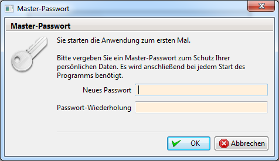
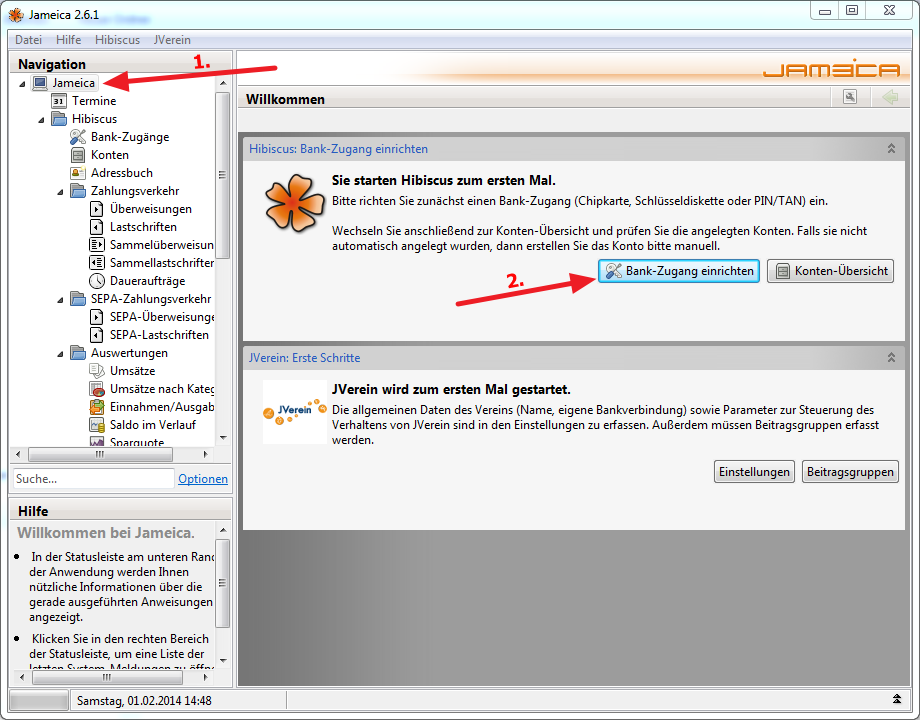
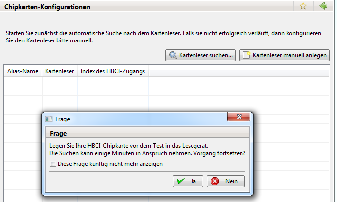
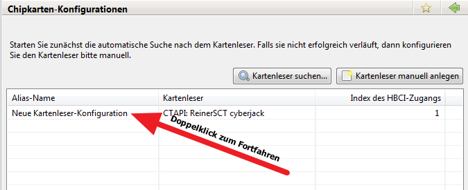

# Aller Anfang

Aller Anfang ist schwer. Damit das "schöne" Werkzeug JVerein nicht am Start scheitert, gibt es hier eine Einführung für eine Windows Installation.

## Installation

Siehe [Installation](installation.md)

## Der erste Start

Jameica und damit die gesamte Software wird mit "C:\Jameica\jameica-win64.exe" (Beispiel für die 64bit Version) gestartet. Bei jedem Start, bzw. solange nichts Gegenteiliges eingestellt wurde (z.B. "Künftig immer diesen Ordner verwenden"), wird der Benutzerordner abgefragt:

Dies bietet daher auch die Option mehrere Vereine zu verwalten: diese müssen lediglich verschiedene Benutzerordner haben. Nach der Bestätigung des Ordner wird ein "Master"Passwort benötigt:

Anmerkung des "Aller Anfang" Erst-Autors:

Was und wie genau das Masterpasswort schützt ist 'nicht' eindeutig ersichtlich.Einen Zugang zu Software / diesem Benutzerordner hat man "nur" mit korrektem Masterpasswort, an die Daten in der Datenbank kommt man aber auch OHNE Kenntnis dieses Masterpasswortes. Siehe u.a. dazu: LibreOfficeDB .

Nach der Vergabe eines Masterpasswortes, gelangt man zur Hauptübersicht von Jameica, mit den Plugins: Hibiscus und JVerein.

## Grundlagen einrichten

### Bankzugang einrichten

Zum Einrichten des Onlinebankings wird in der Hauptübersicht (Klick auf Jameica - über "Hibiscus" und Termine") der "Bank-Zugang einrichten" Knopf gedrückt.

Es erscheint folgende Abfrage, bei der das HBCI Verfahren abgefragt wird. Aus dem Dropdownmenü (siehe Grafik) eine passende Variante auswählen und mit "Übernehmen" bestätigen.

**Im Folgenden wird das Verfahren für eine HBCI-Chipkarte beschrieben.**

Das HBCI Lesegerät muss erfolgreich in Windows eingerichtet sein (Treiber usw.). Nach dem Klick auf "Kartenleser suchen..." erscheint folgend dargestellte Hinweis/Abfrage, die nach dem Durchlesen mit "Ja" zu beantworten ist.

Im Idealfall wurde der Kartenleser auf Anhieb gefunden. Die Kontodaten werden danach durch einen Doppelklick auf die entsprechende Zeile (siehe Grafik) eingerichtet.

Im nächsten Fenster besteht die Möglichkeit, HBCI-Version und die einzurichtenden Konten auszuwählen. Anmerkung zur HBCI-Version. Hier sollte nach Möglichkeit 2.2 oder "höher" (z.B. FinTS3) ausgewählt werden. Die HBCI-Version 2.1 führt unter Umständen zu Fehlern bei SEPA Buchungen (Fehler in der Form: funktioniert nicht.). Die getroffenen Einstellungen sollten mit "Konfiguration testen" geprüft werden. Verläuft der Test erfolgreich, bietet einem die Software an, die verfügbaren Konten automatisch anzulegen. Dies kann / sollte man mit "Ja" bestätigen. Im letzten Schritt, muss man nur noch den "Speichern"-Knopf betätigen und die Einrichtung ist abgeschlossen.

### JVerein einrichten

Nach dem Einrichten von Hibiscus, muss JVerein eingerichtet werden. Dazu wählt man entweder den Knopf "Einstellungen" oder Navigiert über die "Navigation" nach unten zu "JVerein" dort zu "Administration" und dort ebenfalls zu "Einstellungen".

Die vorzunehmenden Einstellungen sind selbsterklärend. Man sollte jeden Reiter sorgfältig prüfen und nach besten Wissen ausfüllen.

1. Allgemein: alles ausfüllen
2. Anzeige: externe Mitgliedsnummer? (hier sei schon darauf hingewiesen, die Mitgliedsnummer können nur Zahlen sein)
3. Mitglieder Spalten: kann so bleiben
4. Mitglieder Ansicht: kann so bleiben
5. Abrechnung: Entscheidung! Externe oder von JVerein vergebene Mitgliedsnummern für die Mandatsreferenznummer! Diese kann und sollte im Nachhinein nicht geändert werden.
6. Dateinamen: zum aktuellen Zeitpunkt weniger von Interesse
7. Spendenbescheinigung: alles ausfüllen
8. Buchführung: kann so bleiben
9. Rechnungen: kann so bleiben
10. Mail: alles ausfüllen - Tipp: die IMAP Funktion zur Speicherung von ausgehenden E-Mails ist hilfreich. Dies ist jedoch auch mit der "Immer Bcc an Adresse" ausreichend 'protokolliert'.
11. Statistik: kann so bleiben (vorerst)

### Weitere Einstellungen

Folgende Einstellungen müssen noch vorgenommen werden, um JVerein produktiv zu machen:

* [Konten](../v/allgemeine-funktionen/buchf/konten.md) aus Hibiscus "importieren" / übernehmen
* [Buchungsklasse](../v/allgemeine-funktionen/administration/admbuchf/buchungsklasse.md) - hier mindestens den "Ideellen Bereich" einrichten
* [Buchungsart](../v/allgemeine-funktionen/administration/admbuchf/buchungsart.md) - hier mindestens "Mitgliedsbeitrag" einrichten
* [Beitragsgruppen](../v/allgemeine-funktionen/administration/mitglieder/beitragsgruppen.md) - hier mindesten eine Beitragsgruppe einrichten

An diesem Punkt sollte JVerein beendet werden um den Benutzerordner zu sichern. Der Sinn dahinter ist, dass das folgenden Ausprobieren Spuren in den Datenbanken hinterlässt. Einige Benutzer möchten mit einer "sauberen" Datenbank arbeiten. Sauber wird hierbei unter anderem so definiert, dass keine Testbuchungen oder Testkategorien existieren UND die Datenbankzähler (stetig fortlaufende Nummern) "richtig" bei 1 starten. Das Ausprobieren und Testen der Software treibt die Datenbankzähler jedoch in die Höhe. Funktionell dürfte sich bei der einen oder anderen Variante kein Unterschied ergeben.

Wie man sich auch entschieden hat, einige Testungen sind erforderlich, um die Software und ihr Potential richtig zu verstehen. Folgendes Vorgehen ist ratsam:

ca. 3 Mitglieder anlegen (je nach dem: es ist ratsam, einen "echten" Benutzer - z.B. sich selbst - anzulegen um eine ECHTE Test SEPA Lastschrift durchführen zu können.

* die eingetragenen E-Mail Adressen sollten echt sein und zu Ihnen führen (demjenigen, der das hier liest). Damit können die versandten E-Mail kontrolliert werden.
