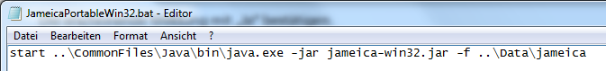
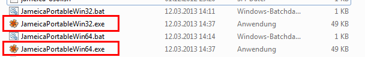

# Anleitung Jameica Portable

**Erstellung einer portablen Version von Jameica mit Plugins für/unter Windows mit „fixen“ Pfaden.**

_Beitrag von Marco Hügel_

## Quellen

Zur Erstellung einer portablen Version wird das Java Framework Jameica benötigt, sowie die gewünschten Plugins. Downloads finden sich wie gehabt unter folgenden Links:

* [http://www.willuhn.de](http://www.willuhn.de) \(Jameica Framework, Hibiscus, Syntax, …\)
* [http://www.jverein.de](http://www.jverein.de)\(Vereinsverwaltung\)
* Weitere: [https://www.willuhn.de/products/jameica/plugins.php](https://www.willuhn.de/products/jameica/plugins.php)

Weiterhin benötigt man noch die portable Version von Java \(jPortable\), die man sich hier herunterladen kann:

* [http://portableapps.com/apps/utilities/java\_portable](http://portableapps.com/apps/utilities/java_portable)

Nachfolgend beschreibe ich die portable Installation auf einem USB-Stick, welcher als Laufwerk E: in meinem System eingebunden ist. Sofern dies bei Euch anders ist, bitte entsprechend berücksichtigen.

Auf dem Stick habe ich ein Verzeichnis E:\Portable angelegt, worunter meine portablen Anwendungen, als auch Daten liegen sollen. Unterhalb dieses Verzeichnisses, habe ich ein Verzeichnis „Data“ angelegt, also E:\Portable\Data. Hier sollen künftig die Daten meiner portablen Anwendungen liegen. Zur Unterscheidung der Daten pro Anwendungen, habe ich hierunter nochmals einen Ordner „jameica“ angelegt. In diesem Ordner E:\Portable\Data\jameica sollen also künftig die Daten von Jameica mit den Plugins liegen. Das ganze sieht dann so aus:


Nun werden Jameica und die Plugins auf den Stick entpackt, hierzu verwende ich bei mir das Programm 7zip. Natürlich kann jedes andere Packprogramm dafür verwendet werden.

Das Java Framework Jameica, entpacke ich dann direkt nach E:\Portable:


Ergebnis:


Anschließend werden die Plugins auf gleichem Wege nach E:\Portable\jameica\plugins entpackt. Beispielhaft anhand der Plugins Hibiscus \(Onlinebanking\) und JVerein \(Vereinsverwaltung\), sieht das dann so aus:


Zur Installation der portablen Java-Version bitte die entsprechende Datei starten. Bei der Pfadauswahl dann den Pfad E:\Portable\CommonFiles\Java wählen wie hier:


Da noch einige Dateien aus dem Internet heruntergeladen werden müssen, kann die Installation je nach Internetverbindung einige Minuten dauern.

Nach Fertigstellung der Java-Installation wären die Vorbereitungen abgeschlossen, und es geht an den portablen Starter für Jameica.

Die Startdateien die wir zur Erstellung der portablen Starter benötigen, liegen im Verzeichnis E:\Portable\jameica, und lauten wie folgt:

* jameica-win32.jar \(für Windows 32bit\)
* jameica-win64.jar \(für Windows 64bit\)

Die ebenfalls vorhandenen EXE-Files können an der Stelle nicht genutzt werden, da wir für die volle Portabilität natürlich das portable Java nutzen wollen.

## Wo sollen die portablen Starter angelegt werden?

Zunächst einmal sollte festgelegt werden, in welchem Verzeichnis die portablen Startdateien abegelegt werden sollen. Denkbar wäre das Programmverzeichnis von Jameica \(E:\Portable\jameica\), denkbar aber auch das übergeordnete Verzeichnis E:\Portable.

Ich beschreibe das ganze zunächst auf Basis des Verzeichnisses E:\Portable\jameica.

Zunächst legen wir uns per rechter Maustaste ein neues Textdokument im Ordner E:\Portable\jameica an:


Das Textdokument bitte gleich umbenennen nach „JameicaPortableWin32.bat“ wie folgt:


Die erscheinende Meldung bzgl. der Umbenennung mit „Ja“ bestätigen.

Nun per rechter Maustaste die so erstellte Datei bearbeiten:


Es öffnet sich der normale Windows Editor \(Notepad\) und wir können nun den Startbefehl in diese Datei eingeben, der Da lautet:



...oder zum kopieren&einfügen:

```text
start ..\CommonFiles\Java\bin\java.exe -jar jameica-win32.jar -f ..\Data\jameica
```

Die Datei noch über Datei → Speichern sichern, und wir wären an der Stelle schon fertig und könn\(t\)en den Startvorgang mit dieser Datei testen.

Wer Windows 64bit einsetzen möchte, kann analog eine neue Textdatei „JameicaPortableWin64.bat“ anlegen und diese anschließend bearbeiten.

Der Inhalt der Datei ist dann analog der Datei für Windows 32bit, nur eben mit dem Aufruf der Jameica-Version für 64bit:

```text
start ..\CommonFiles\Java\bin\java.exe -jar jameica-win64.jar -f ..\Data\jameica
```

**Beachte:**

**Auch unter Windows 64bit, kann die 32bit-Version problemlos genutzt werden! Es muss also nicht zwingend eine portable 64bit Startdatei angelegt werden!**

## Umwandeln der Batch-Dateien in eine EXE mit schönem Icon?

Wer nun noch möchte, kann die portablen Startdateien auch als EXE-Datei mit einem schönen Programm-Icon speichern.

Hierzu lädt man sich das Tool „Bat to Exe“ von folgender Seite herunter:[http://www.f2ko.de/programs.php?lang=de&pid=b2e](http://www.f2ko.de/programs.php?lang=de&pid=b2e)

Das Programm ist portabel, und es gibt eine 32bit und eine 64bit-Version. Prinzipiell dürfte es keine Rolle spielen, mit welcher Version man die Umwandlung zu einer EXE vollzieht.

Ich nutze an der Stelle die 32bit-Version.


Zunächst lädt man sich die Batch-Datei über den entsprechenden Suchbutton. Der Dateiname für die EXE wird automatisch gesetzt kann aber natürlich geändert werden.

Die Optionen auf diesem Reiter können so belassen werden. Wir wechseln nun noch auf den Reiter „Versionsinformation“:


Das Hibiscus-Icon befindet sich im Pfad E:\Portable\jameica\plugins\hibiscus\icons.

Die Versionsinformationen füge ich an der Stelle beispielhaft an, für den eigenen Bedarf braucht man diese Informationen wohl eher nicht.

Mit „Kompilieren“ erstellt man nun die portable EXE-Datei mit Programm-Icon.

Analog kann man das gleiche noch für die 64bit-Version durchführen.

Im Verzeichnis E:\Portable\jameica befinden sich nun die portablen Starter im EXE-Format:



## Wie lautet der Startbefehl im Ordner E:\Portable?

Möchte man die portablen Startdateien außerhalb des Jameica-Verzeichnisses legen, dann lautet der Aufruf in der jeweiligen Batchdatei wie folgt:

### Windows 32bit

```text
cd jameica
start ..\CommonFiles\Java\bin\java.exe -jar jameica-win32.jar -f ..\Data\jameica
```

### Windows 64bit

```text
cd jameica
start ..\CommonFiles\Java\bin\java.exe -jar jameica-win64.jar -f ..\Data\jameica
```

## Hinweise zur portablen Version unter Linux, MacOS etc.

Eine richtig portable Version unter Linux, MacOS etc. kann es nicht geben, zumal es keine portable Java-Version hierfür gibt.

Die Nutzung der „portablen“ Version setzt unter den genannten Betriebssystemen eine vorinstallierte Java Runtime ab Version 6 voraus.

Eventuell werden ich diese Anleitung noch um die mehr oder minder portable Nutzung unter den genannten Betriebssystemen erweitern.

## Update der portablen Version

Ein Update muss immer von Version zu Version erfolgen. Wenn man versehentlich eine Version überspringt, kann dies zu Problemen führen.

Updates gibt es aktuell ca. 2x jährlich, diese sollte man auch in aller Regel einspielen.

Zur Einspielung einfach wie folgt vorgehen:

1. Die portablen Startdateien vorher sichern, zumindest wenn Nutzung unter E:\Portable\jameica erfolgt.
2. Den Ordner E:\Portable\jameica löschen
3. Neue Versionen von Jameica und Plugins entsprechend dieser Anleitung in die gleichen Pfade installieren/entpacken.
4. Das portable Java \(jPortable\) kann über die bestehende Version installiert bzw. upgedatet werden.
5. Die portablen Startdateien wieder an den richtigen Ort kopieren.

Sofern man versehentlich die portablen Startdateien nicht gesichert hat, kann man diese auch schnell gemäß dieser Anleitung anlegen.

## Download einer so vorgefertigten Version?

Da Updates sowieso manuell durchgeführt werden müssen/sollten, macht eine vorgefertigte Version nur bedingt Sinn. Gleiches gilt auch dann, wenn andere Pfade verwendet werden, wie ich sie hier verwendet habe.

## Wie erstelle ich eine portable Version gemäß den Spezifikationen von [http://portableapps.com](http://portableapps.com)

Im Wesentlichen muss man hier die gleichen Schritte wie erläutert machen, vor allem muss man sich aber an deren Spezifikationen halten, insbesondere die Verzeichnisstruktur betreffend:

[http://portableapps.com/development/portableapps.com\_format](http://portableapps.com/development/portableapps.com_format)

Hat man die Dateien entsprechend den Spezifikationen in die vorgegebenen Verzeichnisse entpackt/kopiert, und die portablen Starter gemäß dieser Anleitung erstellt bzw. evtl. auch angepasst, so kann man mit dem PortableApps.com Installer, daraus ein Installationspaket der Form MeineAnwendung.paf.exe erstellen:

[http://portableapps.com/apps/development/portableapps.com\_installer](http://portableapps.com/apps/development/portableapps.com_installer)

Viel Erfolg dabei!

