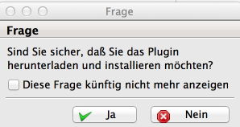
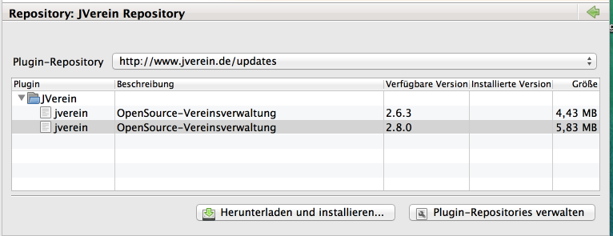
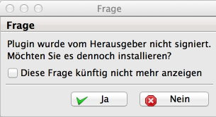
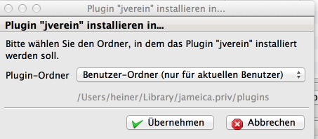

# Installation

## Jameica-Installation

Die zum Betriebssystem passende Jameica-Version ist von [http://www.willuhn.de/products/jameica/download.php](http://www.willuhn.de/products/jameica/download.php) herunter zu laden. Sofern Jameica in einer älteren Version bereits installiert ist, ist das Verzeichnis entweder umzubenennen oder zu löschen. Die heruntergeladene ZIP-Datei ist an der gewünschten Stelle zu entpacken (z. B. C:\Programme). In dem entpackten Verzeichnis die zum verwendeten Betriebssystem passende Startdatei starten.

Die Instalalation von Java ist dur noch bei Linux-Systemen notwendig, bei Windows und MacOS ist diese bereits in Jameica enthalten.

Beim ersten Start der neuen Version wird die Datenbank an die neuen Strukturen angepasst und ist dann mit der alten Version nicht mehr kompatibel. Es gibt auch keinen Weg zurück. Daher ist es sinnvoll, das Datenverzeichnis vor dem Update als Sicherung zu kopieren. Falls etwas schief geht ist damit mit der alten Version noch immer ein lauffähiges System vorhanden.

Sofern noch keine Plugins installiert sind, erscheint folgende Meldung:

## Hibiscus-Installation

Datei | Plugins online suchen

Sofern Hibiscus erstmalig installiert wird und das Zertifikat bislang noch nicht akzeptiert wurde, erscheint folgende Meldung, die mit "ja" zu bestätigen ist:

Passende Hibiscus-Version anklicken und "Herunterladen und installieren" anklicken.

"Ja" anklicken

Passenden Plugin-Ordner auswählen. Wichtig! Eine einmal getroffene Auswahl sollte beibehalten werden.

Jameica beenden und neu starten.

## JVerein-Installation

Datei | Plugins online suchen

Wichtig! Wenn mit Jameica < 2.10.3 gearbeitet wird, ist das aktuelle JVerein-Repositiory noch nicht eingetragen. "Repositories bearbeiten..." anklicken, rechter Mausklick auf das alte JVerein-Repository, löschen. "Neues Repository hinzufügen" anklicken, URL: https://openjverein.github.io/jameica-repository.

Anschließend das neu angelgete OpenJVerein-Repository auswählen:

Passende JVerein-Version auswählen und "Installieren..." anklicken.

"Ja" anklicken.

"Ja" anklicken.

Passenden Plugin-Ordner auswählen. Wichtig! Eine einmal getroffene Auswahl sollte beibehalten werden.

Jameica beenden und neu starten.

### Wichtig

Die Installation muss immer auf dem oben beschriebenen Weg erfolgen. Das direkte entpacken in das Plugins-Verzeichnnis wird nicht empfohlen.

## MySQL

JVerein unterstützt seit dem 29.1.2008 auch MySQL. Zur Installation siehe [MySQL-Support.](mysql-support.md)
