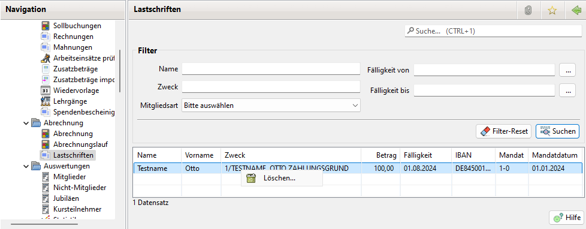

# Lastschriften

Lastschriften werden bei einem Abrechnungslauf für Mitglieder oder Nicht-Mitglieder generiert bei denen als Zahlungsweg "Basislastschrift" ausgewählt ist und auch für Kursteilnehmer.

Entsprechend der Abbuchungsausgabe wurden diese entweder an Hibiscus übergeben oder in einer XML Datei exportiert. Siehe [Abrechnung](abrechnung.md).

Die Lastschriften lassen sich in dem View nach verschiedenen Kriterien filtern. Mit dem Filter Mitgliedschaft lässt sich nach Mitglieder, Nicht-Mitglieder oder Kursteilnehmer filtern.

Die Lastschrifteinträge werden für die Generierung der Pre-Notificationen verwendet. Siehe [Pre-Notification](pre-notification.md).

Mit einem Rechtsklick auf einen oder mehrere selektierte Tabelleneinträge öffnet sich ein Menü zum löschen der Einträge. Damit können alte Einträge wenn sie aus Dokumentationszwecken nicht mehr gebraucht werden gelöscht werden.

Lastschrift Einträge werden automatisch gelöscht wenn man den zugehörigen Abrechnungslauf löscht.

Achtung:

Solange für Einträge die Pre-Notificationen noch nicht versendet wurden dürfen diese Einträge nicht gelöscht werden. Für gelöschte Einträge können keine Pre-Notificationen verschickt werden.

