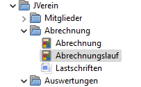
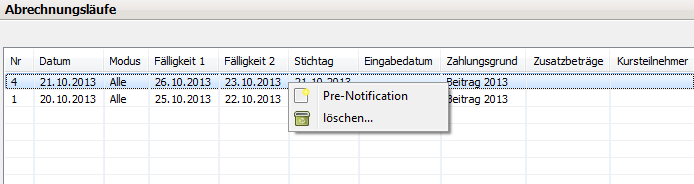

# Pre-Notification

Mit der Pre-Notification Funktion ist es einfach möglich, den Ansprüchen der SEPA Regelung bzgl. der Ankündigung einer SEPA-Lastschrift gerecht zu werden. Die Pre-Notification Benachrichtigung kann erst erstellt werden, wenn der Buchungsvorgang abgeschlossen ist. Die Buchungen \(d.h. die Abrechnung\) müssen dafür nur erstellt sein. Eine Onlinebuchung/ -übertragung zur Bank ist für diese Funktion nicht erforderlich.

In JVerein stehen folgende Alternativen für die Pre-Notifications zur Verfügung:

* Schriftlich an alle Mitglieder
* Per E-Mail an alle Mitglieder mit E-Mail-Adresse und schriftlich an die Übrigen
* Als 1ct-Überweisung an alle Mitglieder

## Aufruf der Pre-Notification-Funktion\[Bearbeiten\]

Die Pre-Notification Funktion ist etwas versteckt und kann nur über folgenden Weg aufgerufen werden:



Klick auf Abrechnungslauf.

Mit einem rechts-Klick auf den entsprechenden Abrechnungsverlauf öffnet sich ein Kontextmenü, mit dem man die Pre-Notification Mail erstellen kann.



## Pre-Notification schriftlich und per E-Mail

Bevor Pre-Notification erstellt werden können muss zunächst muss ein [Formulare](../administration/formulare.md) dafür angelegt werden.

In diesem Fenster kann die Pre-Notification erstellt werden, und zwar auf der Karte Mail + PDF .


### Schriftliche Pre-Notification an alle Mitglieder

Im Block Parameter bei Ausgabe muss PDF \(alle\) eingestellt werden und das Formular passend ausgewählt werden, dann den Startknopf drücken.

Über die Einstellung zu "PDF als" kann gesteuert werden, ob die PDF als eine einzige, mehrseitige Datei erzeugt wird, die alle einzelnen Schreiben enthält \(Einstellung "eine PDF-Datei"\), oder ob jedes Schreiben an einen Benutzer in einer separaten Datei abgelegt wird. In jedem Fall muss der Benutzer über den aufkommenden Dialog Ausgabedatei wählen das Ablageverzeichnis und den Namen \(bzw. das Prefix\) der PDF-Datei\(en\) festlegen.

Sollen separate Dateien erzeugt werden, so wird der ausgewählte Dateiname vor der Endung .PDF um eine fortlaufende Nummer \("einzelne PDF-Dateien, nummeriert"\), um die Mitgliedsnummer des angeschriebenen Mitglieds \("einzelne PDF-Dateien, mit Mitgliedsnummer"\) oder um beide Werte \("einzelne PDF-Dateien, nummeriert mit Mitgliedsnummer"\) ergänzt, je nach dem, was in der Einstellung "PDF als" ausgewählt wurde.

Die direkte Erzeugung einzelner PDF-Dateien ist hilfreich, wenn für das Versenden der Briefe ein Online-Dienstleister herangezogen werden soll.

### E-Mail-Pre-Notification an Mitglieder mit E-Mail-Adresse

Im Block Parameter bei Ausgabe muss EMail eingestellt werden.

Im Block Mail wird der Mail-Text eingegeben und schließlich der Startknopf gedrückt.

Hinweis: Für die Pre-Notification-Mail gibt es keine E-Mail Vorlage\(n\). Der Inhalt des E-Mailformulars wird jedoch gespeichert und steht für zukünftige Versendungen zur Verfügung sobald der Startknopf gedrückt wurde. Dies löst bei korrekt eingestellten E-Mail-Server-Daten den Versand der E-Mails aus. Es ist daher ratsam, diese Funktion im Vorfeld zu testen, ohne mit echten Mitgliederdaten/e-mails zu hantieren.

Die versendeten Pre-Notification-E-Mails werden nach dem Versand beim jeweiligen Mitglied in der Mail-Historie gespeichert.

#### Beispiel für eine Pre-Notification Mail

```text
NAME_DES_VEREINS___  - SEPA  Ankündigung

$lastschrift_empfaenger

ORT____, den  $lastschrift_abrechnungslauf_datum

aufgrund des von Dir erteilten Mandats zieht DER_VEREIN___ mittels SEPA-Lastschrift
von Deinem unten angegebenen Konto folgende Forderung am $lastschrift_abrechnungslauf_faelligkeit ein.

unsere Gläubiger-ID: DE___
Deine Mandats-ID: $lastschrift_mandatid
Das Mandats-Datum: $lastschrift_mandatdatum
Deine BIC: $lastschrift_bic
Deine IBAN: $lastschrift_iban
Das Fälligkeitsdatum: $lastschrift_abrechnungslauf_faelligkeit
Der Verwendungszweck: $lastschrift_verwendungszweck
Der Betrag: $lastschrift_betrag Euro

Fragen und Korrekturen bitte an: EMAILADRESSE___ 

Mit freundlichen Grüßen
die Verwaltung
```

### Schriftliche Pre-Notification an Mitglieder ohne E-Mail-Adresse

Nachdem die Pre-Notifications per E-Mail versendet wurden müssen die übrigen Mitglieder diese Nachricht noch schriftlich erhalten.

Im Block Parameter bei Ausgabe muss nun PDF \(Lastschriften ohne Mailadresse\) eingestellt werden und das Formular passend ausgewählt werden, dann den Startknopf drücken.

Die weitere Bedienung entspricht dem Vorgehen beim Senden der schriftlichen Pre-Notification an alle Mitglieder.

## 1ct-Überweisung Pre-Notification

Durch eine Überweisung von einem Cent kann über den Verwendungszweck die Pre-Notification durchgeführt werden.

Auf der Karte 1ct-Überweisung müssen die Ausgabeart \(Datei oder Hibiscus\) und das Ausführungsdatum eingestellt werden.

Für den Verwendungszweck stehen alle unten aufgeführten $lastschrift\_\*-Variablen zur Verfügung.

### Beispiel für einen Verwendungszweck

```text
Lastschriftankündigung/Betrag:$lastschrift_betrag/Datum:$lastschrift_abrechnungslauf_faelligkeit/Mandat-ID:$lastschrift_mandatid/Gläubiger-ID:DE....
```

In der Mail können im Betreff und im Text, bei der 1ct-Überweisung im Verwendungszweck die Lastschriftvariable verwendet werden. Diese Daten werden aus dem Abrechnungslauf genommen. Änderungen in den Mitgliederdaten nach dem Abrechnungslauf werden NICHT berücksichtigt.

## Besonderheiten - zusammengefasst

* Änderungen der Mitgliederdaten nach einem Buchungslauf werden für diesen Buchungslauf NICHT mehr berücksichtigt. Der Buchungslauf stellt eine eigenen Datensatz dar.
  * So werden z.B. E-Mailadresseänderungen für die Pre-Notification außer acht gelassen.
  * Teilt ein Mitglied z.B. aufgrund der Pre-Notification eine neue Bankverbindung mit, so ändert man sie in den Mitgliederdaten nur für künftige Abrechnungen.
    * Wurde die entsprechende Lastschrift der aktuellen Abrechnung jedoch noch nicht zur Bank übertragen, so kann man zusätzlich in Hibiscus \(oder in der XML-Datei\) für diese Abrechnung noch die Bankverbindung ändern \(Achtung: evtl. neue Mandatsreferenz und geänderte Erst-/Folgelastschrift beachten\).
    * Wurde die Lastschrift aber bereits zur Bank übertragen, dann sind für diese Abrechnung keine Änderungen mehr möglich. Die Lastschrift wird wahrscheinlich zurückkommen, zum Handling siehe Rücklastschrift.
* Das E-Mailformular wird mit ausgeführtem E-Mailversand gespeichert.
* Es gibt keine Pre-Notification E-Mailformulare.
* Die Variablen in der Pre-Notification Mail sind NICHT identisch mit den Variablen eines "normalen" E-Mailversandes.

