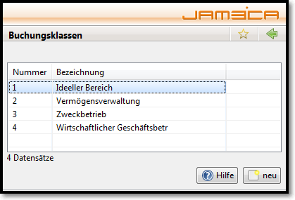

# Buchungsklasse

Die Buchungsklassen dienen dazu die einzelnen Buchungsarten entsprechend den steuerlichen Vorgaben zu gruppieren. Siehe auch [Buchführung Zusammenhänge.](../../../sonstiges/buchfuhrung-zusammenhange.md)

