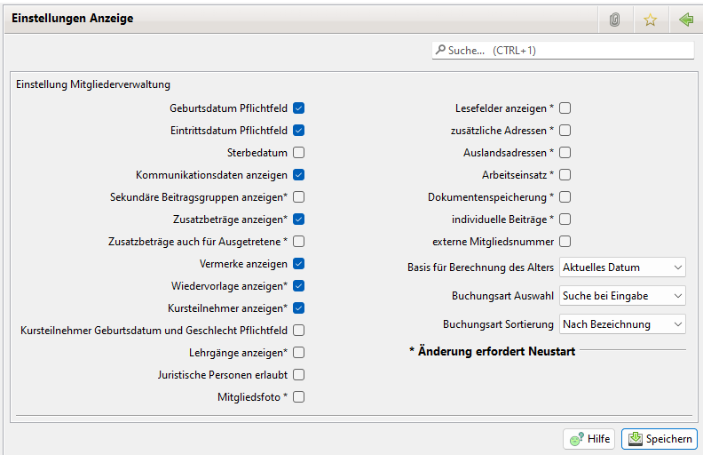
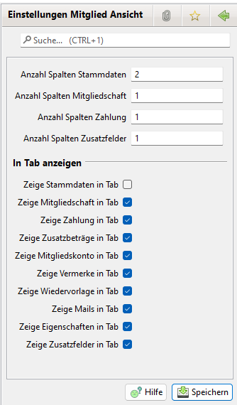
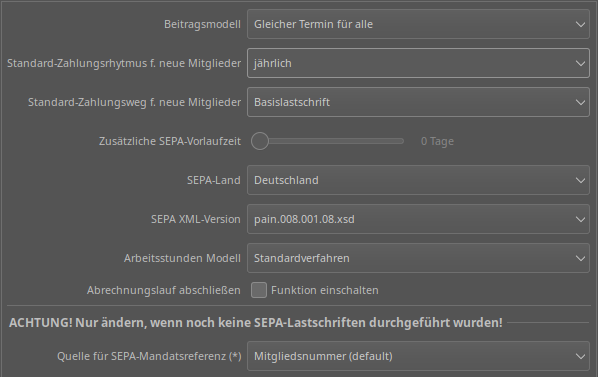
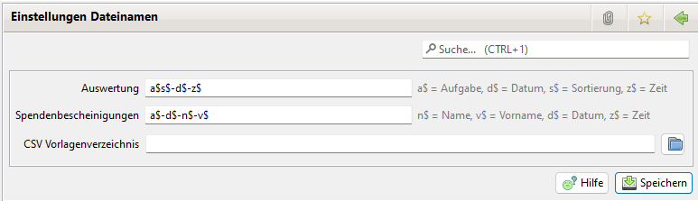
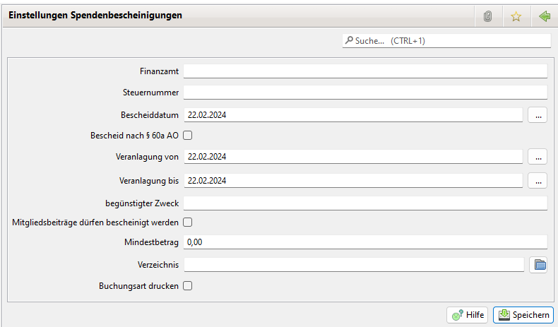
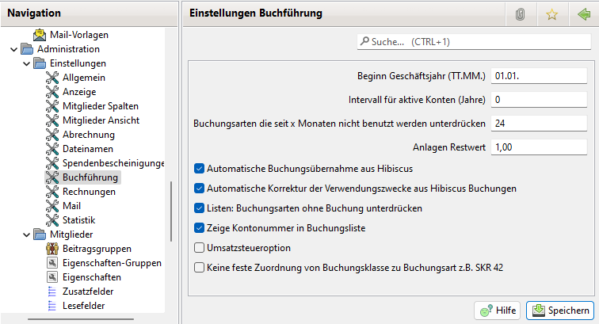
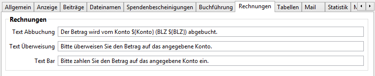
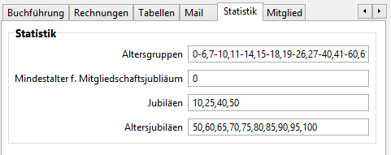

# Einstellungen

## Allgemein

Name und Anschrift des Vereins müssen hier eingegeben werden \(Pflichtangaben\). Für die Abbuchung sind die Bankverbindung und Gläubiger-ID einzugeben.

Die Pflichtfelder werden von der Abrechnung für die Erstellung der Lastschriften zwingend benötigt. Die weiteren Angaben werden überwiegend bei Spendenbescheinigungen eingesetzt.

## Anzeige

Durch die Einstellungen kann das Verhalten von JVerein beeinflußt werden.

Nach Änderungen der mit Stern gekennzeichneten Werte ist ein Neustart von Jameica erforderlich.

Folgende Einstellungen können vorgenommen werden:

### Geburtsdatum Pflichtfeld

Beim Mitglied muss ein Geburtsdatum eingetragen sein, damit der Datensatz gespeichert werden kann.

### Eintrittsdatum Pflichtfeld

Beim Mitglied muss ein Eintrittsdatum eingetragen sein, damit der Datensatz gespeichert werden kann.

### Sterbedatum

Das Eingabefeld für das Sterbedatum ist vorhanden und auswertbar

### Kommunikationsdaten anzeigen

Beim Mitglied können folgende Kommunikationsdaten gepflegt werden:

* private Telefonnummer
* Handynummer
* Dienstliche Telefonnummer
* E-Mail Adresse

### Zusatzbeträge anzeigen

Tab Zusatzabbuchungen beim Mitglied anzeigen. Impliziert, dass die Übersicht der Zusatzabbuchungen \(nicht\) angezeigt wird und die Option bei der Abbuchung \(in\)aktiv ist.

### Vermerke anzeigen

Tab Vermerke beim Mitglied anzeigen. Beim Mitglied können 2 mal 255 Zeichen Vermerke gespeichert werden.

### Wiedervorlage anzeigen

Tab Wiedervorlage beim Mitglied anzeigen. Impliziert, dass die Übersicht der Wiedervorlagen \(nicht\) angezeigt wird.

### Kursteilnehmer anzeigen

Kursteilnehmer ein-/ausblenden. Auswirkung auf die Abbuchung.

### Lehrgänge anzeigen.

Zu einem Mitglied können die durchgeführten Lehrgänge mit Ergebnissen gespeichert werden.

### Juristische Personen erlaubt.

Die Eingabe von Firmen, Organisationen und Behörden als Mitglieder wird erlaubt. Anstatt Name und Vorname werden Name-Zeile1 und Name-Zeile2 erfasst. Geburtsdatum und Geschlecht werden nicht erfasst.

### Mitgliedsfoto.

Zu jedem Mitglied kann ein Foto gespeichert werden.

### Lesefelder anzeigen

Tab Lesefelder beim Mitglied anzeigen. Lesefelder können unter Administration - Lesefelder definiert werden

### Nicht-Mitglieder anzeigen

In einem eigenen Dialog können Nicht-Mitglieder von z.B. Spender, Lieferanten, Trainer gespeichert werden.

### Auslandsadressen

Beim Mitglied kann zusätzlich der Wohnsitz-Staat gespeichert werden

### Arbeitseinsatz

Beim Mitglied können Arbeitseinsätze erfasst werden.

In einem eigenen Dialog können Buchungen von Arbeitsstunden angezeigt und geprüft werden.

### Dokumentenspeicherung

Speicherung von Dokumenten zu Mitgliedern und Buchungen. Wird diese Einstellung aktiviert muss das Plugin jameica.messaging installiert sein.

### Individuelle Beiträge

Grundsätzlich zahlt das Mitglied den Beitrag, der in der Beitragsgruppe angegeben wurde. Sofern diese Option aktiviert wurde, kann bei jedem Mitglied ein abweichender individueller Beitrag angegeben werden.

### Externe Mitgliedsnummer

Vereine, die auf Bundes- oder Landesebene organisiert sind und eine durchgängige Mitgliedsnummer verwalten möchten, können in JVerein eine externe Mitgliedsnummer speichern.

### Basis für Berechnung des Alters.

In der Ansicht Tabellen kann in der Mitgliederliste in einer Spalte das Alter angezeigt werden. Hier mit diesem Feld bestimmen Sie welches Referenzdatum bei der Berechnung des Alters verwendet wird.Zur Auswahl stehen:

* Aktuelles Datum. Das Alter berechnet sich aus dem Geburtsdatum und dem aktuellen Datum.
* Jahres Start. Das Alter berechnet sich aus dem Geburtstag und dem 01.01. des aktuellen Jahres.
* Jahres Ende. Das Alter berechnet sich aus dem Geburtstag und dem 31.12. des aktuellen Jahres.

### Buchungsart Auswahl

Hier kann eingestellt werden wie sich bei Buchungen das Feld für die Buchunsgart verhält:

Bei Suche bei Eingabe tippt man den Wortteil der Bezeichnung der Buchungsart ein, nach ein paar Millisekunden wird einer Auswahlliste mit den Treffern angezeigt aus der man dann die gewünschte Buchungsart übernehmen kann.

Anzeige der kompletten Liste stellt eine Drop-Down-Liste mit allen Buchungsarten zur Verfügung.

### Buchungsart Sortierung

Wie sollen die Buchungsarten sortiert werden: nach Bezeichnung, nach Nummer oder nach Bezeichnung/Nummer.

## Mitglieder Spalten

Festlegung der Spalten, die in der Mitglieder Tabelle angezeigt werden sollen.

In diesem Dialog werden auch benutzerdefinierte [Felddefinitionen](mitglieder/felddefinition.md) angezeigt. Diese können ebenfalls für die Anzeige in der Mitgliederliste selektiert werden.

## Mitglieder Ansicht

Festlegung der Ansicht der Mitglieder Daten. Es kann ausgewählt werden welche Daten direkt angezeigt werden oder innerhalb der Tabs.

## Abrechnung

Beitragsmodell, siehe auch [Beitragsmodelle](../../allgemein/beitragsmodelle.md)

Die Standardwerte für den Zahlungsrhytmus und den Zahlungsweg bei der Speicherung neuer Mitglieder kann eingestellt werden.

Für die SEPA-Konvertierung ist das SEPA-Land auszuwählen.

### SEPA XML-Version

SEPA XML-Version welche für die Generierung einer 1ct Überweisung (pain.001...) bzw. einer Lastschrift (pain.008...) XML Datei verwendet wird.

Unterstützte Versionen sind aus folgender Tabelle ersichtlich.

### Arbeitsstundenmodell

Mit dem Arbeitsstundenmodel wird die Buchung von Arbeitsstunden eingestellt.

Mögliche Werte sind:

#### Standardverfahren

Es können beim Erfassen der Arbeitsstunden nur positive Werte im Stundenfeld eingegeben werden.

#### Negative Stunden erlaubt

Beim Erfassen der Arbeitsstunden vom Mitgliedern können im Stundenfeld positive und negative Werte eingetragen werden. Positive und negative Werte können sich gegenseitig aufheben. Negative Werte können die Gesamtschuld an Arbeitsstunden bei einem Mitglied erhöhen und zu einer höheren Buchung von Zusatzbeiträgen führen.

## Dateinamen

Bei der Ausgabe von Dateien \(Abbuchung, Auswertungen...\) werden die Dateinamen nach dem vorgegebenen Muster aufgebaut. Es können zusätzliche, vom Betriebssystem unterstützte Zeichen, in das Muster aufgenommen werden. Bleibt das Muster leer, wird kein Vorschlag für den Dateinnamen angezeigt. Spendenbescheinigungen werden jeweils für den einzelnen Spender ausgestellt. Daher sollten zur leichteren Identifizierung Name und Vorname in den Dateinamen aufgenommen werden.

Folgende Variable stehen zur Verfügung:

* a$ : Aufgabe \(z. B. auswertung, abbuchung\)
* d$ : Aktuelles Datum
* s$ : Sortierung. Wird nur bei Auswertungen gefüllt. Ansonsten leer.
* z$ : Aktuelle Zeit
* n$ : Name des Mitglieds
* v$ : Vorname des Mitglieds

Verzeichnis für CSV-Vorlagen.

## Spendenbescheinigungen

Hier können die Werte zur Erstellung von Spendenbescheinigungen eingestellt werden.

Neben den steuerlich relevanten Informationen können folgende Daten konfiguriert werden.

#### Mindestbetrag für Spendenbescheinigungen

Allgemeine Einstellung ab welchem Betrag eine Spendenbescheinigung erstellt werden soll. Diese Einstellung kommt bei der automatischen Generierung von Spendebescheinigungen zum Tragen.

#### Verzeichnis für Spendenbescheinigungen

Um ein flüssiges Erzeugen von mehreren Dokumenten zu ermöglichen, kann hier das Verzeichnis für die PDF-Dateien festgelegt werden. Wenn aus der Liste der Spendenbescheinigungen heraus die Dokumente generiert werden, werden sie in diese Verzeichnis geschrieben. Das Verzeichnis wird auch vorbelegt, wenn eine Dokumentenerstellung aus der Detailansicht Spendenbescheinigung erfolgt. Hier wird jedoch der Dateidialog angeboten.

#### Buchungsart drucken

Ist das Häkchen gesetzt, wird in der Buchungsliste nicht der Zweck aus der Buchung, sondern die der Buchung zugewiesene Buchungsart verwendet. Bei sprechenden Namen eine einheitlichere Darstellung.

#### Unterschrift drucken

Ist das Häkchen gesetzt, wird beim Standard Druck eine Unterschrift in die Spendenbescheinigung eingefügt.

#### Unterschrift

Hier lässt sich ein Bild der Unterschrift einfügen welche entsprechend der selektierten Option eingefügt wird.

## Buchführung

Hier sind folgende Eingaben nötig bzw. möglich:

Beginn des Geschäftsjahres in der Form TT.MM.

Intervall für aktive Konten. Aktive Konten sind die, deren Auflösung um mehr als die ausgewählte Anzahl von Jahren zurück liegt. Diese können im Kontoauswahl Dialog ausgeblendet werden.

Buchungsarten die seit x Monaten nicht benutzt werden unterdrücken in der Form Monate.

Automatische Übernahme von Buchungen aus Hibiscus \(Standard: aktiviert\).

Automatische Korrektur der Verwendungszwecke aus Hibiscus Buchungen.

Unterdrückung nicht gebuchter Buchungsarten in Listen/Auswertungen \(Standard: nicht aktiviert\).

Zeige Kontonummer in der Buchungsliste.

Umsatzsteueroption.

Auswahl ob eine feste Zuordnung zwischen Buchungsart und Buchungsklasse existiert oder nicht. Die feste Zuordnung sollte nur bei einem Wechsel des Kontenrahmen passieren und dann weim Wechsel des Geschäftsjahres. Sie auch [Buchungsart](admbuchf/buchungsart.md).

## Rechnungen

Texte für die einzelnen Zahlungswege für den Rechnungsdruck. In den Text zur Abbuchung können die Variablen ${IBAN}, ${BIC}, ${MANDATID}, ${Konto} und ${BLZ} eingemischt werden.

Es ist möglich einen QR Code mit den Rechnungsdaten auf die Rechnung zu plazieren. Dazu sind die entsprechenden Felder zu konfigurieren.

## Mail 

In diesem Dialog sind die Daten für den Mailzugang einzurichen.

Über die Option "Bei Mail Versand von Formularen Anhang in DB speichern" lässt sich einstellen, ob bei versendeten Formularen wie z.B. Rechnung, Mahnung etc. der Mailanhang zusammen mit der Mail in der Datenbank gespeichert werden sollen. Damit lässt sich später beim betrachten der Mail auch der Anhang sehen.

Alternativ zur EMail-Adresse kann auch der Name zur Absenderadresse hinzugefügt werden: "Mein Name &lt;vorstand@verein.de&gt;" Wichtig ist dabei das Format: \(Name\) \(Spitze Klammer auf\) \(Email\) \(Spitze Klammer zu\)

Hinweis: Die Passwörter werden aber JVerein 2.6.1 verschlüsselt in einer Jameica-Wallet-Datei abgelegt \(im Jameica Datenordner, Unterordner "cfg"\), und sind mit dem Jameica-Masterpasswort gesichert, das beim Starten von JVerein eingegeben wird.

Um versendete EMails auch im EMail-Postfach \(und nicht nur in JVerein\) abzulegen, gibt es zwei Möglichkeiten:

1. Eine Kopie \(Cc\) oder Blindkopie \(Bcc\) der EMail verschicken. Dazu das Feld "Immer Cc an Adresse" oder "Immer Bcc an Adresse" mit einer EMailadresse ausfüllen.
2. Die EMail in den "Gesendete"-Ordner eines ggf. vorhandenen IMAP-Kontos ablegen. Dazu den Bereich "IMAP 'Gesendete'-Ordner mit den IMAP-Zugangsdaten ausfüllen und "Kopie in 'Gesendete'-Ordner IMAP ablegen" anklicken. Der technische Name des "Gesendete"-Ordners kann variieren, ist aber meist "Sent".

Beide Möglichkeiten können auch kombiniert werden.

## Statistik

Für statistische Zwecke können Altersgruppen angegeben werden. Erfassen Sie die Gruppen wie im folgendem Beispiel

1-5,6-10,11-17,18-25,26-50,50-100

Zur Ausgabe einer Jubiläumsliste werden die Jubeljahre durch Komma getrennt eingetragen. Ohne Eingabe werden die Standardwerte 10,25,40,50 verwendet.

Es kann eine Liste der Altersjubilare ausgegeben werden. Ohne Eingabe werden die Standardwerte 50,60,65,70,75,80,85,90,95 verwendet.

Ab Version 2.5 gibt es das Feld Mindestalter f. Mitgliedschaftsjubiläum

Geben Sie hier eine Zahl ein, dann werden Mitgliedsjahre, die vor diesem Alter liegen beim Errechnen eines Mitglieds-Jubiläums nicht mit gerechnet.

Für weitere technische Details siehe: [Für Entwickler](../../sonstiges/fur-entwickler.md)
