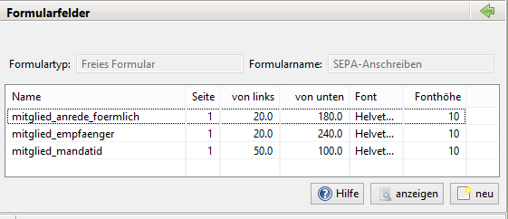
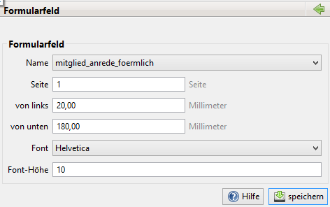
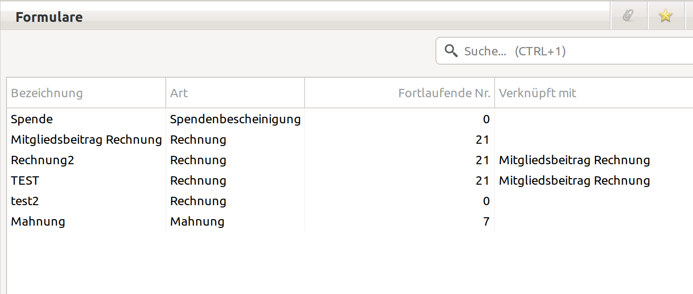
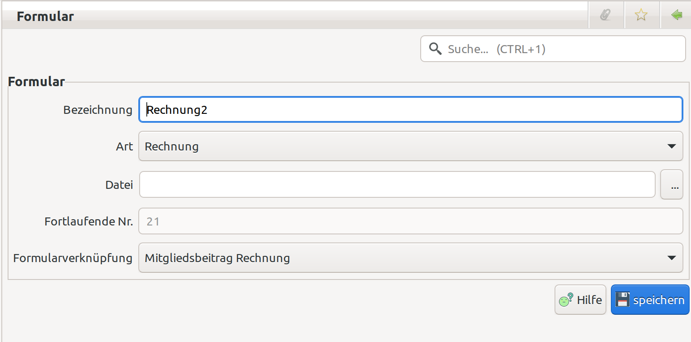
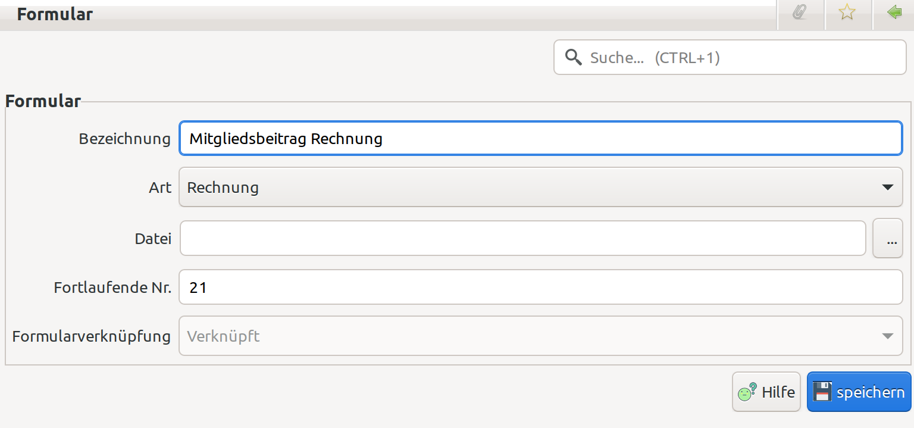

# Formulare

In JVerein werden für [Spendenbescheinigungen](../spendenbescheinigung.md), [Rechnungen](../rechnungen.md), [Pre-Notification](../abrech/pre-notification.md) und diverse Zwecke \(freie Formulare\) Formulare hinterlegt.

Man erstelle ein einfaches Dokument/Formular in Word, Open-/LibreOffice oder was auch immer \(Dankeschönschreiben, Rundschreiben, whatsoever...\) und lasse an den entsprechenden Stellen im Schreiben einfach leeren Platz \(weisse unbeschriebene Stellen\) als Platzhalter für die später von JVerein einzufügenden Daten.

Macht Euch hier genau Gedanken, wie Euer Formular aussehen soll und was Ihr später alles an Daten einfügen möchtet.

Bitte in der Textverarbeitungssoftware KEIN FORMULAR erstellen - nur einfach ein Dokument mit weissen/leeren Stellen als Platzhalter für später!! Das reicht.

Nun muss aus dem Dokument noch ein PDF gemacht werden. Das geht mit einem virtuellen PDF-Drucker \(z.B. FreePDF XP oder PDFCreator\) oder mit Adobe Acrobat \(nicht mit dem Reader, der kann halt nur lesen :-\) \) oder einfach in Open-/LibreOffice mit dem PDF-Export. Das fertige PDF \(mit den weissen/leeren Stellen für die späteren Daten aus jVerein\) hat keinerlei Funktionen eingebaut \(keine Formularfelder, nur weisse/leere Stellen im Text an der richtigen Stelle\).

Dann erstellt man in JVerein unter "Administration-&gt;Formulare" ein neues Formular. Dazu unten auf "neu" gehen, Bezeichnung und Art auswählen \("Art" gibt an, wann und wo dieses Formular in JVerein verfügbar sein wird\).

Nun noch die gerade erstellte PDF-Datei auswählen und auf "speichern" klicken.

Nun kommt die eigentliche Arbeit:

Unter "Formulare" habt Ihr nun euer neues Formular. Bitte mit rechter Maustaste drauf klicken und aus dem Kontextmenu "Formularfelder" auswählen. Ihr kommt dann auf die Seite "Formularfelder".

Hier klickt Ihr auf "neu", um das erste einzufügende Datenfeld auszuwählen und zu positionieren: \(Die spätere Reihenfolge Eurer Datenfelder ist egal! Ihr könnt auch erst hinten anfangen\)

Unter "name" könnt Ihr nun aus den möglichen Datenfelder dasjenige aus der Datenbank auswählen, das eingefügt werden soll.

Dieses Datenfeld müsst Ihr nun Millimetergenau auf euer gerade eben generiertes PDF händisch setzen. der Punkt \(0,0\) liegt unten links auf der Seite!

Tipp: Druckt das Dokument aus und messt mit einem Lineal die Positionen aus.

speichert das Ganze.

geht mit dem grünen Pfeil rechts oben zurück zu den Formularfeldern und schaut Euch das Ergebnis Eurer Arbeit mit "anzeigen" \(unten rechts\) an.

Das müßt Ihr solange wiederholen, bis das Datenfeld an der richtigen Stelle eingefügt wurde.

Übrigens: Da das System noch nicht weiss, welchen Datensatz es beim Austesten nehmen soll, hat der Entwickler einen Dummy-Datensatz automatisch für das Erstellen und Testen des neuen Formulars bereitgestellt.

## Formulargröße

Für jedes Dokument kann jede beliebige Größe \(DIN A4 hoch, quer, A5 oder A6 ...\) haben. Die Größe wird in die neu generierten Dokumente übernommen.

## Formularfelder

Liste der Formularfelder:

Im Menü Formularfelder öffnet sich durch einen Klick auf neu bzw. mit einem Doppelklick auf ein bestehendes Formularfeld der Dialog zur Bearbeitung des Formularfelds - im zweiten Fall bereits gefüllt mit den vorhandenen Werten \(siehe unten\). Mit einem Rechtsklick auf ein bestehendes Formularfeld öffnet sich ein Kontextmenü, über das das Formularfeld gelöscht werden kann.

Die Definition eines Formularfeldes besteht aus dem Inhalt, der über ein vordefiniertes Feld belegt wird \(Empfänger, Betrag etc.\), der Startposition auf der Seite \(gemessen von links und unten in Millimetern, eine Positionierung auf hundertstel Millimeter ist möglich\), der Schriftart/Font \(auswählbar aus einer Liste\) und der Schriftgröße \(Font-Höhe\).

Wenn die Formularfelder definiert wurden, kann die Position in Verbindung mit dem aktuellen Formular überprüft und angepasst werden. Gehe hierzu in das Menü "Formulare", markiere das aktuell bearbeitete Formular und gehe über das Kontext-Menü \(rechter Mausklick\) auf "anzeigen". Prüfe das Aussehen des generierten Formulars anhand der Testdaten und korrigiere gegebenenfalls noch einmal die Positionen der Formularfelder und die Schriftgrößen bis das Gesamtbild passt.

### Allgemeine Formularfelder

* zaehler: Eine fortlaufende natürliche Zahl die bei jeder Verwendung des Formulares um 1 hochgezählt wird (z.B. für Rechnungsnummern).
  * Der Zähler hat eine Mindestlänge. Die Länge wird unter Administration > Einstellungen > Rechnungen > Zählerlänge festgelegt. Die Standard-Zählerlänge ist 5.
  * Der Zähler wird mit Nullen (0) als Präfix aufgefüllt bis die Mindestlänge erreicht ist.
  * Der Zähler wird als Spalte "Fortlaufende Nr." in der Formularübersicht ausgegeben.
  * Der Zähler wird beim Anzeigen (Vorschau) von Formularen hochgezählt aber nicht gespeichert.
  * Der Wert kann in der Detailansicht des Formulares überschrieben werden.

### Formularfelder für Spendenbescheinigungen

* tagesdatum: Enthält das aktuelle Datum im Format TT.MM.JJJJ
* spendenbescheinigung\_empfaenger: Zusammengesetzt aus den Empfängerzeilen der Spendenbescheinigung
* spendenbescheinigung\_datum: Datum der Spendenbescheinigung. Dieses Datum wird verwendet, um zwischen den Formularen zu unterscheiden:
  * Bis 31.12.2012 altes Formular
  * Ab 01.01.2013 neues Formular
* spendenbescheinigung\_betrag: Betrag aus der Spendenbescheinigung
* spendenbescheinigung\_betraginworten: Betrag aus der Spendenbescheinigung in Worten.
* spendenbescheinigung\_spendenart: Art aus der Spendenbescheinigung \(Geldspende, Sachspende\)
* spendenbescheinigung\_spendedatum: Datum der Spende \(Einzelspendenbescheinigung\) oder Festtext: "s. Anlage" \(Sammelspendenbescheinigung\)
* spendenbescheinigung\_spendenzeitraum: Zeitraum der Spenden \(Sammelspendenbescheinigung\) "&lt;Datum der ersten Buchung&gt; bis &lt;Datum der letzten Buchung&gt;". Hinweis: ab 2013 muss dieser Zeitraum auf der ersten Seite angegeben werden!
* spendenbescheinigung\_ersatzaufwendungen: Kennzeichen, ob es sich auf einen "Verzicht auf Erstattung von Aufwendungen" handelt
  * Bis 31.12.2012: "X", wenn das Häkchen gesetzt ist.
  * Ab 01.01.2013: "Ja", wenn das Häkchen gesetzt ist, sonst "Nein".
* spendenbescheinigung\_buchungsliste: Für Sammelbestätigungen die aufbereitete Liste der Buchungen, die bescheinigt werden.
  * Bis 31.12.2012: alte Variante, Liste mit folgenden Spalten:
    * Datum Betrag Verwendung
    * Summenzeile
    * Legende, ob es sich um einen Verzicht auf Erstattung von Aufwendungen handelt.
  * Ab 01.01.2013: den Vorgaben entsprechende neue Liste:
    * "Datum der Zuwendung" "Art der Zuwendung" "Verzicht auf die Erstattung..." Betrag
    * Summenzeile
    * In den Spalten "Verwendung" und "Art der Zuwendung" wird in Abhängigkeit von der Einstellungen "Spendenbescheinigung / Buchungsart drucken" entweder der Name der Buchungsart oder der Zweck aus der Buchung verwendet.
* spendenbescheinigung\_bezeichnungsachzuwendung: Bezeichung des Gegenstandes aus der Spendenbescheinigung
* spendenbescheinigung\_herkunftsachzuwendung:
  * Bis 31.12.2012: Herkunft des Gegenstandes aus der Spendenbescheinigung \(keine Angaben, Privatvermögen, Betriebsvermögen\)
  * Ab 01.01.2013: Herkunft des Gegenstandes aus der Spendenbescheinigung, Festtexte:
    * bei keine Angaben: "Der Zuwendende hat trotz Aufforderung keine Angaben zur Herkunft der Sachzuwendung gemacht."
    * bei Privatvermögen: "Die Sachzuwendung stammt nach den Angaben des Zuwendenden aus dem Privatvermögen."
    * bei Betriebsvermögen: "Die Sachzuwendung stammt nach den Angaben des Zuwendenden aus dem Betriebsvermögen und ist
    * mit dem Entnahmewert \(ggf. mit dem niedrigeren gemeinen Wert\) bewertet."
* spendenbescheinigung\_unterlagenwertermittlung: Wenn das Kennzeichen in der Spendenbescheinigung gesetzt ist, der Festtext: "Geeignete Unterlagen, die zur Wertermittlung gedient haben, z. B. Rechnung, Gutachten, liegen vor."

### Formularfelder für Rechnungen

Folgende Formularfelder stehen für Rechnungen zur Verfügung:

* tagesdatum: Enthält das aktuelle Datum im Format TT.MM.JJJJ
* Empfänger: Empfänger der Rechnung. Formatiert für ein Adressfeld
* Zahlungsgrund: Multipel. Es können mehrere Positionen für ein Mitglied in Rechnung gestellt werden. Zur korrekten Darstellung ist "Zahlungsgrund" zu verwenden.
* Zahlungsgrund1: Sollte ab Version 1.4 nicht mehr verwendet werden
* Zahlungsgrund2: Sollte ab Version 1.4 nicht mehr verwendet werden.
* Buchungsdatum: Multipel
* Betrag: Multipel
* sowie alle Felder des Mitgliedsdatensatzes

### Formularfelder für SEPA-PreNotification

Folgende Formularfelder stehen für die PreNotification zur Verfügung:

* tagesdatum: Enthält das aktuelle Datum im Format TT.MM.JJJJ
* lastschrift\_empfaenger: Empfänger der PreNotification \(=Kontoinhaber\), formatiert für ein Adressfeld.
* lastschrift\_verwendungszweck: Der Verwendungszweck wie per SEPA ausgegeben.
* lastschrift\_mandatid: Die Mandatsreferenz
* lastschrift\_mandatdatum: Datum des SEPA-Lastschrift-Mandats
* lastschrift\_bic: Der BIC.
* lastschrift\_iban: Die IBAN
* lastschrift\_betrag: Der Abbuchungsbetrag
* lastschrift\_abrechnungslauf\_nr: Datum des Abrechnungslaufs.
* lastschrift\_abrechnungslauf\_datum: Datum des Abrechnungslaufs.
* lastschrift\_abrechnungslauf\_faelligkeit: Das Buchungsdatum der Lastschrift.
* sowie alle Felder des Zahlungspflichtigen \(=Kontoinhaber\) aus dem Mitgliedsdatensatz mit jeweils vorangestellten lastschrift\_...

## Beispiele

## Freie Formulare

Freie Formulare haben keinen speziellen Zweck und können mit den verfügbaren Variablen belegt werden. Zuerst wird mit einem beliebigen Programm eine Vorlage erstellt im Format .pdf. Die zu füllenden Bereiche werden frei gelassen. Im Bereich Administration/Formulare. Mit "neu" wird ein neues Formular eingepflegt und in der Datenbank verankert. Nachträgliche Änderungen an der Datei haben damit keine Auswirkungen, solange die Datei nicht neu in jVerein eingepflegt wird. In der Liste der Formulare wird das neu angelegte Formular angezeigt. Mit Rechtsklick auf den Eintrag kann man anwählen, ob man Formularfelder auswählen und platzieren will, die Datei mit Dummydaten anzeigen, duplizieren oder löschen will. Um das noch leere Formular mit Feldern zu füllen wählen wir "Formularfelder". Mit "neu" können nun Felder eingefügt werden. Die Variablen werden aus einer Liste ausgewählt und dann durch Abstand zum linken und unteren Seitenrand platziert. Schriftgröße und -art sind wählbar. Mit "anzeigen" kann die korrekte Platzierung geprüft werden. Es werden Dummy-Daten angezeigt.

Die Ausgabe mit echten Daten erfolgt aus der Mitgliederliste. Man filtert geeignet und markiert alle Zeilen, mit dessen Daten das Formular gefüllt werden soll. Ein Rechtsklick mit Auswahl des Formulars erzeugt dann eine PDF-Datei mit entsprechend vielen Seiten.

## Formularverknüpfungen

Formulare können verknüpft werden um Abhängigkeiten untereinander aufzubauen. Die Spalte "Verknüpft mit" in der Formular-Übersicht zeigt die Abhängigkeiten an. Bei verknüpften Formularen werden die fortlaufenden Nummern (Formularfeld "zaehler") gleichgesetzt und untereinander aktualisiert. Eine Vererbung der Verknüpfung ist nicht implementiert. Formulare können nicht mit sich selbst verknüpft werden. Ein verknüpftes Formular kann nicht gelöscht werden, bis die Abhängigkeiten entfernt wurden.

