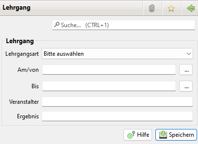

# Lehrgänge

Zur Nutzung der Lehrgänge ist die Option in den Einstellungen \(Administration \| Einstellungen\) zu aktivieren.

## Lehrgangsarten

### Übersicht über die Lehrgangsarten

### Lehrgangsart neu anlegen oder bearbeiten

Die Bezeichnung des Lehrgangs muss ausgefüllt werden. Die restlichen Daten können leer gelassen werden. Diese Daten sind dann einzugeben, wenn beim Mitglied der Lehrgang angelegt wird.

## Lehrgangsübersicht beim Mitglied

## Lehrgang beim Mitglied anlegen

Über den Button "Neuer Lehrgang" lässt sich ein neuer Lehrgang anlegen.

## Lehrgangsübersicht

Der Übersicht View für Lehrgänge zeigt alle vorhandenen Lehrgänge an.

Über den Filterbereich lässt sich nach verschidenen Kriterien filtern.

