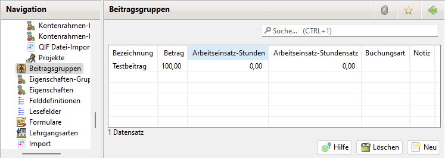
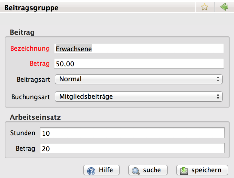

# Beitragsgruppen

Mit Neu kann eine neue Beitragsgruppe eingerichtet werden.

Durch einen Doppelklick wird die Bearbeitung einer Beitragsgruppe eingeleitet.

Durch die Markierung einer Beitragsgruppe und Löschen wird die Löschung eingeleitet. Alternativ kann mit einem rechten Mausklick auf eine Beitragsgruppe ein Kontext-Menü geöffnet werden. Damit kann eine Beitragsgruppe, die keinem Mitglied zugeordnet ist, gelöscht werden. Bei zugeordneten Beitragsgruppen erscheint eine Fehlermeldung

Es muss mindestens eine Beitragsgruppe erfasst werden. Jeder Beitragsgruppe ist eine der folgenden Arten zuzuordnen:

1. Normal
2. Familie: Zahler
3. Familie: Angehöriger
4. Die Zuordnung einer Buchungsart bewirkt die korrekte Verbuchung des Mitgliedsbeitrages in der Buchführung.

Zu einer Beitragsgruppe kann eine interne Notiz erfaßt werden.

## Beitragsart Normal

Dies ist die Standard-Beitragsart, die für alle Mitglieder gewählt sein sollte, die nicht zu einer \(als solchen gemeldeten\) Familie gehören.

## Beitragsart Familie

Die Beitragsart Familie setzt sich aus zwei Beitragsgruppen zusammen. Das Hauptmitglied, das das zahlende Mitglied ist, wird in einer Beitragsgruppe der Art Familie: Zahler geführt. Alle anderen Familienangehörigen werden in eine Beitragsgruppe der Art Familie: Angehöriger. Dabei ist zu beachten, dass nur dem zahlenden Mitglied ein Beitrag berechnet wird, die Angehörigen sind beitragsbefreit.

Die Gruppierung in Familienverbände erlaubt die schnelle Übersicht aller Familienmitglieder auf der Detailansicht aller Familienmitglieder. Siehe auch Mitglieder -&gt; Mitgliedschaft und Beitragsmodelle -&gt; Familientarif.

Siehe Familientarife

## Sekundäre Beitragsgruppen

Sollen für Mitglieder die Beiträge aus mehr als einer Beitragsgruppe abgerechnet werden, können sekundäre Beitragsgruppen eingerichtet werden. Dazu muss unter Administration \| Einstellungen \| Anzeige das Häkchen "sekundäre Beitragsgruppen anzeigen" gesetzt werden. Anschließend ist es möglich, Beitragsgruppen als sekundäre Beitragsgruppen zu kennzeichnen.

Die so gekennzeichneten Beitragsgruppen können den Mitgliedern als sekundäre Beitragsgruppe zugewiesen werden.
