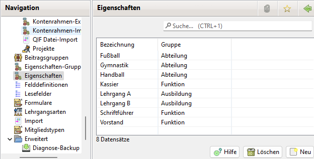

# Eigenschaften

Jedem Mitglied können Eigenschaften zugeordnet werden. Die Eigenschaften werden unter Administration\|Eigenschaften bearbeitet. Jeder Eigenschaft ist eine [Eigenschaften-Gruppe ](eigenschaften-gruppen.md)zuzuordnen.

