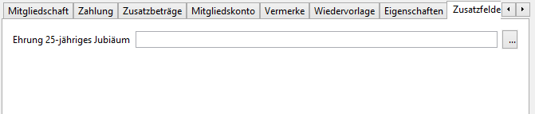
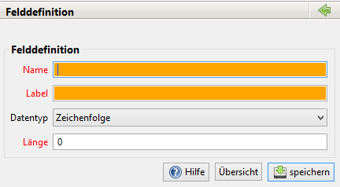

# Zusatzfelder

Der Benutzer kann zusätzliche Datenfelder \(=Zusatzfelder\) definieren.

Diese erscheinen beim Mitglied unter Reiter dem "Zusatzfelder".

Zusätzlich lassen sie sich in der Tabelle der Mitgliederliste anzeigen. Dazu sind die entsprechenden Mitgliedern Spalten in den [Einstellungen](../einstellungen.md) zu aktivieren.

Eingerichtet werden solche Zusatzfelder unter JVerein -&gt; Administration -&gt; Felddefinitionen

Durch einen Klick auf neu öffnet sich folgendes Fenster:

Der Names des Feldes kann auch den Zeichen a-z und 0-9 und \_ \(Unterstrich\) bestehen. Er darf keine Leerzeichen enthalten und sich nicht mit existierenden Feldnamen überschneiden. Als Label kann ein beliebiger Begriff verwendet werden, der bei der Eingabe der Daten den Feld vorangestellt wird.

Folgende Datentypen stehen zur Verfügung:

* Zeichenkette \(bis zu 1.000 Zeichen lang\)
* Datum \(Format TT.MM.JJJJ\)
* Ganzzahl
* Ja/Nein-Wert
* Währung

Feldnamen und Label können jederzeit geändert werden. Daten gehen hierdurch nicht verloren. Bis zur Version 1.2 \(einschl.\) kann ein Feld kann nur gelöscht werden, wenn bei keinem Mitglied Daten in diesem Feld gespeichert sind. Ab Version 1.3 werden die Daten nach Rückfrage gelöscht.

Bei der Änderung des Datentypen ist zu beachten, dass eine Konvertierung möglich sein muss. Beispielsweise kann ein Zusatzfeld vom Typ Zeichenfolge nur dann in den Typ Datum umgewandelt werden, wenn ausschließlich Daten in der Form TT.MM.JJJJ gespeichert sind. Alle Datentypen können in Zeichenfolge umgewandelt werden.
