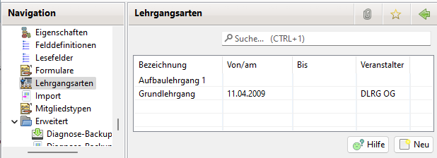

# Lehrgangsarten

Zur Nutzung der Lehrgänge ist die Option in den Einstellungen \(Administration \| Einstellungen\) zu aktivieren.

## Übersicht über die Lehrgangsarten

## Lehrgangsart neu anlegen oder bearbeiten

Die Bezeichnung des Lehrgangs muss ausgefüllt werden. Die restlichen Daten können leer gelassen werden. Diese Daten sind dann einzugeben, wenn beim Mitglied der Lehrgang angelegt wird.
