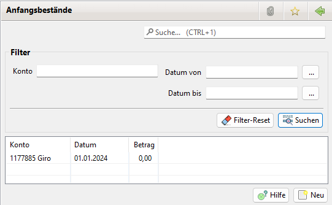

# Anfangsbestand

## Allgemeines

Für jedes Konto muss zum Beginn des Geschäftsjahres der Anfangsbestand gebucht werden. Wird ein Konto im Laufe des Jahres eröffnet, ist der Bestand zu diesem Zeitpunkt zu buchen.

Kontobestände können nur in zeitlich aufsteigender Reihenfolge eingegeben werden. Wurde beispielsweise zu einem Konto der Bestand zum 1.1.2008 eingegeben, kann nicht mehr für den 1.1.2007 gebucht werden.

Anfangsbestände, die durch einen Jahresabschluss erfasst sind, können nicht mehr geändert oder gelöscht werden. Außerdem können keine neuen Anfangsbestände für abgeschlossene Zeiträume eingegeben werden.

## Auflistung Anfangsbestände

Der Filterbereich erlaubt es nach Anfangsbeständen in einem vorgegebenen Zeitraum zu filtern.

Der Filterparameter "Nummer" erlaubt es nach der Kontonummer zu filtern.

Der Filterparameter "Bezeichnung" erlaubt es nach dem Kontonamen zu filtern.

Der Werte müssen nicht vollständig eingegeben werden da auch nach teilweiser Übereinstimmung gefiltert wird.

Über den Button Neu werden neue Anfangsbestände aufgenommen. Mit einem Doppelklick auf einen Anfangsbestand kann der Bestand bearbeitet werden. Ein Rechtsklick auf einen Anfangsbestand öffnet ein Kontextmenü. Damit kann ein Anfangsbestand gelöscht werden.

