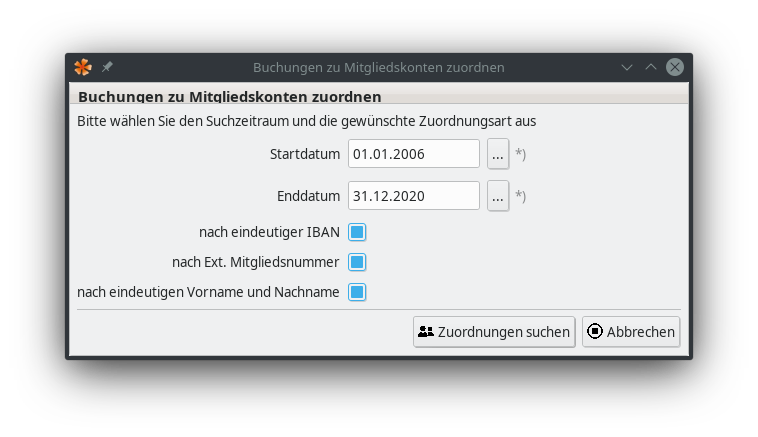

# Buchungen

## Liste der Buchungen

Die im System gespeicherten Buchungen können nach folgenden Kriterien selektiert werden:

* Konto
* Buchungsart
* Projekt
* von Datum
* bis Datum
* enthaltener Text

Mit einem Doppelklick auf eine Buchung wird die Detailansicht zur Bearbeitung geöffnet. Mit einem rechten Mausklick öffnet sich ein Kontextmenü. Damit können neue Buchungen aufgenommen werden und bestehende Buchungen gelöscht werden. Der Export der Daten ins PDF-Format wird durch einen Klick auf PDF angestoßen.

Buchungen können nur neu aufgenommen, geändert oder gelöscht werden, wenn sie nicht durch einen [Jahresabschluss](jahresabschluss.md) abgeschlossen wurden.

## Automatische Zuordnung von Buchungen zu einem Mitgliedskonto

In der Ansicht Buchführung -> Buchungen gibt es den Button "Zuordnung", mit dem eine automatische Zuordnung von Buchungen zu Mitgliedskonten vorgenommen werden kann. Diese kann auf Basis einer eindeutigen IBAN, der Mitgliedsnummer im Verwendungszweck und/oder den eindeutigen Vor- und Nachname im Verwendungszweck vorgenommen werden. Über das Start- und Enddatum kann der Suchbereich von aktiven Mitgliedern, Buchungen und Mitgliedskonten eingeschränkt werden.

Folgende Zuordnungsregeln bestehen:

* Ist eine IBAN, oder der Vor- und Nachname über den angegeben Suchzeitraum eines aktiven Mitglieds nicht eindeutig, findet keine Zuordnung mit dieser Zuordnungsart für dieses Mitglied statt.
* Wurden mehrere Zuordnungsarten auf einmal angegeben (IBAN, Mitgliedsnummer, Vor- und Nachname) wird eine Zuordnung in der genau dieser Reihenfolge versucht.
* Wurde unter Administration -> Einstellungen -> Anzeige „externe Mitgliedsnummer“ angegeben, wird anstatt der Mitgliedsnummer mit der externe Mitgliedsnummer im Verwendungszweck gesucht, falls diese Zuordnungsart gewählt wurde eine Zuordnung findet nur statt, wenn sowohl das Mitglied als auch das Mitgliedskonto den Zahlungsweg Überweisung aufweist.
* Der Betrag der Buchung muss genau mit dem offenen Betrag des Mitgliedskontos übereinstimmen, damit eine Zuordnung erfolgt.
* Gibt es mehrere Buchungen und Mitgliedskonten, die in den angegebenen Zeitraum passen würden, erfolgt die Zuordnung mit dem jeweils ältesten zuerst.

Nach der Suche wird ein Dialog angezeigt, der die Zuordnungen dem Nutzer präsentiert. Dieser kann diese Zuordnungen auf Wunsch dann persistieren lassen.

## Import

Siehe [Buchungsimport](buchungsimport.md)

## CSV-Export

Die über die Suchkriterien ausgewählten Buchungen können mit einem Klick auf CSV-Export als CSV-Datei ausgegeben werden. Dabei werden bei Nutzung des Mitgliedskontos ggfls. auch die Daten des Mitgliedes ausgegeben.

## PDF-Ausgaben

Die nachfolgenden PDF-Auswertungen sind hier abrufbar. Ausführlich beschrieben werden sie im Artikel [Buchführung Zusammenhänge](../../sonstiges/buchfuhrung-zusammenhange.md).

### PDF-Buchungsjournal

Auflistung aller Buchungen nach verschiedenen Sortierungen.

### PDF-Einzelbuchungen

Auflistung aller Buchungen nach Buchungsarten.

### PDF-Summen

Ausgabe der Summen pro Buchungsart.

## Buchungen

Siehe auch [Mitgliedskonto, ](../mitgliedskonto.md)[Splittbuchungen](splittbuchungen.md)

