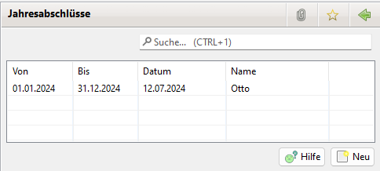
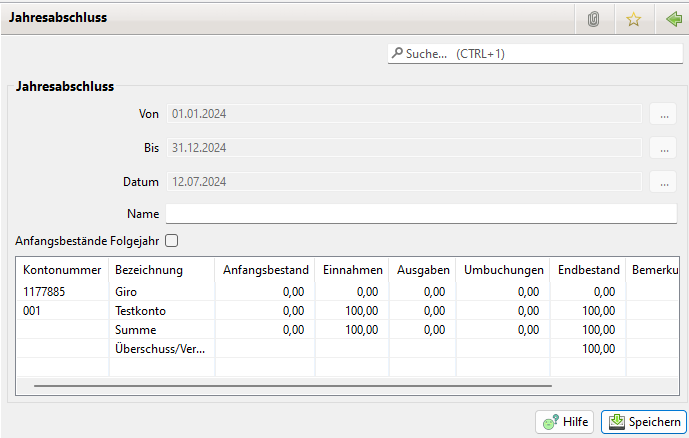

# Jahresabschluss

Zunächst wird eine Liste der bereits getätigten Jahresabschlüsse angezeigt:

In der Liste der Jahresabschlüsse kann mit einem Linksklick auf einen Abschluss ein Kontext-Menü geöffnet werden. Hiermit wird die Löschung eines Jahresabschlusses erledigt.

Damit ein Jahresabschluss verbucht werden kann, müssen folgende Bedingungen erfüllt sein:

* Für jedes Konto muss ein Jahresanfangsbestand existieren
* Alle Buchungen müssen einer Buchungsart zugeordnet worden sein.
* Die Abschlüsse müssen in chronologischer Reihenfolge erfolgen.

Es kann jeweils nur der neuste Jahresabschluss gelöscht werden.

Durch eine Klick auf neu kann ein neuer Jahresabschluss vorgenommen werden:

Tip:

Die Checkbox "Anfangsbestände Folgejahr" sollte aktiviert werden. Damit werden die Endstände in der Liste der Anfangsbestände abgespeichert und als Basis für das nächste Geschäftsjahr verwendet.

