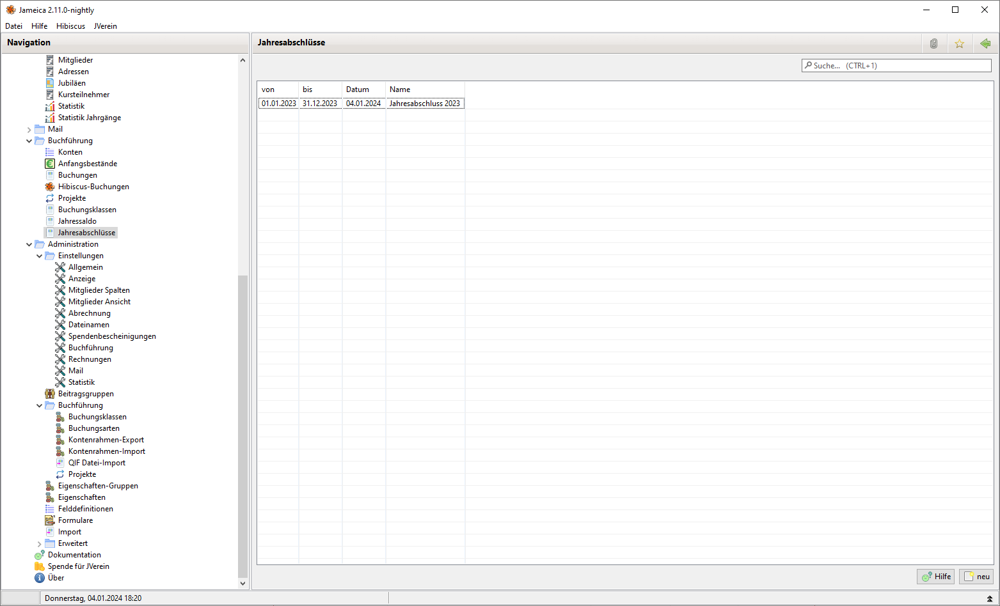

---
layout:
  title:
    visible: true
  description:
    visible: false
  tableOfContents:
    visible: true
  outline:
    visible: true
  pagination:
    visible: true
---

# Jahresabschluss

Um die Buchführung eines Geschäftsjahres abzuschließen wird ein Jahresabschluss erstellt. Dadurch ist es im Nachhinein nicht mehr möglich Änderungen an Buchungen durchzuführen. Siehe hierzu auch [Buchführung Zusammenhänge](../../sonstiges/buchfuhrung-zusammenhange.md)

Zunächst wird eine Liste der bereits getätigten Jahresabschlüsse angezeigt:

<figure><figcaption>
Übersicht über die bereits getätigten Jahresabschlüsse
</figcaption></figure>

Durch eine Klick auf neu kann ein neuer Jahresabschluss erstellt werden.

<figure><figcaption>
Erstellen eines neuen Jahresabschlusses
</figcaption></figure>

Damit ein Jahresabschluss verbucht werden kann, müssen folgende Bedingungen erfüllt sein:

* Für jedes Konto muss ein Jahresanfangsbestand existieren
* Alle Buchungen müssen einer Buchungsart zugeordnet worden sein.
* Die Abschlüsse müssen in chronologischer Reihenfolge erfolgen.

Wird die Option "Anfangsbestände Folgejahr" aktiviert, so wird automatisch das Jahresendsaldo als neuer Anfangsbestand übernommen.

Mittels Rechtsklick auf einen Abschluss kann der Jahresabschluss gelöscht werden. Es ist nur möglich, den neuesten Jahresabschluss zu löschen.
