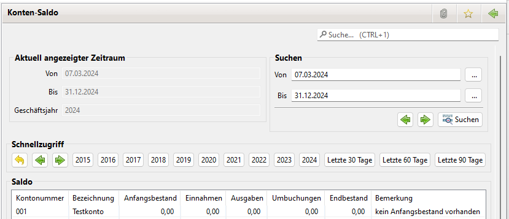

# Kontensaldo

Hier können für alle Konten die Salden eines Geschäftsjahres angezeigt werden. Der Beginn des Geschäftsjahres wird unter Einstellungen eingegeben.

Das jeweilige Geschäftsjahr lässt sich über die Schnellzugriff Buttons auswählen. Mit den Navigations Pfeilen lässt sich die Zeitachse um jeweils 5 Jahre verschieben. Mit dem Zurück Button kommt man zum aktuellen Geschäftsjahr zurück.

Der aktuell ausgewählte Zeiraum wird angezeigt.

Über die Suchen Funktion lassen sich beliebige Zeiträume auswählen. Wird beispielsweise ein Monat ausgewählt, lassen sich die Saldenstände mit den Kontoauszügen der Bank vergleichen.

Mit den den Navigations Pfeilen lässt sich der ausgewählte Bereich nach vorne oder hinten verschieben.

Beginnt das Von Datum an einem Monatsanfang und endet das Bis Datum an einem letzten Tag eines Monats, wird Monatsweise geblättert. Andernfalls mit der Anzahl der Tage des Zeitbereichs.

Sofern kein [Anfangsbestand](anfangsbestand.md) vorhanden ist, wird ein entsprechender Hinweis ausgegeben.

Die Daten können im PDF-Format ausgegeben werden.

