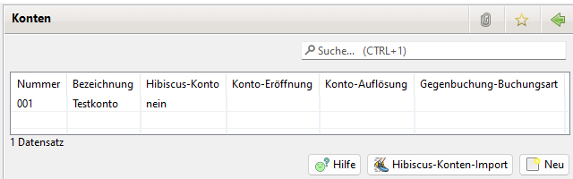
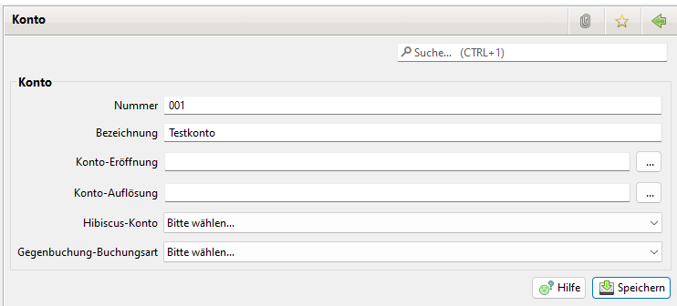

# Konten

## Auflistung der Konten

Durch Doppel Klick auf ein Konto werden die Daten der Kontos angezeigt.
Es lassen sich neue Offlinekonten erstellen oder Online Konten aus Hibiscus importieren.

## Konto

Hier können die Daten der Kontos editiert werden.

Bei Gegenbuchung-Buchungsart lässt sich eine Buchungart einstellen. Falls beim Erzeugen einer Gegenbuchung, die selektierte Buchung, die hier konfigurierte Buchungsart besitzt, wird das Konto automatisch in der Gegenbuchung eingetragen.

Siehe [Buchungen](buchungen.md)