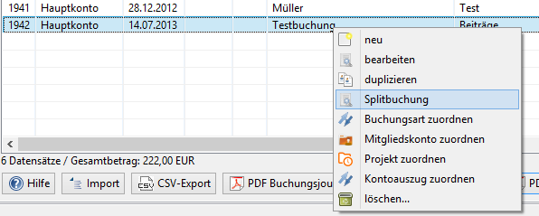
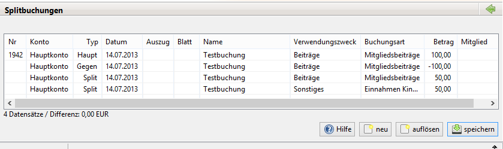

# Splitbuchungen

## Allgemeines

Wofür werden Splitbuchungen gebraucht?

Beispiele:

* Ein Mitglied überweist für mehrere Familienmitglieder den Beitrag in einer Summe. Die Buchung muss für jedes Familienmitglied aufgesplittet werden, damit die Gutschrift für das jeweilige Mitgliedskonto erfolgen kann.
* Der Kassierer überweist einen Gesamtbetrag, der aus buchungstechnischen Gründen auf verschiedene Buchungsarten verteilt werden soll.
* Der Kassierer erzeugt Sammelüberweisungen, deren Einzelposten er auf verschiedene Buchungsarten verteilen muss.

## Splitbuchung erzeugen

Rechtsklick auf die Buchung(en), dann Splitbuchung auswählen:

Es können auch mehrere Buchungen gleichzeitig ausgewählt werden. Sie müssen allerdings den gleichen Betrag haben. Anschliesend wird ein Buchungeintrag bearbeitet. Beim Speichern wird eine analoge Aufteilung der Beträge auch auf alle anderen selektierten Buchungen angewendet. 

Es erscheint dann:

Die angeklickte Buchung erscheint in der ersten Zeile. In der zweiten Zeile erscheint die Gegenbuchung mit umgekehrtem Vorzeichen beim Betrag.

Jetzt können über den "Neu"-Knopf die Splitbuchungen eingegeben werden:

Die Splitbuchungen können nur gespeichert werden, wenn

* Haupt- und Gegenbuchung den gleichen Betrag haben, unabhängig vom Vorzeichen.
* Die Summe der Splitbuchungen muss identisch mit dem Betrag der Hauptbuchung übereinstimmen.
* Die Buchungsart bei der Haupt- und der Gegenbuchung muss identisch sein.
* Jede Buchung muss eine Buchungsart haben.

So können die Buchungen gespeichert werden:

## Anzeige der Buchungen

Die Splitbuchungen werden in der Liste der Buchungen "normal" angezeigt. Ein Doppelklick auf eine Haupt-, Gegen- oder Splitbuchung öffnet den Splitbuchungsdialog.

## Sammelüberweisung

Mit einem Klick auf Sammelüberweisung erscheint folgendes Fenster:

Es werden die in Hibiscus vorhandenen Sammelüberweisungen angezeigt. Mit einem Doppelklick auf eine Sammelüberweisung werden die Einzelposten der Sammelüberweisung in die Splitbuchungen übernommen.

## Splitbuchungen auflösen

Sollte versehentlich eine Splitbuchung erzeugt worden sein, kann sie über den Knopf "Auflösen" wieder aufgelöst werden. Die Gegen- und Splitbuchungen werden gelöscht. Bei der Hauptbuchung wird das Splitbuchungsmerkmal entfernt.

