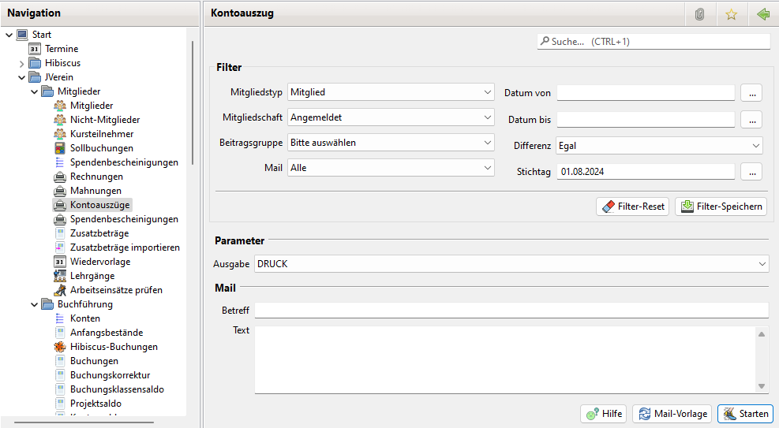

# Kontoauszug

Der Kontoauszug ist eine Liste \(PDF-Ausgabe\) sämtlicher Buchungen auf einem Mitgliedskonto.

Einen Kontoauszug kann in der Anzeige des Mitglieds \(bzw. Nicht-Mitglied\) abgerufen werden und auf einen Zeitraum eingegrenzt werden.

Die jüngsten Positionen des Kontoauszugs werden auch auf dem Personalbogen ausgegeben.

Die Kontoauszüge können für den Druck in ein PDF-Dokument ausgegeben werden oder per Mail an die Mitglieder versandt werden.

## Kontoauszüge selektiv erstellen

Möchten Sie einen Kontoauszug selektiv erstellen, so öffnen Sie den Dialog Mitglieder bzw. Nicht-Mitglieder. Wählen Sie den Filter so, dass die gewünschten Mitglieder angezeigt werden. Selektieren Sie einen oder mehrere Einträge und drücken die rechte Maustaste. Es öffnet sich ein Kontext-Menü. Wählen Sie hier den Menüpunkt "Kontoauszug". Es öffnet sich hier der Dialog Kontoauszug der Sie bei der Erstellung des Kontoauszug unterstützt.

Hier lässt sich bei der Ausgabe zwischen Drucken oder Versenden per Mail wählen.

Alternativ kann in der Detailansicht eines Mitglieds über den Button "Kontoauszug" der Dialog für dieses Mitglied geöffnet werden.

Im Info Feld wird angezeigt wieviele Mitglieder selektiert wurden und welche keine Mailadresse haben. Haben sie keine Mail Adresse werden sie beim Versand per Mail ignoriert.

Über die Buttons lässt sich eine gespeicherte Mailvorlage auswählen.

Das drücken des Startknopf löst bei korrekt eingestellten E-Mail-Server-Daten den Versand der E-Mails aus. Es ist daher ratsam, diese Funktion im Vorfeld zu testen, ohne mit echten Mitgliederdaten/e-mails zu hantieren.

## Kontoauszüge automatisch erstellen

Um automatisch Kontoauszüge zu erstellen wählen Sie im Navigations Baum dem Menü Eintrag "Kontoauszüge" aus. Es öffnet sich ebenfalls der Dialog Kontoauszug.

Im Gegensatz zum selektiven Erstellen wird hier der ein Filter Bereich angezeigt. Es werden dann Kontoauszüge für alle Mitglieder/Nicht-Mitglieder die die Filter Kriterien erfüllen gedruckt bzw. per Mail versendet.

Ist kein Mitgliedstyp ausgewählt werden die Kontoauszüge sowohl für alle Mitglieder als alle Nicht-Mitglieder erzeugt.

Da der Filter hier eine Untermenge des Filters im Mitglied bzw. Nicht-Mitglied Dialog ist, hat man hier weniger Filter Möglichkeiten. Werden weitere Filter Optionen gebraucht muss über den selektiven Weg gegangen werden.

Tip:

Falls Sie Kontoauszüge per Mail versenden wollen, wählen Sie erst bei Mail die Option "Nur mit Mailadresse" und als Ausgabe MAIL. Damit versenden sie die Kontoauszüge an alle Mitglieder die eine Mail Adresse haben.

Falls nicht alle Mitglieder eine Mail Adresse haben, wählen Sie anschliesend bei Mail die Option "Nur ohne Mailadresse" und die Ausgabe DRUCK. Diese können Sie dann per Post verschicken.
