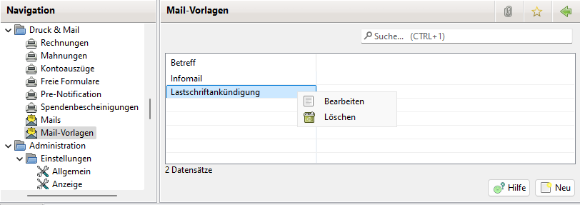

# Mail-Vorlagen

## Allgemeines

Für den Fall, dass immer ähnliche Mails versandt werden, kann die Tipparbeit durch Mail Vorlagen minimiert werden.

## Liste der Mail-Vorlagen

Über das Kontextmenü lassen sich Mail Vorlagen bearbeiten und löschen.

Durch einen Doppelklick auf den Betreff oder durch einen Klick auf Neu öffnet sich das Bearbeitungsfenster.

## Mail-Vorlage

