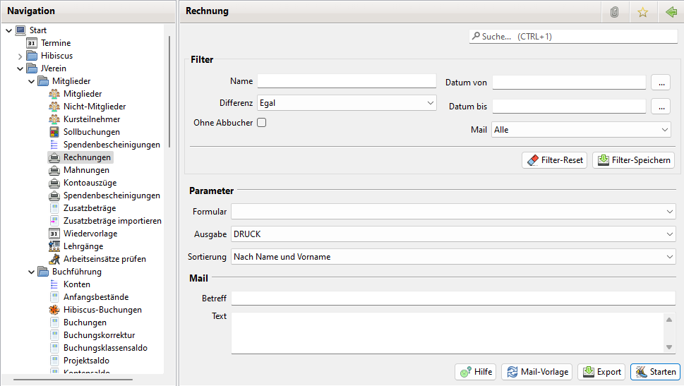

# Rechnungen drucken/mailen

## Allgemeines

Für alle Sollbuchungen können Rechnungen erstellt werden. Dabei hat man die Möglichkeit eine Rechnung selektiv oder automatisch zu erstellen.

Möchten Sie Rechnungen direkt aus JVerein druckfertig generieren, so müssen Sie mindestens ein Rechnungsformular angelegt haben. Die Erstellung von Rechnungsformularen ist unter Administration\|Formulare beschrieben.

Die Rechnungen können für den Druck in ein PDF-Dokument ausgegeben werden oder per Mail an die Mitglieder versandt werden.

## Rechnungen selektiv erstellen

Möchten Sie eine Rechnung selektiv erstellen, so öffnen Sie den Dialog Sollbuchungen. Wählen Sie den Filter so, dass die gewünschten Daten angezeigt werden. Selektieren Sie einen oder mehrere Einträge und drücken die rechte Maustaste. Es öffnet sich ein Kontext-Menü. Wählen Sie hier den Menüpunkt "Rechnung erstellen". Es öffnet sich hier der Dialog Rechnung der Sie bei der Erstellung der Rechnung unterstützt.

Hier lässt sich bei der Ausgabe zwischen Drucken oder Versenden per Mail wählen.

Im Info Feld wird angezeigt wieviele Sollbuchungen selektiert wurden und ob  zugehörige Mitglieder keine Mailadresse haben. Haben sie keine Mail Adresse werden sie beim Versand per Mail ignoriert.

Über die Buttons lässt sich eine gespeicherte Mailvorlage auswählen bzw. die Rechnung exportieren.

## Rechnungen automatisch erstellen

Um automatisch Rechnungen zu erstellen wählen Sie im Navigations Baum dem Menü Eintrag "Rechnungen" aus. Es öffnet sich ebenfalls der Dialog Rechnungen.

Im Gegensatz zum selektiven Erstellen wird hier der gleiche Filter Bereich angezeigt wie im Sollbuchungen Dialog. Es werden dann Rechnungen für alle Sollbuchungen die die Filter Kriterien erfüllen gedruckt bzw. per Mail versendet.

Tip:

Falls Sie Rechnungen per Mail versenden wollen, wählen Sie erst bei Mail die Option "Nur mit Mailadresse" und als Ausgabe MAIL. Damit versenden sie die Rechnung an alle Mitglieder die eine Mail Adresse haben.

Falls nicht alle Mitglieder eine Mail Adresse haben, wählen Sie anschliesend bei Mail die Option "Nur ohne Mailadresse" und die Ausgabe DRUCK. Diese können Sie dann per Post verschicken.

## Rechnungen drucken

Es öffnet sich ein Dialog der den Speicherort und den Dateinamen der PDF Datei abfragt, in die alle Rechnungen erstellt werden. Mit Bestätigen dieser Eingaben werden die Rechnungen generiert und die fertige PDF geöffnet. Diese können Sie nun ausdrucken.

## Rechnungen per Mail versenden

Rechnungen können per Mail versandt werden. Dazu muss die Mailkonfiguration abgeschlossen sein. Bei der Ausgabe wird zu Kontrollzwecken eine ZIP-Datei mit allen erstellten und versandten Rechnungen erstellt.

## Rechnungsdaten exportieren

Sollen die Rechnungsdaten exportiert werden, so drücken Sie im Dialog Rechnung den Schalter Export. Es öffnet sich ein Dialog der den Speicherort und den Dateinamen der CSV abfragt. Bestätigen Sie diesen Dialog, werden die Rechnungsdaten in diese Dateien exportiert und können danach z.B. für einen Serienbrief verwendet werden.

Für die einzelnen Zahlungswege können Texte unter Administration\|Einstellungen\|Rechnungen hinterlegt werden.
