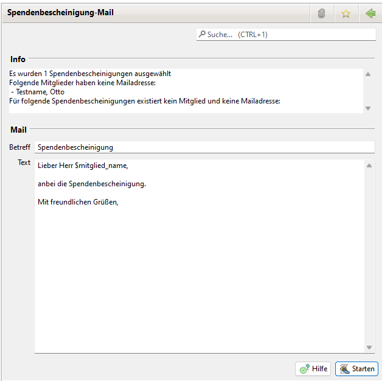
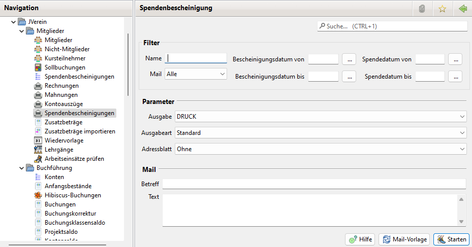

# Spendenbescheinigung drucken/mailen

## Spendenbescheinigung selektiv per Mail versenden

Durch eine Klick auf den Menüpunkt Spendenbescheinigungen versenden wird der Spendenbescheinigung Mail View an gezeigt.

Im Info Feld erfolgt eine Information über die Anzahl der ausgewählten Spendenbescheinigungen ausgegeben.

Danach wird angezeigt für welche Mitglieder keine Mail Adresse konfiguriert ist und ihre Spendenbescheinigungen damit nicht verschickt werden.

Es wird ebenfalls angezeigt für welche Spendenbescheinigung kein Mitglied zugeordnet ist. In diesem Fall wird der Inhalt von Zeile 1..3 ausgegeben und keine Mail verschickt.

In den Parametern lässt sich einstellen ob das Standard oder ein individuelles Format verwendet werden soll. Ebenso lässt sich einstellen ob eine extra Seite mit einer Anschrift ausgedruckt werden soll, welche in ein Brieffenster passt.

Im Bereich Mail lässt sich der Betreff und der Mailtext eingeben.

Durch Klick auf den Senden Button werden die Spendenbescheinigungen an die Mitglieder versendet.

## Spendenbescheinigung automatisch drucken oder per Mail versenden

Neben der individuellen Auswahl für Drucken und Versenden über das Kontextmenü im Spendenbescheinigungen Dialog lässt sich dies auch über den Eintrag im Navigations Menü erreichen.

Der Dialog enthält hier die Filter Optionen wie im Spendenbescheinigungen Dialog und zusätzlich die Auswahl der Ausgabe DRUCK/EMAIL.

Es werden hier alle Spendenbescheinigungen gedruckt bzw. versendet die die Filterkriterien erfüllen. Eine individuelle Auswahl aus den gefilterten Einträgen ist hier nicht möglich.

