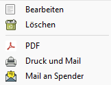
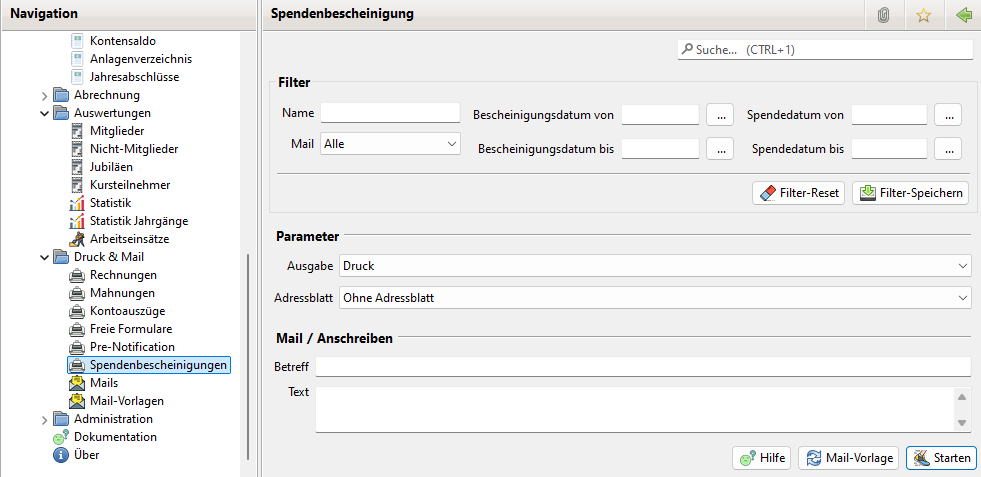

# Spendenbescheinigung drucken/mailen

## Spendenbescheinigungen selektiv drucken

Im View Spendenbescheinigungen werden bereits erstellte Spendenbescheinigungen angezeigt.

In der Liste können ein oder mehrere Einträge markiert werden. Über ein Kontextmenu \(rechter Mausklick\) stehen verschiedene Aktionen zur Verfügung.

* Bearbeiten: Spendenbescheinigung bearbeiten.
* Löschen: Spendenbescheinigung löschen.
* PDF: Spendenbescheinigung als PDF drucken. Es wird ein individuelles Formular verwendet welches in der Spendenbescheinigung konfiguriert ist oder ein Standard Ausdruck wenn es so in der Spendenbescheinigung gesetzt ist.
* Druck und Mail: Es wird der Dialog zum Drucken bzw. Versenden von Spendenbescheinigungen geöffnet. Diese bietet weitere Druckoptionen. Siehe weiter unten.
* Mail an Spender: Es lässt sich eine Mail an den Spender verschicken.

## Spendenbescheinigung selektiv per Mail versenden

Möchten Sie eine Spendenbescheinigung selektiv versenden, so öffnen Sie den Dialog für Spendenbescheinigungen. Wählen Sie den Filter so, dass die gewünschten Spendenbescheinigungen angezeigt werden. Selektieren Sie einen oder mehrere Einträge und drücken die rechte Maustaste. Es öffnet sich ein Kontext-Menü. Wählen Sie hier den Menüpunkt "Spendenbescheinigungen versenden". Es öffnet sich hier der Dialog Spendenbescheinigungen der Sie beim Versenden der Spendenbescheinigungen unterstützt.

Im Info Feld erfolgt eine Information über die Anzahl der ausgewählten Spendenbescheinigungen ausgegeben.

Danach wird angezeigt für welche Mitglieder keine Mail Adresse konfiguriert ist und ihre Spendenbescheinigungen damit nicht verschickt werden.

Es wird ebenfalls angezeigt für welche Spendenbescheinigung kein Mitglied zugeordnet ist. In diesem Fall wird der Inhalt von Zeile 1..3 ausgegeben und keine Mail verschickt.

In den Parametern lässt sich einstellen ob das Standard oder ein individuelles Format verwendet werden soll. Ebenso lässt sich einstellen ob eine extra Seite mit einer Anschrift ausgedruckt werden soll, welche in ein Brieffenster passt.

Im Bereich Mail lässt sich der Betreff und der Mailtext eingeben.

Durch Klick auf den Starten Button werden die Spendenbescheinigungen an die Mitglieder versendet.

## Spendenbescheinigung automatisch drucken oder per Mail versenden

Neben der individuellen Auswahl für Drucken und Versenden über das Kontextmenü im Spendenbescheinigungen Dialog lässt sich dies auch über den Eintrag im Navigations Menü erreichen.

Der Dialog enthält hier die Filter Optionen wie im Spendenbescheinigungen Dialog und zusätzlich die Auswahl der Ausgabe DRUCK/MAIL.

Mit der Option Adressblatt lässt sich auswählen, ob eine zusätzliche Seite an die Spendenbescheinigung angefügt werden soll. Auf diese lässt sich eine Briefanschrift und/oder ein Anschreiben ausgeben. Das Anschreiben wird im Feld Text eingegeben.

Es werden hier alle Spendenbescheinigungen gedruckt bzw. versendet die die Filterkriterien erfüllen. Eine individuelle Auswahl aus den gefilterten Einträgen ist hier nicht möglich.

