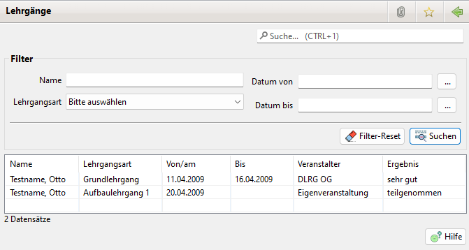

# Lehrgänge

Zur Nutzung der Lehrgänge ist die Option in den Einstellungen \(Administration \| Einstellungen\) zu aktivieren.

## Lehrgangsübersicht

Der Übersicht View für Lehrgänge zeigt alle vorhandenen Lehrgänge an.

Über den Filterbereich lässt sich nach verschiedenen Kriterien filtern.

## Lehrgang löschen

Durch rechts Klick auf einen Lehrgangs Eintrag erschein ein Menü zum Löschen eins Eintrags.

