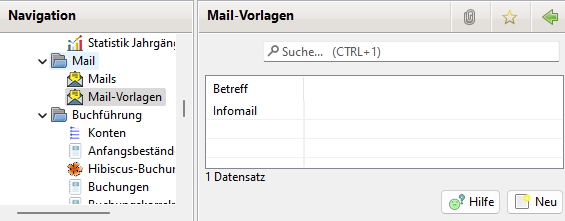
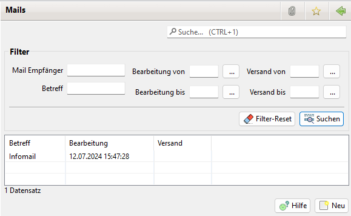

# Mail

In JVerein ist ein einfaches Mail-Programm integriert. Hiermit ist es möglich, einfache Textmails mit Dateianhängen an einzelne Mitglieder, Gruppen von Mitglieder oder alle Mitglieder zu verschicken. Es werden stets einzelne Mails versendet, d.h. bei bspw. 200 ausgewählten Mitgliedern eben auch 200 Mails an jeweils nur die E-Mail-Adresse des Mitglieds \(nur eine Adresse im To\). Die einzelnen E-Mails können mittels Variablen personalisiert werden.

Der Empfang von Mails ist nicht vorgesehen.

## Konfiguration

Die Konfiguration ist unter Einstellungen beschrieben.

## Mail-Vorlagen

Für den Fall, dass immer ähnliche Mails versandt werden, kann die Tipparbeit durch Mailvorlagen minimiert werden.

Durch einen Doppelklick auf den Betreff oder durch einen Klick auf neu öffnet sich das Bearbeitungsfenster.

## Mails

In der Liste aller Mails wird der Betreff, das Bearbeitungs- und das Versanddatum angezeigt.

Über den Filter kann nach verschiedenen Kriterien gefiltert werden z.B. nach "Mail Empfänger" um zu sehen welche Mails an jemanden versendet wurden.

Durch einen Klick auf neu öffnet sich ein Mail-Vorlagen-Auswahlfenster:

Entweder wird eine Mailvorlage ausgewählt oder es geht ohne Vorlage weiter.

Ein Doppelklick auf eine Mail öffnet das Bearbeitungsfenster.

Durch einen Klick auf Hinzufügen öffnet sich folgendes Auswahlfenster:

In diesem Fenster sind zunächst alle an- und abgemeldeten Mitglieder sowie alle weiteren Adressen aufgelistet, bei denen eine E-Mail-Adresse hinterlegt ist. Mail-Empfänger können nun einzeln durch Setzen des Häckchens vor der E-Mail-Adresse ausgewählt werden. Ferner stehen \(ab Version 2.8.4\) folgende Filter bzw. Selektoren zur Verfügung:

* Durch einen Klick auf Eigenschaften öffnet sich ein Dialog mit dem Mitglieder/Adressen anhand von Eigenschaften ausgewählt werden können.
* aktive Mitglieder selektiert alle aktuell angemeldeten Mitglieder \(Stichtag=Tagesdatum\).
* Mit inaktive Mitglieder werden alle abgemeldeten Mitglieder ausgewählt.
* Um alle Adressen \(also nur sämtliche weiteren Adressen jedoch keine Mitglieder\) auszuwählen bitte alle Adressen anklicken.
* Bei aktive Mitglieder und Adressen bleiben nur die abgemeldeten Mitglieder unselektiert \(entspricht aktive Mitglieder und dann alle Adressen\).
* Mit alle werden alle E-Mail-Adressen ausgewählt.

Die obigen Filter/Selektoren wirken additiv, mit keinen wird die komplette Auswahl rückgängig gemacht. Ein Klick auf übernehmen fügt die ausgewählten E-Mail-Adressen dann als Empfänger in die Mail ein.

Der Mailversand kann auch über einen Rechtsklick auf ein Mitglied ausgelöst werden:

## Variablen

Im Betreff und im Text können Variable eingefügt werden, die beim Mailversand mit den konkreten Daten gefüllt werden. Mit Rechtsklick auf den Empfänger können die verfügbaren Variablen und ihre Belegung angezeigt werden.

siehe auch [Mitglieder](mitglieder.md) und [Variable](../sonstiges/variable.md)

