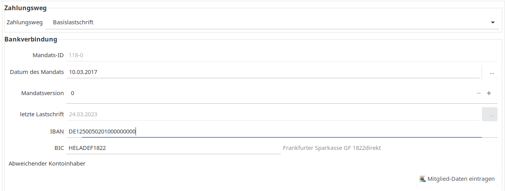

# Mitglieder

## Suche

### Allgemein

Das Fenster der Mitglieder-Suche besteht aus zwei Teilen: Filter \(oben\) und Mitgliedertabelle \(unten\). Die angezeigten Mitglieder können nach verschiedenen Kriterien gefiltert werden:

* Nachname
* Mitgliedschafts-Status "Angemeldet", "Abgemeldet" und "Beide"
* Externe Mitgliedsnummer \(optional\)
* Eigenschaften
* Beitragsgruppe
* Zusatzfelder \(optional\)
* Geburtsdatum
* Geschlecht
* Eintritts- und Austrittsdatum
* Stichtag
* Mail

Jeweils beim Verlassen eines Feldes mit pull down Menüs wird die Suche ausgelöst. Änderungen in Eingabefeldern für Text oder Datum lösen erst eine Suche aus wenn der Suchen Button gedrückt wird oder alternativ durch drücken des Enter auf der Tastatur.

Nach einem Doppelklick auf das Mitglied werden die kompletten Daten angezeigt. Mit einem Rechtsklick auf ein Mitglied öffnet sich ein Kontextmenü. Damit kann das Mitglied bearbeitet oder gelöscht werden. Außerdem ist die Ausstellung einer [Spendenbescheinigung](spendenbescheinigung.md) möglich.

Die Filterkriterien können für eine spätere Verwendung in einem [Suchprofil](suchprofil.md) gespeichert werden.

Mit dem Reset Button können die Filter Felder auf Defaultwerte zurückgesetzt werden.

### Filterung nach Eigenschaften

Es können eine oder mehrere Eigenschaften ausgewählt werden \(STRG-Taste beim Mausklick gedrückt halten\).

Folgende Eigenschaften-verknüpfungen sind möglich:
* "und": D.h. es werden nur die Mitglieder angezeigt, die alle Eigenschaften haben.
* "oder": D.h. es werden die Mitglieder angezeigt, die mindestens eine der ausgewählten Eigenschaften haben.

### Filterung nach Zusatzfeldern

Soll nach Zusatzfelder gefiltert werden, kommt es auf den Datentyp des jeweiligen Zusatzfeldes an. Bei einem Ja/Nein Feld kann nur nach Ja-Einträgen gefiltert werden. Bei einem Textfeld gelten zur Filterung die SQL-Regeln für einen Textvergleich: Hier können die Wildcards % \(0...n beliebige Zeichen\) und \_ \(genau 1 beliebiges Zeichen\) eingesetzt werden. Durch die Verwendung der Kombination \_% kann man nach allen nicht leeren Textfeldern filtern.

## Grunddaten des Mitglieds

Im oberen Teil sind die allgemeinen Daten des Mitgliedes zu finden. Wird eine Postleitzahl eingegeben, für die bereits ein Mitglied gespeichert ist, wird der entsprechende Ort übernommen.

Hinweis zur E-Mail-Adresse: In JVerein kann aktuell je Mitglied nur eine E-Mail-Adresse gespeichert werden. Hat ein Mitglied aber mehrere E-Mail-Adressen, kann man sich derzeit mit der 'Group'-Notation behelfen, Details dazu im [http://www.jverein.de/forum](http://www.jverein.de/forum).

Sofern in den [Einstellungen](administration/einstellungen.md) der Parameter "Juristische Personen erlaubt" gesetzt ist, wird bei der Neuaufnahme von Mitgliedern folgender Dialog eingeblendet:

Hier kann ausgewählt werden ob es sich um eine

* natürliche Person
* juristische Person

handelt. Sofern "juristische Person" ausgewählt wird, sieht der Bildschirm so aus:

## Mitgliedschaft

Eintrittsdatum und Geburtsdatum sind Pflichtfelder wenn es in den Einstellungen so konfiguriert wurde. Beitragsgruppe ist ein Pflichtfeld. Die Beitragsgruppen können unter [Beitragsgruppen](administration/beitragsgruppen.md) für jeden Verein individuell konfiguriert werden. Siehe auch [Beitragsmodelle](../allgemein/beitragsmodelle.md) und [Einstellungen](administration/einstellungen.md). Beim Austrittsdatum wird das Datum des satzungsgemäßen Austritts \(z. B. der 31.12. des jeweiligen Jahres\) eingetragen. Unter Kündigung wird das Datum des Eingangs der Kündigung vermerkt.

Standardaussehen des Formulars:

Sofern eine Beitragsgruppe ausgewählt wurde, die mit "Familie: Zahler" gekennzeichnet ist, verändert sich das Formular wie folgt:

Die Person \(ebenfalls ein Mitglied\), die für das Mitglied zahlt, kann aus einer Liste ausgewählt werden. Hinweis: Dieser Person muss eine Beitragsgruppe der Art "Familie: Zahler" zugewiesen sein, ansonsten taucht sie in der Auswahl-Box nicht auf. Bei einer Beitragsgruppe, die mit "Familie: Angehöriger" gekennzeichnet ist, sieht das Formular so aus:

Hier werden die Personen angezeigt, für die das Mitglied die Beiträge zahlt.

Sinn und Zweck dieser Familienverknüpfung ist es, die Voraussetzungen für die Familienmitgliedschaft prüfen zu können. Tritt ein Mitglied aus, dass für andere Mitglieder als Zahler eingetragen ist, kommt eine entsprechende Fehlermeldung. Dann sind die Beitragsgruppen der beitragsfreien Mitglieder zu verändern oder es ist ein anderer Zahler einzutragen.

## Zukünftige Beitragsgruppen

Hier kann man Beitragsgruppen eintragen, die für dieses Mitglied ab einem definierten Datum gültig sein soll. Hat man z.B. im ersten Jahr einen vergünstigten Probebeitrag, trägt man diesen oben unter Beitragsgruppe ein. Die Beitragsgruppe für den normalen Beitrag, der gültig werden soll, sobald die Probezeit beendet ist, kann man sofort in dieser Tabelle zukünftige Beitragsgruppen eintragen.

Bei Programmstart wird geprüft, ob das Datum für eine Änderung der Beitragsgruppe erreicht wurde. Alle zu ändernden Mitglieder werden in einer Liste angezeigt und es können die neuen Beitragsgruppen für ausgewählte Mitglieder oder alle angezeigten übernommen werden. Damit die Daten angezeigt werden, ist einmal die Box "künftige Beitragsgruppen" zu aktivieren:

Hinweis: Die Box ist nur sichtbar, wenn im Menü "Start" ausgewählt wurde.

Zum Erfassen einer zukünftigen Beitragsgruppe klicken Sie mit der rechten Maustaste in die Tabelle. Im Kontextmenü wählen Sie den Punkt Beitragsgruppe hinzufügen. Es öffnet sich eine Ansicht, in der Sie die neue Beitragsgruppe auswählen und das Datum erfassen, ab dem diese Gruppe gültig werden soll. Sie können in einem Bemerkungsfeld noch hinterlegen, warum diese Änderung durchgeführt werden sollte.

Bei Mitgliedern von Beitragsgruppen der Beitragsart Familie: Zahler können Sie nur andere Beitragsgruppen mit der Beitragsart Familie: Zahler als zukünftige Beitragsgruppe eintragen.

Bei Mitgliedern von Beitragsgruppen der Beitragsart Normal können Sie nur andere Beitragsgruppen mit der Beitragsart Normal als zukünftige Beitragsgruppe eintragen.

Bei Mitgliedern von Beitragsgruppen der Beitragsart Familie: Angehöriger können Sie keine zukünftigen Beitragsgruppen hinterlegen, weil hier u.U. Zahlungsdaten fehlen.

## Sekundäre Beitragsgruppen

Für ein Mitglied können auch Beiträge aus mehreren Beitragsgruppen abgerechnet werden. Dazu muss unter Administration \| Einstellungen \| Anzeige das Häkchen bei "sekundäre Beitragsgruppen anzeigen" gesetzt werden und unter Administration \| Beitragsgruppen muss für mindestens eine Beitragsgruppe das Höschen "sekundäre Beitragsgruppe" gesetzt werden. Dann kann beim Mitglied eine entsprechende Auswahl vorgenommen werden.

## Zahlung

Als Zahlungswege stehen

* Basislastschrift
* Barzahlung
* Überweisung

zur Verfügung. Die Standardwerte können unter Administration\|Einstellungen\|Beiträge festgelegt werden.

Beim Zahlungsweg Basislastschrift sind BIC und IBAN anzugeben. Durch die Eingabe einer BLZ gefolgt von einem Leerzeichen und der anschließenden Kontonummer wird der SEPA-Konverter angestoßen und die IBAN und die BIC ermittelt.

Die Mandats-ID wird automatisch aus der Mitgliedsnummer oder optional aus der externen Mitgliedsnummer \(siehe Einstellungen\) gebildet. Zusätzlich wird ein Versionszähler geführt, der das 1., 2., 3. .... Mandat referenziert.

Das Datum des Mandats muss angegeben werden.

Zusätzlich kann ein abweichender Kontoinhaber angegeben werden:

Mit dem Button "Mitglied-Daten übernehmen" werden einige der Daten des Mitglieds übertragen. Hinweis: Es werden nicht alle Daten übertragen, da es sich um einen abweichenden Kontoinhaber handelt. Z. B. der Vorname wird nicht übertragen.

## Zusatzbeträge

Zusätzliche Zahlungen \(z. B. Eigenanteile für Fahrten, Strafgelder ...\) können über Zusatzbeträge verarbeitet werden.

Ein Klick auf Neu öffnet folgendes Fenster:

Weitere Informationen dazu: [Zusatzbeiträge](zusatzbetrage.md)

## Vermerke

Vermerke über das Mitglied \(z. B. Funktionen ...\) können in zwei Datenfeldern hinterlegt werden.

## Wiedervorlage

Mit einem Rechtsklick auf einen Wiedervorlagetermin kann entweder ein Erledigungsdatum gesetzt oder zurückgesetzt werden. Mit einem Klick auf Neu öffnet sich folgendes Fenster:

Zusätzlich werden die Daten unter Jameica \| Termine in einem Kalenderformat angezeigt.

## Eigenschaften

Die Eigenschaften des Mitgliedes können angehakt werden, bzw. das Häkchen kann entfernt werden. Die Änderungen werden bei Druck auf den Speichern-Knopf in die Datenbank geschrieben.

[Eigenschaften](administration/eigenschaften.md) und [Eigenschaften-Gruppen](administration/eigenschaften-gruppen.md) sind in der Administration einzurichten.

## Zusatzfelder

Durch [Felddefinitionen](administration/felddefinition.md) können zusätzliche Datenfelder erfasst werden.

## Lehrgangsübersicht

Zur Nutzung ist in den [Einstellungen](administration/einstellungen.md) das entsprechende Häkchen zu setzen und die [Lehrgänge](administration/lehrgange.md) sind in der Administration&gt;Lehrgangsarten einzurichten.

### Lehrgang beim Mitglied anlegen

## Lesefelder

Zur Nutzung ist in den [Einstellungen](administration/einstellungen.md) das entsprechende Häkchen zu setzen und die Lesefelder sind unter Administration&gt;Lesefelder einzurichten.

Vorschau der definierten [Lesefelder](administration/lesefelder.md) für das aktuelle Mitglied.

## Arbeitseinsatz

In dieser Ansicht sehen Sie die geleisteten Arbeitsstunden, die diesem Mitglied zu gebucht wurden.

Drücken Sie den Schalter "Neu" der oberhalb der Liste angeordnet ist so öffnet sich ein Dialog, in dem Sie neue Stunden für das Mitglied erfassen können. Sie geben das Datum ein, an dem die Stunden geleistet wurden, die Anzahl der Stunden und, im Feld Bemerkung, was geleistet wurde.

In den Einstellungen von JVerein auf der Ansicht Beiträge können Sie ab der Version 2.5 ein Arbeitsstunden Modell ändern und negative Stunden erlaubt einstellen.

Danach kann hier beim Erfassen von Arbeitsstunden im Feld Stunden auch ein negativer Wert eingetragen und damit die Sollstunden des Mitglieds erhöht werden. Damit kann man Dienstleistungen des Vereins, die mit Arbeitsstunden gegengerechnet werden können, einfach erfassen und abrechnen.

Im Dialog Arbeitseinsätze prüfen können Sie sich jederzeit die Abrechnung aller Mitglieder anzeigen lassen. Es werden allerdings nur solche Mitglieder dort aufgeführt, die einer Beitragsgruppe angehören, in der zu leistende Arbeitsstunden eingetragen sind.

## Kontextmenu

### Bearbeiten

Mitglied bearbeiten. Identisch mit Doppelklick auf das Mitglied.

### Duplizieren

Es wird ein neuer Datensatz mit den Daten des Mitgliedes angelegt. Dieser kann dann vor der Speicherung verändert werden.

### In Zwischenablage kopieren

Es wird ein  Datensatz mit den Daten des Mitgliedes in die Zwischenablage kopiert.

### Zu Nicht-Mitglied umwandeln

Ein Mitglied in ein Nicht-Mitglied umwandeln.

### Löschen

Löscht das Mitglied.

### Mail senden...

Es wird eine Mail an das Mitglied versandt. Dabei wird eine Auswahl von Mailvorlagen zur Verfügung gestellt.

### vCard-Datei

Die Daten des Mitgliedes lassen sich als vCard exportieren.

### vCard-QR-Code

Zeigt eine QR-Code mit den Daten des Mitgliedes an.

### Eigenschaften

Für alle markierten Mitglieder werden die angeklickten Eigenschaften gesetzt. Dabei stehen nur die Eigenschaftengruppen ohne Pflichteintrag oder ohne die Kennzeichnung "maximal 1" zur Verfügung.

### Arbeitseinsätze zuweisen

Für alle markierten Mitglieder werden Arbeitseinsätze erzeugt.

### Zusatzbeiträge zuweisen

Für alle markierten Mitglieder werden Zusatzbeiträge erzeugt.

### Kontoauszug

Für einen vorgegebenen Zeitraum werden alle Buchungen des Mitgliedskontos ausgegeben.

### Geldpendenbescheinigung

Erstellung einer Geldpendenbescheinigung, die direkt dem Mitglied zugeordnet ist.

### Sachspendenbescheinigung

Erstellung einer Sachspendenbescheinigung, die direkt dem Mitglied zugeordnet ist.

### Personalbogen

Ausgabe aller zu einem Mitglied gespeicherten Daten \(Ausnahme: Ggfls. gespeicherte Dokumente\)

### Manuelle Lastschrift...

Generierung einer manuellen Lastschrift in Hibiscus.

