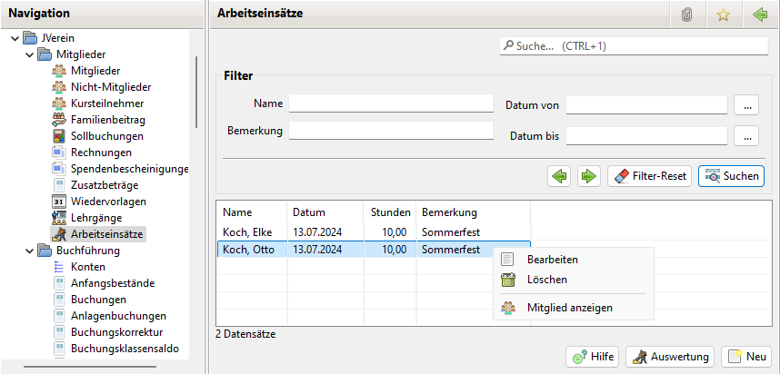

# Arbeitseinsätze

### Aktivierung

Zur Nutzung der Arbeitseinsätze ist die Option in den Einstellungen->Administration->Einstellungen zu aktivieren.

Anschließend sollte JVerein neu gestartet werden, damit der Menüpunkt "Arbeitseinsätze" zur Verfügung steht.

### Allgemeines

Neben Geldzahlungen kann als Beitrag auch Arbeitsleistung dienen.

In den betroffenen [Beitragsgruppen](../../v3.0.x/administration/mitglieder/beitragsgruppen.md) wird die Anzahl der Pflichtstunden und der Betrag für nicht erbrachte Stunden hinterlegt

### Erstellung

Die Arbeitseinsätze können erstellt werden

* in den Mitglied Details (siehe [Arbeitseinsatz](content/arbeitseinsatz.md))
* über das Kontextmenü eines Mitglieds (siehe [Mitglieder](../../v3.1.x/mitglieder/content/mitglieder.md))
* aber auch in der Liste der Arbeitseinsätze

## Liste der Arbeitseinsätze

Der Übersicht View für Arbeitseinsätze zeigt alle vorhandenen Arbeitseinsätze an.

Über den Filterbereich lässt sich nach verschiedenen Kriterien filtern.

Mit dem Button Neu kann ein neuer Arbeitseinsatz eingerichtet werden.

Mit dem Button Auswertung kann zum [Auswertungsdialog](../auswertungen/arbeitseinsatz.md) gesprungen werden.

Durch einen Doppelklick wird die Bearbeitung eines Arbeitseinsatzes eingeleitet.

Das Kontextmenü bietet folgende Optionen:

* Bearbeiten: Der ausgewählte Eintrag wird zum Bearbeiten geöffnet
* Löschen: Damit kann ein Arbeitseinsatz gelöscht werden
* Mitglied anzeigen: Damit können die Daten des Mitglieds angezeigt werden

## Arbeitseinsatz

Mit einem Klick auf Neu oder Bearbeiten öffnet sich folgender Dialog:

Im Feld Mitglied lässt sich das Mitglied auswählen.

Geben Sie das Datum ein, an dem die Stunden geleistet wurden, die Anzahl der Stunden und, im Feld Bemerkung, was geleistet wurde.

In den Einstellungen von JVerein auf der Ansicht Beiträge können Sie ein Arbeitsstunden Modell ändern und negative Stunden einstellen.

Danach kann hier beim Erfassen von Arbeitsstunden im Feld Stunden auch ein negativer Wert eingetragen und damit die Sollstunden des Mitglieds erhöht werden. Damit kann man Dienstleistungen des Vereins, die mit Arbeitsstunden gegengerechnet werden können, einfach erfassen und abrechnen.
