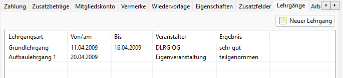
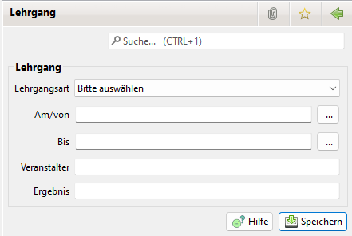

# Lehrgänge

Zur Nutzung ist in den [Einstellungen](../../administration/einstellungen.md) das entsprechende Häkchen zu setzen und die [Lehrgänge](../../administration/lehrgange.md) sind in der Administration&gt;Lehrgangsarten einzurichten.

## Lehrgangsübersicht beim Mitglied

## Lehrgang beim Mitglied anlegen

Durch Auswahl des Buttons "Neuer Lehrgang" kan ein neuer Lehrgang für das Mitglied angelegt werden.

## Lehrgang beim Mitglied löschen

Durch rechts Klick auf einen Lehrgangs Eintrag erschein ein Menü zum Löschen eins Eintrags.