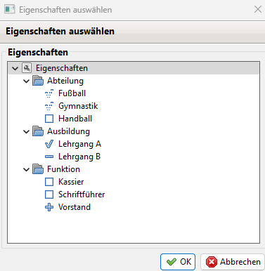

# Mitgliederliste

### Allgemein

Das Fenster der Mitglieder-Suche besteht aus zwei Teilen: Filter (oben) und Mitgliedertabelle (unten). Die angezeigten Mitglieder können nach verschiedenen Kriterien gefiltert werden:

* Nachname
* Mitgliedschaft Status "Angemeldet", "Abgemeldet" und "Beide"
* Externe Mitgliedsnummer (optional)
* Eigenschaften
* Beitragsgruppe
* Zusatzfelder (optional)
* Geburtsdatum
* Geschlecht
* Eintritts- und Austrittsdatum
* Stichtag
* Mail

Jeweils beim Verlassen eines Feldes mit pull down Menüs wird die Suche ausgelöst. Änderungen in Eingabefeldern für Text oder Datum lösen erst eine Suche aus wenn der Suchen Button gedrückt wird oder alternativ durch drücken des Enter auf der Tastatur.

Nach einem Doppelklick auf das Mitglied werden die kompletten Daten angezeigt. Mit einem Rechtsklick auf ein Mitglied öffnet sich ein Kontextmenü. Damit kann das Mitglied bearbeitet oder gelöscht werden. Außerdem ist die Ausstellung einer [Spendenbescheinigung](../spendenbescheinigung.md) möglich.

Die Filterkriterien können für eine spätere Verwendung in einem [Suchprofil](../../../v3.0.x/mitglieder/content/suchprofil.md) gespeichert werden.

Mit dem Reset Button können die Filter Felder auf Defaultwerte zurückgesetzt werden.

## Liste der Mitglieder

Mit dem Button "Neu" lässt sich ein neues Mitglied anlegen. Siehe [Stammdaten](grunddaten.md)

Mit dem Button "Import" lassen sich ein neue Mitglieder aus CSV Dateien importieren. Siehe [Mitglieder Import](../import.md)

### Filterung nach Eigenschaften

Es können eine oder mehrere Eigenschaften ausgewählt werden.

Folgende Eigenschaften-Verknüpfungen sind möglich:

* "und": D.h. es werden nur die Mitglieder angezeigt, die alle ausgewählten Eigenschaften erfüllen.
* "oder": D.h. es werden die Mitglieder angezeigt, die mindestens eine der ausgewählten Eigenschaften erfüllen.

Auswahl einer Eigenschaft:

* "+": Hier ist die Eigenschaft ausgewählt.
* "-": Es ist die inverse Eigenschaft ausgewählt. Z.B. Gymnastik in Bild unten. Dies bedeutet diese Eigenschaft darf nicht enthalten sein.

Durch klicken auf die Eigenschaft kann zwischen den Werten umgeschaltet werden.

Bedeutung des Symbols bei der Eigenschaften Gruppe:

* "P": Bei der Eigenschaften Gruppe ist die Pflicht Checkbox ausgewählt.
* "I": Bei der Eigenschaften Gruppe ist die Maximal 1 Eigenschaft Checkbox ausgewählt.
* "PI": Bei der Eigenschaften Gruppe ist die Pflicht und die Maximal 1 Eigenschaft Checkbox ausgewählt.

### Filterung nach Zusatzfeldern

Soll nach Zusatzfelder gefiltert werden, kommt es auf den Datentyp des jeweiligen Zusatzfeldes an. Bei einem Ja/Nein Feld kann nur nach Ja-Einträgen gefiltert werden. Bei einem Textfeld gelten zur Filterung die SQL-Regeln für einen Textvergleich: Hier können die Wildcards % (0...n beliebige Zeichen) und \_ (genau 1 beliebiges Zeichen) eingesetzt werden. Durch die Verwendung der Kombination \_% kann man nach allen nicht leeren Textfeldern filtern.

## Kontextmenu

### Bearbeiten

Mitglied bearbeiten. Identisch mit Doppelklick auf das Mitglied.

Siehe [Mitglied](grunddaten.md).

### Duplizieren

Es wird ein neuer Datensatz mit den Daten des Mitgliedes angelegt. Dieser kann dann vor der Speicherung verändert werden.

### In Zwischenablage kopieren

Es wird ein Datensatz mit den Daten des Mitgliedes in die Zwischenablage kopiert.

### Eigenschaften

Für alle markierten Mitglieder können die Eigenschaften gleichzeitig gesetzt oder gelöscht werden. Dabei stehen nur die Eigenschaften Gruppen ohne Pflichteintrag oder ohne die Kennzeichnung "maximal 1" zur Verfügung.

Die Icons haben fünf Zustände:

* Quadrat: Kein Mitglied hat die Eigenschaft gesetzt und sie wird bei niemanden geändert.
* Haken: Alle selektierten Mitglieder haben die Eigenschaft gesetzt und sie wird bei niemanden geändert.
* Gestrichelter Haken: Mindestens ein selektiertes Mitglieder hat die Eigenschaft gesetzt und sie wird bei niemanden geändert.
* Plus Zeichen: Die Eigenschaft wird nach OK bei allen selektierten Mitgliedern gesetzt.
* Minus Zeichen: Die Eigenschaft wird nach OK bei allen selektierten Mitgliedern gelöscht.

### Arbeitseinsätze zuweisen

Für alle markierten Mitglieder werden Arbeitseinsätze erzeugt.

### Zusatzbeträge zuweisen

Für alle markierten Mitglieder werden Zusatzbeiträge erzeugt.

### Zu Nicht-Mitglied umwandeln

Ein Mitglied in ein Nicht-Mitglied umwandeln.

### Löschen

Löscht das Mitglied.

### Mail senden

Es wird eine Mail an das Mitglied versandt. Dabei wird eine Auswahl von Mailvorlagen zur Verfügung gestellt.

### vCard-Datei

Die Daten des Mitgliedes lassen sich als vCard exportieren.

### vCard-QR-Code

Zeigt eine QR-Code mit den Daten des Mitgliedes an.

### Kontoauszug

Für einen vorgegebenen Zeitraum werden alle Buchungen des Mitgliedskontos ausgegeben.

### Geldpendenbescheinigung

Erstellung einer Geldpendenbescheinigung, die direkt dem Mitglied zugeordnet ist.

### Sachspendenbescheinigung

Erstellung einer Sachspendenbescheinigung, die direkt dem Mitglied zugeordnet ist.

### Personalbogen

Ausgabe aller zu einem Mitglied gespeicherten Daten (Ausnahme: Ggfls. gespeicherte Dokumente)

### Manuelle Lastschrift...

Generierung einer manuellen Lastschrift in Hibiscus.
