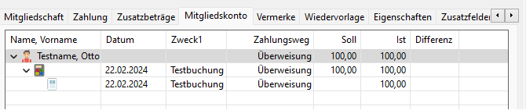
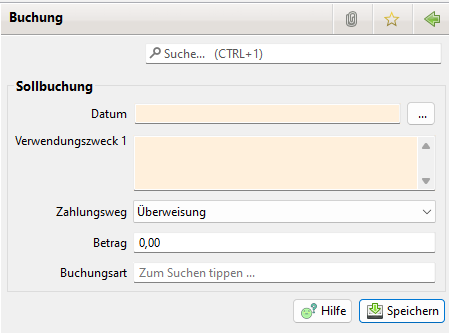

# Mitgliedskonto

In der Baumansicht werden die Summen pro Mitglied, die einzelnen Sollbuchungen \(Rechnersymbol\), sowie die einzelnen zugeordneten Istbuchungen \(Euro-Symbol\) angezeigt.

Mit einem rechten Mausklick auf das Mitglied öffnet sich ein Kontextmenü. Damit können neue Sollbuchungen aufgenommen werden.

Mit einem rechten Mausklick auf eine Sollbuchung öffnet sich ein Kontextmenü. Damit kann die Sollbuchung bearbeitet, oder, sofern keine Istbuchung zugeordnet ist, auch gelöscht werden.

Mit einem rechten Mausklick auf eine Istbuchung öffnet sich ein Kontextmenü. Damit kann die Istbuchung von der Sollbuchung gelöst werden.