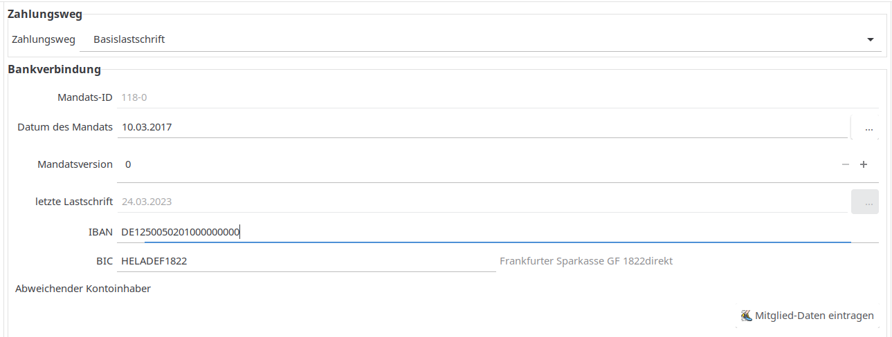
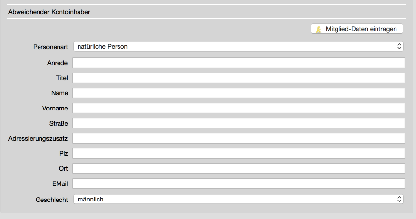

# Zahlung

Als Zahlungswege stehen

* Basislastschrift
* Barzahlung
* Überweisung

zur Verfügung. Die Standardwerte können unter Administration\|Einstellungen\|Beiträge festgelegt werden.

Beim Zahlungsweg Basislastschrift sind BIC und IBAN anzugeben. Durch die Eingabe einer BLZ gefolgt von einem Leerzeichen und der anschließenden Kontonummer wird der SEPA-Konverter angestoßen und die IBAN und die BIC ermittelt.

Die Mandats-ID wird automatisch aus der Mitgliedsnummer oder optional aus der externen Mitgliedsnummer \(siehe Einstellungen\) gebildet. Zusätzlich wird ein Versionszähler geführt, der das 1., 2., 3. .... Mandat referenziert.

Das Datum des Mandats muss angegeben werden.

Zusätzlich kann ein abweichender Kontoinhaber angegeben werden:

Mit dem Button "Mitglied-Daten übernehmen" werden einige der Daten des Mitglieds übertragen. Hinweis: Es werden nicht alle Daten übertragen, da es sich um einen abweichenden Kontoinhaber handelt. Z. B. der Vorname wird nicht übertragen.
