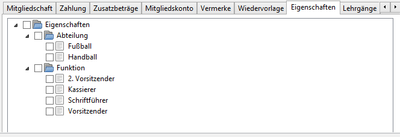

# Eigenschaften

Die Eigenschaften des Mitgliedes können angehakt werden, bzw. das Häkchen kann entfernt werden. Die Änderungen werden bei Druck auf den Speichern-Knopf in die Datenbank geschrieben.

[Eigenschaften](../administration/eigenschaften.md) und [Eigenschaften-Gruppen](../administration/eigenschaften-gruppen.md) sind in der Administration einzurichten.