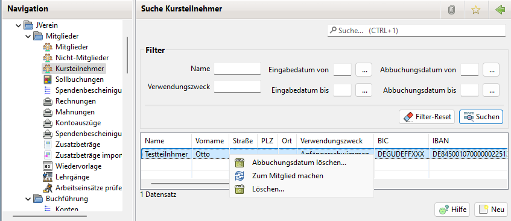
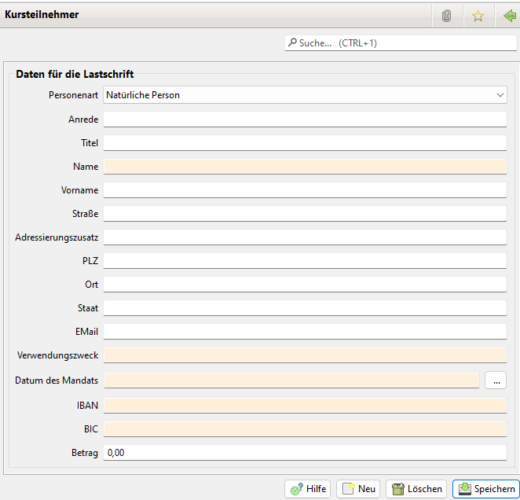

# Kursteilnehmer

Teilnehmer von Kursen können abgerechnet werden. Kursteilnehmer sind Personen, die nicht Mitglied des Vereins sind. Sofern Mitglieder an Kursen teilnehmen, die zusätzlich abgerechnet werden, bieten sich die Zusatzabbuchungen an.

Das Kursteilnehmer Menü hat folgende Einträge:

* Abbuchungsdatum löschen...
* Zum Mitglied machen
* Löschen
 

Eingabe eines neuen Kursteilnehmers:

