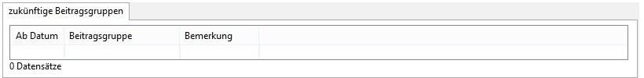

# Mitgliedschaft

Eintrittsdatum und Geburtsdatum sind Pflichtfelder wenn es in den Einstellungen so konfiguriert wurde. Beitragsgruppe ist ein Pflichtfeld. Die Beitragsgruppen können unter [Beitragsgruppen](administration/beitragsgruppen.md) für jeden Verein individuell konfiguriert werden. Siehe auch [Beitragsmodelle](../allgemein/beitragsmodelle.md) und [Einstellungen](administration/einstellungen.md). Beim Austrittsdatum wird das Datum des satzungsgemäßen Austritts \(z. B. der 31.12. des jeweiligen Jahres\) eingetragen. Unter Kündigung wird das Datum des Eingangs der Kündigung vermerkt.

Standardaussehen des Formulars:

## Familienverband

Sofern eine Beitragsgruppe ausgewählt wurde, die mit "Familie: Zahler" gekennzeichnet ist, verändert sich das Formular wie folgt:

Die Person \(ebenfalls ein Mitglied\), die für das Mitglied zahlt, kann aus einer Liste ausgewählt werden. Hinweis: Dieser Person muss eine Beitragsgruppe der Art "Familie: Zahler" zugewiesen sein, ansonsten taucht sie in der Auswahl-Box nicht auf. Bei einer Beitragsgruppe, die mit "Familie: Angehöriger" gekennzeichnet ist, sieht das Formular so aus:

Hier werden die Personen angezeigt, für die das Mitglied die Beiträge zahlt.

Sinn und Zweck dieser Familienverknüpfung ist es, die Voraussetzungen für die Familienmitgliedschaft prüfen zu können. Tritt ein Mitglied aus, dass für andere Mitglieder als Zahler eingetragen ist, kommt eine entsprechende Fehlermeldung. Dann sind die Beitragsgruppen der beitragsfreien Mitglieder zu verändern oder es ist ein anderer Zahler einzutragen.

## Zukünftige Beitragsgruppen

Hier kann man Beitragsgruppen eintragen, die für dieses Mitglied ab einem definierten Datum gültig sein soll. Hat man z.B. im ersten Jahr einen vergünstigten Probebeitrag, trägt man diesen oben unter Beitragsgruppe ein. Die Beitragsgruppe für den normalen Beitrag, der gültig werden soll, sobald die Probezeit beendet ist, kann man sofort in dieser Tabelle zukünftige Beitragsgruppen eintragen.

Bei Programmstart wird geprüft, ob das Datum für eine Änderung der Beitragsgruppe erreicht wurde. Alle zu ändernden Mitglieder werden in einer Liste angezeigt und es können die neuen Beitragsgruppen für ausgewählte Mitglieder oder alle angezeigten übernommen werden. Damit die Daten angezeigt werden, ist einmal die Box "künftige Beitragsgruppen" zu aktivieren:

Hinweis: Die Box ist nur sichtbar, wenn im Menü "Start" ausgewählt wurde.

Zum Erfassen einer zukünftigen Beitragsgruppe klicken Sie mit der rechten Maustaste in die Tabelle. Im Kontextmenü wählen Sie den Punkt Beitragsgruppe hinzufügen. Es öffnet sich eine Ansicht, in der Sie die neue Beitragsgruppe auswählen und das Datum erfassen, ab dem diese Gruppe gültig werden soll. Sie können in einem Bemerkungsfeld noch hinterlegen, warum diese Änderung durchgeführt werden sollte.

Bei Mitgliedern von Beitragsgruppen der Beitragsart Familie: Zahler können Sie nur andere Beitragsgruppen mit der Beitragsart Familie: Zahler als zukünftige Beitragsgruppe eintragen.

Bei Mitgliedern von Beitragsgruppen der Beitragsart Normal können Sie nur andere Beitragsgruppen mit der Beitragsart Normal als zukünftige Beitragsgruppe eintragen.

Bei Mitgliedern von Beitragsgruppen der Beitragsart Familie: Angehöriger können Sie keine zukünftigen Beitragsgruppen hinterlegen, weil hier u.U. Zahlungsdaten fehlen.

## Sekundäre Beitragsgruppen

Für ein Mitglied können auch Beiträge aus mehreren Beitragsgruppen abgerechnet werden. Dazu muss unter Administration \| Einstellungen \| Anzeige das Häkchen bei "sekundäre Beitragsgruppen anzeigen" gesetzt werden und unter Administration \| Beitragsgruppen muss für mindestens eine Beitragsgruppe das Höschen "sekundäre Beitragsgruppe" gesetzt werden. Dann kann beim Mitglied eine entsprechende Auswahl vorgenommen werden.

