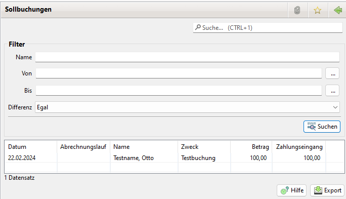
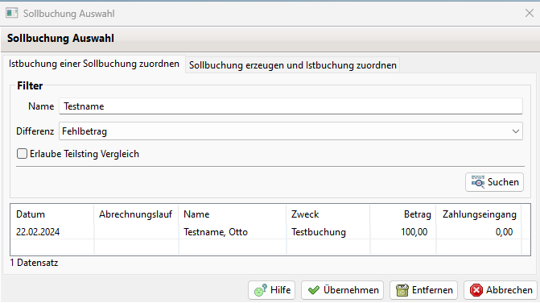

# Sollbuchungen

## Abrechnung

Die [Abrechnung](../abrech/abrechnung.md) schreibt Informationen zu Mitgliedsbeiträgen und Zusatzabrechnungen in die Tabelle [Mitgliedskonto](content/mitgliedskonto.md) des Mitglieds. Zusätzlich werden für den Zahlungsweg Abbuchung Informationen \(Istbuchung\) in die Buchungstabelle der Buchführung geschrieben.

## Sollbuchungenübersicht 

Es gibt eine zentrale Übersicht über alle Sollbuchungen. Die Buchungen können über einen Zeitraum oder über einen Namen, bzw. Namensfragment gefiltert werden. Zusätzlich kann angegeben werden, ob nur Sollbuchungen mit Differenzen zwischen Soll und Ist \(Offene Posten oder Überzahlungen\) angezeigt werden.

Zudem lässt sich filtern ob das Mitglied per Lastschift zahlt oder eine Mailadresse hat. Letzteres ist interessant wenn die Rechnungen bzw. Mahnungen per Mail versendet werden sollen.

Durch einen Doppelklick auf die Sollbuchung wird die Sollbuchung angezeugt.

Durch einen Rechtsklick auf einen Abrechnungslauf öffnet sich ein Kontextmenü mit mehreren Optionen:
* Sollbuchung bearbeiten: Bearbeiten der Sollbuchung
* Sollbuchung löschen: Löschen der Sollguchungen
* Mitglied anzeigen: Öffnet das Mitglied zur Sollbuchung
* Rechnung erstellen: Erstellt Rechnungen für die selektierten Sollbuchungen.
* Mahnung erstellen: Erstellt Mahnungen für die selektierten Sollbuchungen.

## Buchungen einer Sollbuchung zuordnen 

Unter Buchführung&gt;[Buchungen](../buchf/buchungen.md) ist eine Buchung auszuwählen und doppelt anzuklicken:

Durch einen Klick auf ... neben Sollbuchung erscheint folgender Dialog:

Der Name aus der Buchung wird in das Namensfeld übernommen. Der Inhalt wird in Wörter zerlegt und in den Spalten Name und Vorname gesucht.

PS: Alternativ erreicht man diesen Dialog auch mit einem rechten Mausklick auf einen Buchung und wählt dann den Menüpunkt "Sollbuchung zuordnen" aus.

Zur Filterung des Buchungen steht weiterhin Egal \(= eine beliebige Differenz\), Fehlbetrag oder Überzahlung zur Verfügung. Durch einen Klick auf entfernen wird die Mitgliedskontoinformation aus der Buchung entfernt. Damit können Fehleingaben korrigiert werden.

Der obige Dialog hat zwei Registerkarten:
- Istbuchung einer Sollbuchung zuordnen
- Sollbuchung erzeugen und Istbuchung zuordnen

Die erste Karte dient der Zuordnung einer Istbuchung auf eine vorhandene Sollbuchung \(z.B. aus einem Abrechnungslauf\).

Auf der zweiten Karte kann alternativ in einem Schritt automatisch zuerst eine \(neue\) Sollbuchung erzeugt werden und dieser dann sogleich die Istbuchung zugeordnet werden. So können z.B. Spenden bequem bei einem Mitglied oder Nicht-Mitglied verbucht werden.

Hier kann nur nach dem Namen gefiltert werden.

In der zweiten Karte kann zusätzlich "Erlaube Teilstring Vergleich" angehakt werden. Mit dieser Option werden auch Namensteile gefunden \(Suchbegriff "Anna" liefert alle Mitglieder in deren Vor- oder Nachname anna, bspw. Hannah Muster, Anna Test, Maria Hannauer...\). Sonst werden nur vollständige Namen gefunden \(Suchbegriff "Max Mustermann" findet alle Mitglieder deren Vor- oder Nachname genau Max ist oder deren Vor- oder Nachname exakt Mustermann ist, bspw. Max Mustermann, Anna Mustermann, Karl Max\).

## Spalten im Export

Exportieren Sie Rechnungsdaten oder Mahnungsdaten so haben Sie in der CSV Datei die Spalten des Mitglieds und des Mitgliedskontos

