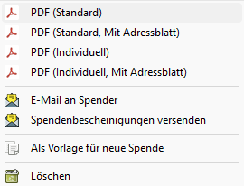
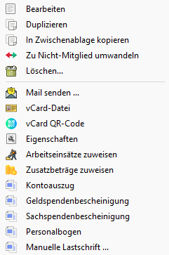
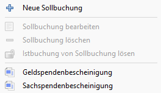

# Spendenbescheinigung

Mit JVerein können Spendenbescheinigungen ausgestellt und gespeichert werden. Vorbereitend können ein oder mehrere [Formulare](../administration/mitglieder/formulare.md) für den individuellen Druck eingerichtet werden.

## Allgemeines

JVerein unterstützt das Erstellen von:
* Sachspendenbescheinigungen
* Geldspendenbescheinigungen

Im View Spendenbescheinigungen werden bereits erstellte Spendenbescheinigungen angezeigt.

Der Filterbereich erlaubt es nach verschiedenen Kriterien zu filtern.

Über den Filter "Mail" lassen sich z.B. Spendenbescheinigungen finden für deren Spender keine Mail Adressen hinterlegt sind. Diese können dann nicht per Mail verschickt werden sondern nur per Brief.

In der Liste können ein oder mehrere Einträge markiert werden. Über ein Kontextmenu \(rechter Mausklick\) stehen verschiedene Aktionen zur Verfügung.

Damit können Spendenbescheinigungen gelöscht oder als Vorlage gespeichert werden.

Mit einem Doppelklick auf eine Spendenbescheinigung öffnet sich das Bearbeitungsfenster.

Es ist möglich eine Mail an den Spender zu schreiben oder die ausgewählten Spendenbescheinigungen zu drucken oder per Mail an die Spender zu schicken. Eine Beschreibung zum Drucken und Verschicken siehe [Spendenbescheinigungen](../druckmail/spendenbescheinigungen.md).

Sind mehrere Einträge markiert, wird die Aktion auf alle markierten Einträge angewendet. Das Drucken beschränkt sich darauf, die Dokumente in dem in den Einstellungen angegebenen Verzeichnis zu speichern.

## Sachspendenbescheinigungen erstellen

Sachspendenbescheinigungen können auf verschiedene Art erzeugt werden:

* In der Mitgliedersuche kann man mit einem Klick auf die rechte Maustaste ein Kontextmenü öffnen. Darin den Menüpunkt Sachspendenbescheinigung auswählen. Es wird das Spendenbescheinigungsformular mit den Daten des Mitglieds gefüllt.

  

* Alternativ kann im Mitglieds View unter dem Tab Mitgliedskonto das Mitglied ausgewählt werden. Mit einem Klick auf die rechte Maustaste öffnet sich ein Kontextmenü um die Spendenbescheinigungen zu erstellen. Es wird das Spendenbescheinigungsformular mit den Daten des Mitglieds gefüllt.

  

* In der Detailansicht einer Spendenbescheinigung kann über den Button "Neu \(Sachspende\)" eine neue Spendenbescheinigung erstellt werden. Es werden die Spender Daten aus der bisher angezeigten Spendenbescheinigung übernommen. Zu beachten ist, dass auch die Referenz auf das Mitglied übernommen wird. Wird die Spendenbescheinigung später per Mail versendet, wird sie an dieses Mitglied verschickt auch wenn man die Spender Daten ändert!

* Als vierte Möglichkeit kann in der Liste Spendenbescheinigungen der Button "Neu \(Sachspende\)" gedrückt werden. Da hier kein Mitglied ausgewählt ist müssen die Daten des Spenders eingetragen werden. Es ist zu beachten, dass dabei kein Bezug zu einem Mitglied hergestellt wird und darum z.B. ein Versenden per Mail aus JVerein heraus später nicht möglich ist da keine Mail Adresse hinterlegt ist.

## Geldbescheinigungen erstellen

### Voraussetzungen

Um Geldspendenbescheinigungen erstellen zu können müssen verschiedene Voraussetzungen erfüllt sein:
* Es muss eine Buchung \(Istbuchung\) in einem Konto existieren
* Die Buchungsart der Buchung muss vom Typ Spende sein. Siehe Admimistration\|Buchführung\|Buchungsart Checkbox Spende.
* Die Buchung muss einer Sollbuchung zugeordnet sein.

Die Zuordnung einer Buchung zu einer Sollbuchung kann auf verschiede Arten erzeugt werden.
* Wird bei einem Abrechnungslauf bei Mitgliedern mit Lastschrift eine Sollbuchung erzeugt, wird automatisch auch eine Buchung ezeugt und diese der Sollbuchung zugeordnet.
* Wird bei einem Abrechnungslauf bei Mitgliedern ohne Lastschrift eine Sollbuchung erzeugt muss die später erfolgte Buchung manuell der Sollbuchung zugeordnet werden. Siehe [Sollbuchungen](mitgliedskonto.md).
* Wurde die Buchung ohne einen Abrechnungslauf erzeugt muss eine Sollbuchung erzeugt und die Buchung zugeordnet werden. Dies kann in einem Schritt erfolgen. Siehe zweite Option in [Sollbuchungen](mitgliedskonto.md).
* Alternativ besteht natürlich die Möglichkeit manuell eine Sollbuchung zu erzeugen und ihr später die Buchung zuzuordnen. Für das Erstellen einer Sollbuchung siehe [Mitgliedskonto](content/mitgliedskonto.md).

### Geldspendenbescheinigung manuell erstellen

Ähnlich einer Sachspendenbescheinigungen kann eine Geldspendenbescheinigung manuell erzeugt werden:

* Im Mitglieds View unter dem Tab Mitgliedskonto eine Istbuchung auswählen \(Buchung mit Euro Symbol\). Mit einem Klick auf die rechte Maustaste öffnet sich ein Kontextmenü um die Geldspendenbescheinigung zu erstellen. In diesem Fall werden die Mitgliedsdaten komplett in die Spendenbescheinigung übernommen, die Buchung bestimmt den Betrag und das Spendendatum.

### Geldspendenbescheinigung automatisch erstellen

Voraussetzungen für die automatische Generierung von Geldspendenbescheinigungen:

* Ein Mitglied wird nur berücksichtigt wenn Straße, Postleitzahl und Ort eingetragen ist.
* Der Betrag der Bescheinigung muss gleich oder größer sein als der Mindestbetrag der unter Administtration\|Einstellungen\|Spendenbescheinigungen eingetragen ist.

Bei der automatischen Generierung werden nur die Buchungen erfasst, die noch keiner Spendenbescheinigung oder Sammelbestätigung zugewiesen wurden. Es werden niemals für eine Buchung mehrere Bescheinigungen generiert.

Werden für ein Mitglied mehrere Buchungen gefunden werden sie zu einer Sammelbestätigung zusammen gefasst.

Geldspendenbescheiniguungen können automatisch auf mehrere Arten erzeugt werden:

* In der Mitgliedersuche kann man mit einem Klick auf die rechte Maustaste ein Kontextmenü öffnen. Darin den Menüpunkt Geldspendenbescheinigung auswählen. In diesem Fall werden die Mitgliedsdaten komplett in die Spendenbescheinigung übernommen, die erste Buchung bestimmt das Spendendatum, der Betrag ist die Summe der Beträge aller Buchungen.
* Alternativ kann im Mitglieds View unter dem Tab Mitgliedskonto das Mitglied ausgewählt werden. Mit einem Klick auf die rechte Maustaste öffnet sich ein Kontextmenü um die Spendenbescheinigungen zu erstellen. In diesem Fall werden die Mitgliedsdaten komplett in die Spendenbescheinigung übernommen, die erste Buchung bestimmt das Spendendatum, der Betrag ist die Summe der Beträge aller Buchungen.
* In der Übersicht über Spendenbescheinigungen können über den Button \"Neu \(Automatisch\)\" Geldspendenbescheinigungen generiert werden.

  

In der Übersicht werden zunächst alle Namen und Buchungen angezeigt, die schließlich als Spendenbescheinigung angelegt werden. Der Typ der Spendenbescheinigungen \(Einzel / Sammel\) macht sich an der Anzahl Buchungen fest, die erfasst wurden.

Über den Button _Erstellen_ werden die Spendenbescheinigungen erzeugt.

## Weitere Anpassungen

### Formulare

Vorlagen von [Formulare](../administration/mitglieder/formulare.md) können auch mehrere Seiten umfassen. Formularfelder können auch auf anderen Seiten als der ersten platziert werden \(siehe auch Formularfelder\).

### Formularfelder

Formularfelder können nun auch auf anderen Seiten als nur der ersten Seite platziert werden. Hierzu gibt es die Spalte "Seite", mit der die Seitennummer angegeben wird.

Für Spendenbescheinigungen stehen nun ergänzend folgende zusätzlichen Felder zur Verfügung:

* Spendenzeitraum Datum der ersten und letzten Buchung auf der Sammelbestätigung
* Buchungsliste
* Alle Buchungen als Liste formatiert:

`Datum Betrag Verzicht Zuwendungsart`

Für eine korrekte Formatierung sollte eine Schriftart mit fester Zeichenbereite gewählt werden.

### Einstellungen

#### Lang-Name

Langer Name des Vereins, bis 70 Zeichen

#### BegünstigterZweck

Bis zu 100 Zeichen

#### Straße

Bis zu 50 Zeichen

#### Ort

Bis zu 50 Zeichen

#### Dateinamenmuster Spende

Für die Generierung von Dokumenten mit Mitglieds-Bezug. Zunächst nur für Spendenbescheinigungen genutzt, könnte aber auch für Kontoauszug des Mitgliedskontos oder den Personalbogen genutzt werden.

#### Mindestbetrag für Spendenbescheinigungen

Allgemeine Einstellung ab welchem Betrag eine Spendenbescheinigung erstellt werden soll. Diese Einstellung kommt bei der automatischen Generierung von Spendebescheinigungen zum Tragen. Bei der Erzeugung einer Spendenbescheinigung aus einem Mitglkiedskonto heraus, wird diese Einstellung nicht beachtet.

#### Verzeichnis für Spendenbescheinigungen

Um ein flüssiges Erzeugen von mehreren Dokumenten zu ermöglichen, kann hier das Verzeichnis für die PDF-Dateien festgelegt werden. Wenn aus der Liste der Spendenbescheinigungen heraus die Dokumente generiert werden, werden sie in diese Verzeichnis geschrieben. Das Verzeichnis wird auch vorbelegt, wenn eine Dokumentenerstellung aus der Detailansicht Spendenbescheinigung erfolgt. Hier wird jedoch der Dateidialog angeboten.

#### Drucke Buchungsart

Ist das Häkchen gesetzt, wird in der Buchungsliste nicht der Zweck aus der Buchung, sondern die der Buchung zugewiesene Buchungsart verwendet. Bei sprechenden Namen eine einheitlichere Darstellung.

#### Unterschrift drucken

Ist das Häkchen gesetzt, wird beim Standard Druck eine Unterschrift in die Spendenbescheinigung eingefügt.

#### Unterschrift

Hie lässt sich ein Bild der Unterschrift einfügen welche entsprechend der selektierten Option eingefügt wird.

#### Spendenbescheinigung Anhang bei Mail Versand in DB spechern

Ist das Häkchen gesetzt, wird die Spendenbescheingung bei Mailversand zusammen mit der Mail in der Datenbank gespeichert. Öffnet man die Mail erneut wird der Anhang mit angezeigt.
