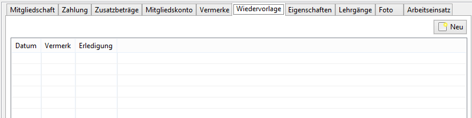
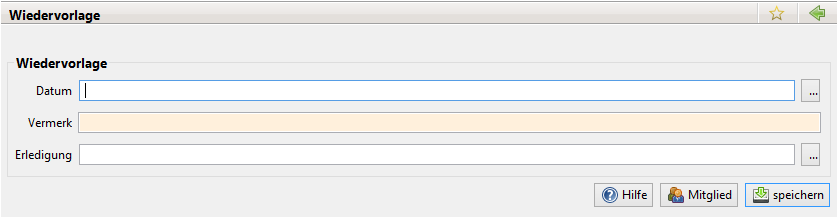

# Wiedervorlage

Mit einem Rechtsklick auf einen Wiedervorlagetermin kann entweder ein Erledigungsdatum gesetzt oder zurückgesetzt werden. Mit einem Klick auf Neu öffnet sich folgendes Fenster:

Zusätzlich werden die Daten unter Jameica \| Termine in einem Kalenderformat angezeigt.