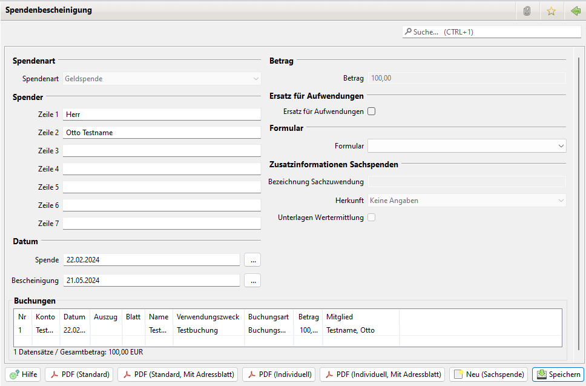

# Spendenbescheinigung

Mit JVerein können Spendenbescheinigungen ausgestellt und gespeichert werden. Vorbereitend ist sind ein oder mehrere [Formulare](administration/formulare.md) einzurichten.

## Übersicht

Durch einen Klick auf neu öffnet sich das Spendenbescheinigungs-Bearbeitungsfenster \(siehe unten\). Mit einem Doppelklick auf eine Spendenbescheinigung öffnet sich das Bearbeitungsfenster \(siehe unten\). Mit einem Rechtsklick öffnet sich ein Kontextmenü. Damit können Spendenbescheinigungen gelöscht werden. Durch einen Klick auf PDF wird die Spendenbescheinigung im PDF-Format ausgegeben.

Tipp: In der Mitgliedersuche kann man mit einem Klick auf die rechte Maustaste ein Kontextmenü öffnen. Darin den Menüpunkt Spendenbescheinigung auswählen. Dann wird das Spendenbescheinigungsformular mit den Daten des Mitglieds gefüllt.

Neben der manuellen Erstellung von Spendenbescheinigungen können sie auch automatisch aus dem Mitgliedskonto erzeugt werden.

Voraussetzungen für die automatische Generierung:

* Administration\|Allgemein Daten zum Verein und zu den Spendenbescheinigungen werden gespeichert.
* Administration\|Buchungsarten mindestens eine Buchungsart hat ein Häkchen im Feld Spende
* Buchung wurde dem Mitgliedskonto und einer Buchungsart mit dem Merkmal Spende zugeordnet.

## Einzel- oder Sammelbestätigungen

Spendenbescheinigungen können in Form von Einzelbestätigungen oder Sammelbestätigungen erzeugt werden. Es sind zwei Formular-Arten \(Spendenbescheinigung und Sammelbestätigung\) hierfür vorgesehen.

### Einzelbestätigungen

Einzelbestätigungen können auf drei Arten erzeugt werden:

* manuell durch Eingabe aller Daten
* aus einem Mitglied / Mitgliedskonto \(rechts Klick auf Buchung\) heraus für eine einzelne Buchung. In diesem Fall werden die Mitgliedsdaten komplett in die Spendenbescheinigung übernommen, die Buchung bestimmt den Betrag und das Spendendatum.
* Automatische Generierung \(siehe unten\)

### Sammelbestätigungen

Sammelbestätigungen können auf zwei Arten erzeugt werden:

* aus einem Mitglied / Mitgliedskonto \(rechts Klick auf Mitgliedsname\) heraus für alle Buchungen im Mitgliedskonto. Es werden nur die Buchungen erfasst, die noch auf keiner Spendenbescheinigung oder Sammelbestätigung ausgewiesen wurden. In diesem Fall werden die Mitgliedsdaten komplett in die Spendenbescheinigung übernommen, die erste Buchung bestimmt das Spendendatum, der Betrag ist die Summe der Beträge aller Buchungen.
* Automatische Generierung \(siehe unten\)

### Automatische Generierung von Spendenbescheinigungen

In der Übersicht über Spendenbescheinigungen können über den Button \_neu \(automatisch\) \_Spendenbescheinigungen generiert werden. Hier kommen die Einstellungen zum Tragen. Es werden nur für die Mitglieder oder Spender Spendenbescheinigungen erzeugt, die eine vollständige Adresse \(Straße und PLZ und Ort\) eingetragen haben. Außerdem werden nur die Mitglieder oder Spender erfasst, deren Spendenbetrag &gt;= dem Mindestbetrag in den Einstellungen ist.

In der Übersicht werden zunächst alle Namen und Buchungen angezeigt, die schließlich als Spendenbescheinigung angelegt werden. Der Typ der Spendenbescheinigungen \(Einzel / Sammel\) macht sich an der Anzahl Buchungen fest, die erfasst wurden.

Über den Button _erstellen_ werden Spendenbescheinigungen erzeugt.

### Spendenbescheinigungen \(Liste\)

In der Liste können ein oder mehrere Einträge markiert werden. Über ein Kontextmenu \(rechter Mausklick\) stehen verschiedene Aktionen zur Verfügung:

* Drucken \(standard\)
* Drucken \(individuell\)
* Duplizieren \(nur wenn genau ein Eintrag gewählt ist
* Löschen

Sind mehrere Einträge markiert, wird die Aktion auf alle markierten Einträge angewendet. Das Drucken beschränkt sich darauf, die Dokumente in dem in den Einstellungen angegebenen Verzeichnis zu speichern.

Über die Buttons in der Buttonleiste stehen die Erzeugung einer neuen bzw. die automatische Generierung \(siehe oben\) von Spendenbescheinigungen zur Verfügung.

Alle Einstellungen \(siehe unten\) werden sowohl bei dem Standard-Dokument als auch dem individuellen Dokumenten berücksichtigt.

### Spendenbescheinigung \(Einzeldarstellung\)

In der Einzeldarstellung wird der Ausdruck über Buttons ebenfalls angeboten. Im Unterschied zum Druck aus der Liste heraus wird zunächst der Datei-Dialog mit der Voreinstellung des Spendenbescheinigungsverzeichnisses aus den Einstellungen und dem erzeugten Namen angeboten. Hier kann das Verzeichnis und der Name noch einmal korrigiert werden.

Der Ausdruck über die Buttons funktioniert nur, wenn die Spendenbescheinigung bereits einmal gespeichert wurde. Die Aktionen neu und drucken direkt hintereinander werden mit einer Fehlermeldung abgewiesen.

## Weitere Anpassungen

### Formulare

Vorlagen von [Formulare](administration/formulare.md)n können auch mehrere Seiten umfassen. Formularfelder können auch auf anderen Seiten als der ersten platziert werden \(siehe auch Formularfelder\).

### Formularfelder

Formularfelder können nun auch auf anderen Seiten als nur der ersten Seite platziert werden. Hierzu gibt es die Spalte "Seite", mit der die Seitennummer angegeben wird.

Für Spendenbescheinigungen stehen nun ergänzend folgende zusätzlichen Felder zur Verfügung:

* Spendenzeitraum Datum der ersten und letzten Buchung auf der Sammelbestätigung
* Buchungsliste
* Alle Buchungen als Liste formatiert:

`Datum Betrag Verzicht Zuwendungsart`

Für eine korrekte Formatierung sollte eine Schriftart mit fester Zeichenbereite gewählt werden.

### Einstellungen

#### Lang-Name

Langer Name des Vereins, bis 70 Zeichen

#### BegünstigterZweck

Bis zu 100 Zeichen

#### Straße

Bis zu 50 Zeichen

#### Ort

Bis zu 50 Zeichen

#### Dateinamenmuster Spende

Für die Generierung von Dokumenten mit Mitglieds-Bezug. Zunächst nur für Spendenbescheinigungen genutzt, könnte aber auch für Kontoauszug des Mitgliedskontos oder den Personalbogen genutzt werden.

#### Mindestbetrag für Spendenbescheinigungen

Allgemeine Einstellung ab welchem Betrag eine Spendenbescheinigung erstellt werden soll. Diese Einstellung kommt bei der automatischen Generierung von Spendebescheinigungen zum Tragen. Bei der Erzeugung einer Spendenbescheinigung aus einem Mitglkiedskonto heraus, wird diese Einstellung nicht beachtet.

#### Verzeichnis für Spendenbescheinigungen

Um ein flüssiges Erzeugen von mehreren Dokumenten zu ermöglichen, kann hier das Verzeichnis für die PDF-Dateien festgelegt werden. Wenn aus der Liste der Spendenbescheinigungen heraus die Dokumente generiert werden, werden sie in diese Verzeichnis geschrieben. Das Verzeichnis wird auch vorbelegt, wenn eine Dokumentenerstellung aus der Detailansicht Spendenbescheinigung erfolgt. Hier wird jedoch der Dateidialog angeboten.

#### Drucke Buchungsart

Ist das Häkchen gesetzt, wird in der Buchungsliste nicht der Zweck aus der Buchung, sondern die der Buchung zugewiesene Buchungsart verwendet. Bei sprechenden Namen eine einheitlichere Darstellung.

