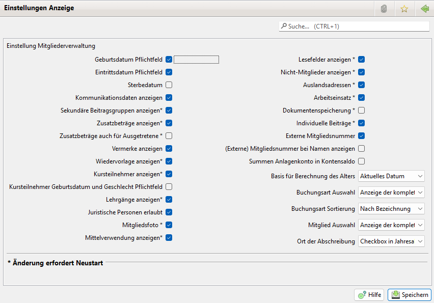

# Anzeige

Durch die Einstellungen kann das Verhalten von JVerein beeinflusst werden.

Nach Änderungen der mit Stern gekennzeichneten Werte ist ein Neustart von Jameica erforderlich.

Folgende Einstellungen können vorgenommen werden:

### Geburtsdatum Pflichtfeld

Beim Mitglied muss ein Geburtsdatum eingetragen sein, damit der Datensatz gespeichert werden kann.

### Eintrittsdatum Pflichtfeld

Beim Mitglied muss ein Eintrittsdatum eingetragen sein, damit der Datensatz gespeichert werden kann.

### Sterbedatum

Das Eingabefeld für das Sterbedatum ist vorhanden und auswertbar

### Kommunikationsdaten anzeigen

Beim Mitglied können folgende Kommunikationsdaten gepflegt werden:

* private Telefonnummer
* Handynummer
* Dienstliche Telefonnummer
* E-Mail Adresse

### Sekundäre Beitragsgruppen anzeigen

Sekundäre Beitragsgruppen werden angeboten.

### Zusatzbeträge anzeigen

Tab Zusatzabbuchungen beim Mitglied anzeigen. Impliziert, dass die Übersicht der Zusatzabbuchungen (nicht) angezeigt wird und die Option bei der Abbuchung (in)aktiv ist.

### Vermerke anzeigen

Tab Vermerke beim Mitglied anzeigen. Beim Mitglied können 2 mal 255 Zeichen Vermerke gespeichert werden.

### Wiedervorlage anzeigen

Tab Wiedervorlage beim Mitglied anzeigen. Impliziert, dass die Übersicht der Wiedervorlagen (nicht) angezeigt wird.

### Kursteilnehmer anzeigen

Kursteilnehmer ein-/ausblenden. Auswirkung auf die Abbuchung.

### Lehrgänge anzeigen

Zu einem Mitglied können die durchgeführten Lehrgänge mit Ergebnissen gespeichert werden.

### Juristische Personen erlaubt

Die Eingabe von Firmen, Organisationen und Behörden als Mitglieder wird erlaubt. Anstatt Name und Vorname werden Name-Zeile1 und Name-Zeile2 erfasst. Geburtsdatum und Geschlecht werden nicht erfasst.

### Mitgliedsfoto

Zu jedem Mitglied kann ein Foto gespeichert werden.

### Mittelverwendung anzeigen

Zeigt die Mittelverwendung an.

### Projekte anzeigen

Zeigt die Projekte an.

### Spendenbescheinigungen anzeigen

Zeigt die Spendenbescheinigungen an.

### Rechnungen/Mahnungen anzeigen

Zeigt die Rechnungen/Mahnungen an.

### Lesefelder anzeigen

Tab Lesefelder beim Mitglied anzeigen. Lesefelder können unter Administration - Lesefelder definiert werden

### Nicht-Mitglieder anzeigen

In einem eigenen Dialog können Nicht-Mitglieder von z.B. Spender, Lieferanten, Trainer gespeichert werden.

### Auslandsadressen

Beim Mitglied kann zusätzlich der Wohnsitz-Staat gespeichert werden

### Arbeitseinsatz

Beim Mitglied können Arbeitseinsätze erfasst werden.

In einem eigenen Dialog können Buchungen von Arbeitsstunden angezeigt und geprüft werden.

### Dokumentenspeicherung

Speicherung von Dokumenten zu Mitgliedern und Buchungen. Wird diese Einstellung aktiviert muss das Plugin jameica.messaging installiert sein.

### Individuelle Beiträge

Grundsätzlich zahlt das Mitglied den Beitrag, der in der Beitragsgruppe angegeben wurde. Sofern diese Option aktiviert wurde, kann bei jedem Mitglied ein abweichender individueller Beitrag angegeben werden.

### Externe Mitgliedsnummer

Vereine, die auf Bundes- oder Landesebene organisiert sind und eine durchgängige Mitgliedsnummer verwalten möchten, können in JVerein eine externe Mitgliedsnummer speichern.

### (Externe) Mitgliedsnummer bei Namen anzeigen

Bei Auswahl dieser Option wird in Tabellen oder bei der Mitglieder Auswahl an den Mitglied Namen in Klammern die Mitgliedsnummer, oder falls Externe Mitgliedsnummer aktiviert ist, die externe Mitgliedsnummer angezeigt.

Dies ist nützlich falls es mehrere Mitglieder mit dem gleichen Namen gibt. Diese lassen sich so unterscheiden.

### Summen Anlagenkonto in Kontensaldo

Ist diese Option aktiviert wird im Kontensaldo nicht jedes Anlagenkonto einzeln aufgelistet sondern nur ein Eintrag mit den Summen über alle Anlagenkonten.

### Basis für Berechnung des Alters.

In der Ansicht Tabellen kann in der Mitgliederliste in einer Spalte das Alter angezeigt werden. Hier mit diesem Feld bestimmen Sie welches Referenzdatum bei der Berechnung des Alters verwendet wird.Zur Auswahl stehen:

* Aktuelles Datum. Das Alter berechnet sich aus dem Geburtsdatum und dem aktuellen Datum.
* Jahres Start. Das Alter berechnet sich aus dem Geburtstag und dem 01.01. des aktuellen Jahres.
* Jahres Ende. Das Alter berechnet sich aus dem Geburtstag und dem 31.12. des aktuellen Jahres.

### Buchungsart Auswahl

Hier kann eingestellt werden wie sich bei Buchungen das Feld für die Buchungsart verhält:

Bei Suche bei Eingabe tippt man den Wortteil der Bezeichnung der Buchungsart ein, nach ein paar Millisekunden wird einer Auswahlliste mit den Treffern angezeigt aus der man dann die gewünschte Buchungsart übernehmen kann.

Anzeige der kompletten Liste stellt eine Drop-Down-Liste mit allen Buchungsarten zur Verfügung.

### Buchungsart Sortierung

Wie sollen die Buchungsarten sortiert werden: nach Bezeichnung, nach Nummer oder nach Bezeichnung/Nummer.

### Mitglied Auswahl

Hier kann eingestellt werden wie sich bei der Suche nach Mitgliedern das Eingabefeld verhält:

Bei Suche bei Eingabe tippt man den Wortteil des Namens ein, nach ein paar Millisekunden wird einer Auswahlliste mit den Treffern angezeigt aus der man dann das gewünschte Mitglied übernehmen kann.

Anzeige der kompletten Liste stellt eine Drop-Down-Liste mit allen Mitgliedern zur Verfügung.

### Ort der Abschreibung

Hier lässt sich einstellen wie die Automatische Generierung von Abschreibungen gestartet werden kann:

* Button in Anlagen Buchungen: Über einen Button im Anlagenbuchungen View.
* Checkbox in Jahresabschluss: Über eine Checkbox im Jahresabschluss View.
