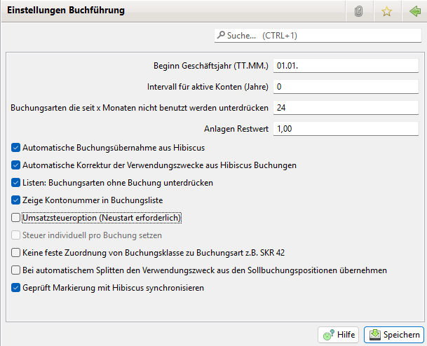

# Buchführung

Hier sind folgende Eingaben nötig bzw. möglich:

* Beginn des Geschäftsjahres in der Form TT.MM.
* Intervall für aktive Konten. Aktive Konten sind die, deren Auflösung um mehr als die ausgewählte Anzahl von Jahren zurück liegt. Diese können im Kontoauswahl Dialog ausgeblendet werden
* Buchungsarten die seit x Monaten nicht benutzt werden unterdrücken in der Form Monate
* Automatische Übernahme von Buchungen aus Hibiscus (Standard: aktiviert)
* Automatische Korrektur der Verwendungszwecke aus Hibiscus Buchungen
* Unterdrückung nicht gebuchter Buchungsarten in Listen/Auswertungen (Standard: nicht aktiviert)
* Zeige Kontonummer in der Buchungsliste
* Umsatzsteuer Support (Neustart erforderlich)\
  Diese Option aktiviert die Möglichkeit Steuer Daten einzugeben (siehe [Steuer](../../../3.1/administration/admbuchf/steuer.md)) und eine Umsatzsteuer Voranmeldung (siehe [Umsatzsteuer Voranmeldung](../../../3.1/buchf/umsatzsteuersaldo.md)) zu bekommen. Damit lassen sich in Buchungsarten bzw. Buchungen die Steuersätze hinterlegen und über die Umsatzsteuer Voranmeldung z.B. feststellen wie hoch die Umsatzsteuer pflichtigen Umsätze sind. In der Buchungsliste wird auch ein Netto Betrag ausgewiesen. Dieser hat aber noch keine Bedeutung solange die Option Umsatzsteuer Pflicht nicht aktiviert ist
* Umsatzsteuer Pflicht\
  Über diese Option wird festgelegt, ob man als Verein Umsatzsteuer pflichtig ist. Diese Option ist nur verfügbar wenn auch Umsatzsteuer Support aktiviert ist. Ist diese Option aktiv wird die Steuer in den Salden Reports wie z.B. dem Buchungsklassensaldo explizit ausgewiesen. Es werden also die Beträge intern in die Nettobeträge und Steuer Beträge automatisch gesplittet. Auch werden die Steuern in den Rechnungen ausgewiesen.\
  Ein manuelles splitten der Buchungen ist ab der Version 3.1.0 nicht mehr nötig!\
  Durch die Aktivierung von Umsatzsteuer Support wird also nur die Möglichkeit geschaffen schon Steuer Daten zu setzen auch wenn man noch nicht Umsatzsteuer pflichtig ist. So kann man über die Umsatzsteuer Voranmeldung feststellen ob man wegen der Umsätze schon Umsatzsteuer pflichtig wird. Auch kann es sein, dass man schon Umsatzsteuer pflichtig war und es momentan nicht mehr ist. Die Salden und die Rechnungen werden ohne Steuer Berücksichtigung generiert.\
  Erst durch Aktivieren des Umsatzsteuer Pflicht Schalters wird in den Auswertungen, also Salden Reports oder Rechnung die Steuer berücksichtigt.\
  Man muss aber berücksichtigen, dass dieses nur für neue Buchungen gilt bei denen eine Buchung nicht über eine Splittbuchung in eine Netto Buchung und Steuer Buchung gesplittet wurde. Sollten explizite Buchungen mit eine Steuer Buchungsart existieren werden diese weiter in den Salden Reports ausgegeben
* Auswahl ob die Steuer über die Buchungsart gesetzt wird oder individuell per Buchung.\
  Diese Option ist nur verfügbar wenn auch Umsatzsteuer Support aktiviert ist
* Auswahl ob eine feste Zuordnung zwischen Buchungsart und Buchungsklasse existiert oder nicht. Die feste Zuordnung sollte nur bei einem Wechsel des Kontenrahmen passieren und dann beim Wechsel des Geschäftsjahres. Sie auch [Buchungsart](../../../3.1/administration/admbuchf/buchungsart.md)
* Beim automatischen Splitten den Verwendungszweck aus den Sollbuchungspositionen übernehmen.
* Geprüft Markierung mit Hibiskus synchronisieren
