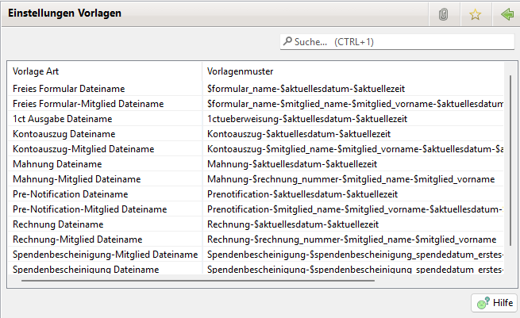

# Vorlagen

Für die Generierung von Dateinamen und anderen Namen existieren Vorlagenmuster die vom Benutzer editiert werden können.

Über einen Doppel Klick oder den Menüeintrag "Bearbeiten" lässt sich eine Vorlage bearbeiten.

Im Vorlagenmuster lassen sich Variablen platzieren. Die verfügbaren Variablen sind von der Art des Namen abhängig. Folgende Variablen sind verfügbar:
* Allgemeine Variablen (immer verfügbar)
* Mitglieder Variablen (verfügbar bei Namen bei denen Mitglieder Information vorhanden ist)
* Rechnung Variablen (verfügbar bei Rechnungen und Mahnungen)
* Spendenbescheinigung Variablen (verfügbar bei Spendenbescheinigungen)
* Lastschriften Variablen (verfügbar bei Pre-Notification)

Die verfügbaren Variablen können über den "Variablen anzeigen" Button ausgewählt werden.

Über den "Update Vorschau" Button kann nach einer Änderung des Vorlagenmusters die Vorschau neu berechnet werden.
