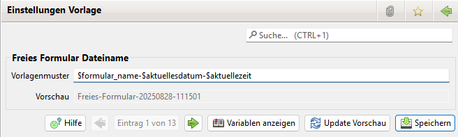

# Vorlagen

## Liste der Vorlagen

Für die Generierung von Dateinamen und anderen Namen existieren Vorlagenmuster die vom Benutzer editiert werden können.

In der Liste sind alle Dateien enthalten die aktuell von JVerein generiert werden können. Es sind jeweils bereits Dateinamen vorbelegt die vom Anwender angepasst werden können. Hierfür stehen alle Variablen zur Verfügung die auch in den Dokumenten platziert werden können. Zusätzlich sind die Parameter aus den Filter bzw. Parameter Bereichen, aus den Ansichten aus denen das Dokument generiert, wird verfügbar.

Über einen Doppel Klick oder den Menüeintrag "Bearbeiten" lässt sich eine Vorlage bearbeiten.

Mit dem Filter lässt sich nach dem eingegebenen Text in den beiden Spalten filtern.

## Vorlage

Im Vorlagenmuster lassen sich Variablen platzieren. Die verfügbaren Variablen sind von der Art des Namen abhängig. Folgende Variablen sind verfügbar:
* Allgemeine Variablen (immer verfügbar)
* Mitglieder Variablen (verfügbar bei Namen bei denen Mitglieder Information vorhanden ist)
* Rechnung Variablen (verfügbar bei Rechnungen und Mahnungen)
* Spendenbescheinigung Variablen (verfügbar bei Spendenbescheinigungen)
* Lastschriften Variablen (verfügbar bei Pre-Notification)
* Variablen aus dem Filterbereich bei Liste Views

Die verfügbaren Variablen können über den "Variablen anzeigen" Button ausgewählt werden.

Über den "Update Vorschau" Button kann nach einer Änderung des Vorlagenmusters die Vorschau neu berechnet werden.

## Hinweise zu Datum

In den Vorlagen sind Datum Variablen auf drei Arten codiert:
* Als formatiertes Datum der Form DD.MM.YYYY z.B. 13.02.2025 (Format 1)
* Als unformatiertes Datum z.B. Mon Jan 01 00:00:00 CET 2024. Ein solches Datum wird je nach System anders angezeigt und kann sich auch zwischen Vorschau und Mail unterscheiden (Format 2)
* Neu in der Version 3.2.0 ein formatiertes Datum der Form YYYYMMDD z.B. 20250213 (Format 3)

Das Format 3 wurde eingeführt und auch als Default bei Dateinamen verwendet. Damit lassen sich generierte Reports entsprechend sortieren. Variablen diesen Typs erkennt man an der Endung "_f".

JVerein enthält Funktionen um zwischen den Formaten zu konvertieren. Hierzu gibt es zwei Formatter:
* dateformat
* udateformat (neu ab der Version 3.2.0)

### Date Formatter (dateformat)
Das dateformat kann zwischen den Formaten 1 und 2 konvertieren. Hat man in den Variablen ein Datum im Format 2 so kann man es folgendermaßen in ein Format vom Typ 1 konvertieren:
* $dateformat.format($<Variable von Typ 2>) 

Beispiel: 
* mitglied_mandatdatum = Mon Jan 01 00:00:00 CET 2024
* $dateformat.format($mitglied_mandatdatum) liefert in der Ausgabe 01.01.2024

Dieser Formatter kann benutzt werden wenn man ein Datum welches in den Variablen vom Typ 2 ist als Typ 1 ausgeben möchte.

PS: Mit $dateformat.parse($<Variable von Typ 1>) lässt sich ein Typ 1 Format in ein Typ 2 Format konvertieren.

### Universal Date Formatter (udateformat)

Beim universal Date Formatter lässt sich das gewünschte Format explizit angeben wodurch es flexibler einsetzbar ist. Es kann folgendermaßen benutzt werden:
* \$udateformat.format(FORMAT, \$\<datum variable von Typ 2>)
* \$udateformat.parse(FORMAT, \$\<datum variable vom Format FORMAT>)

Im FORMAT sind folgende Zeichen unter anderem möglich (weitere siehe https://docs.oracle.com/javase/8/docs/api/java/text/SimpleDateFormat.html):
* d: Eine Stelle von Tag (maximal 2 Stellen)
* M: Eine Stelle von Monat (maximal 2 Stellen)
* y: Eine Stelle von Jahr (maximal 4 Stellen)
* Sonderzeichen wie z.B. .+-

Beachte: d und y sind kleingeschrieben!

Beispiele:
* $udateformat.format("dd.MM.yyyy", $mitglied_mandatdatum) entspricht $dateformat.format($mitglied_mandatdatum) und ergibt 01.01.2024
* $udateformat.format("yyyyMMdd", $mitglied_mandatdatum) ergibt 20240101
* $udateformat.format("yyyy", $mitglied_mandatdatum) ergibt 2024
* $udateformat.format("yy", $mitglied_mandatdatum) ergibt 24
* $udateformat.format("dd-MM", $mitglied_mandatdatum) ergibt 01-01

Da üblicherweise kein Typ 2 Format vorliegt kann man trotzdem zwischen den Formaten mit der Kombination von parse und format konvertieren. Man muss nur jeweils das Format angeben welches man nutzt.

Hat man z.B. filter_datum_bis_f mit Wert 20240315 dann kann man wie folgt konvertieren:
*  $udateformat.format("dd-MM-yyyy", $udateformat.parse("yyyyMMdd", $filter_datum_bis_f)) ergibt 15-03-2024
*  $udateformat.format("yyyy-MM-dd", $udateformat.parse("yyyyMMdd", $filter_datum_bis_f)) ergibt 2024-03-15
*  $udateformat.format("yyyy", $udateformat.parse("yyyyMMdd", $filter_datum_bis_f)) ergibt 2024