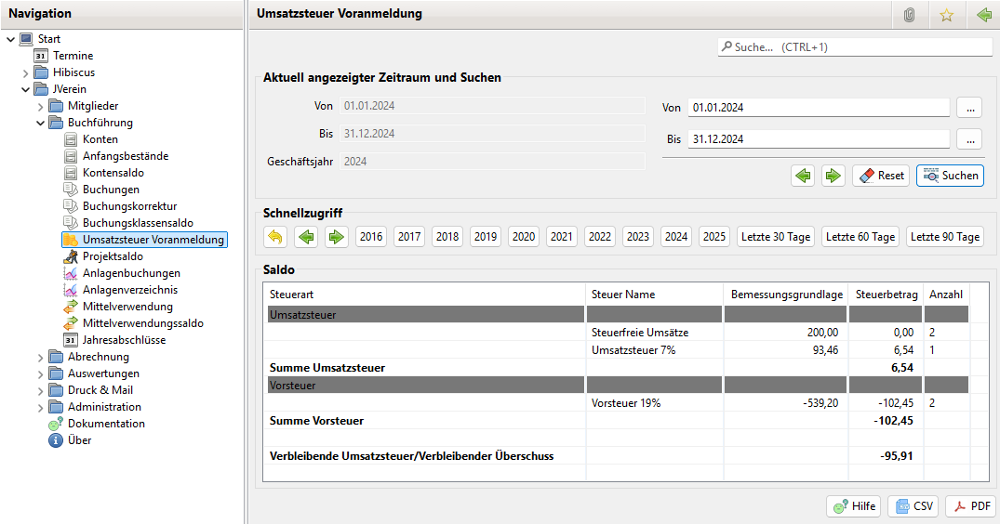

# Umsatzsteuer Voranmeldung

### Aktivierung

Zur Nutzung der Umsatzsteuer Voranmeldung ist die Option Umsatzsteuer Support unter Administration->Einstellungen->Buchführung zu aktivieren.

Anschließend sollte JVerein neu gestartet werden, damit der Menüpunkt "Umsatzsteuer Voranmeldung" zur Verfügung steht.

## Allgemeines

Des Umsatzsteuer Voranmeldung View listet die nach Steuer Name angefallenen Beträge und Steuern für ein Geschäftsjahr oder einen frei wählbaren Zeitraum auf. Zusätzlich werden die steuerfreien Umsätze gelistet.

Das jeweilige Geschäftsjahr lässt sich über die Schnellzugriff Buttons auswählen. Mit den Navigations Pfeilen lässt sich die Zeitachse um jeweils 5 Jahre verschieben. Mit dem Zurück Button kommt man zum aktuellen Geschäftsjahr zurück.

Der aktuell ausgewählte Zeitraum wird angezeigt.

Über die Suchen Funktion lassen sich beliebige Zeiträume auswählen.

Mit den den Navigations Pfeilen lässt sich der ausgewählte Bereich nach vorne oder hinten verschieben.

Beginnt das Von Datum an einem Monatsanfang und endet das Bis Datum an einem letzten Tag eines Monats, wird Monatsweise geblättert. Andernfalls mit der Anzahl der Tage des Zeitbereichs.

Die Daten lassen sich als CSV oder PDF exportieren.
