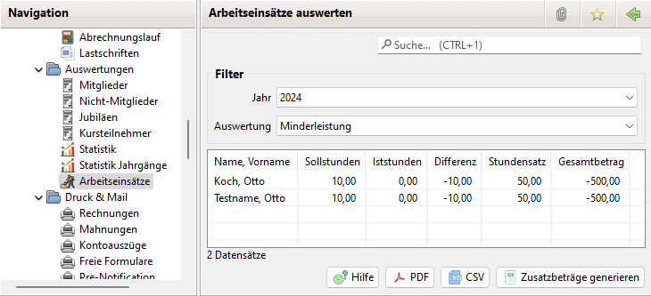

# Arbeitseinsätze

### Aktivierung

Zur Nutzung der Arbeitseinsätze ist die Option unter Administration->Einstellungen->Anzeige zu aktivieren.

Anschließend sollte JVerein neu gestartet werden, damit der Menüpunkt "Arbeitseinsätze" zur Verfügung steht.

### Allgemeines

Die Arbeitseinsätze können ausgewertet werden. Dabei werden Minder-, Normal- und Mehrleistungen überprüft:

Die Daten in der Liste können entweder im PDF- oder CSV-Format ausgegeben werden. Die CSV-Daten können als Serienbriefdatenquelle mit beliebigen Textverarbeitungen z. B. zur Erzeugung von Mahnungen zur Erledigung der Arbeit verwendet werden. Weiterhin ist die Generierung von Zusatzbeträgen zur weiteren Abrechnung möglich.

Über den Button "Zusatzbeiträge generieren" lassen sich für den geschuldeten Betrag Zusatzbeiträge bei den Mitgliedern generieren.
