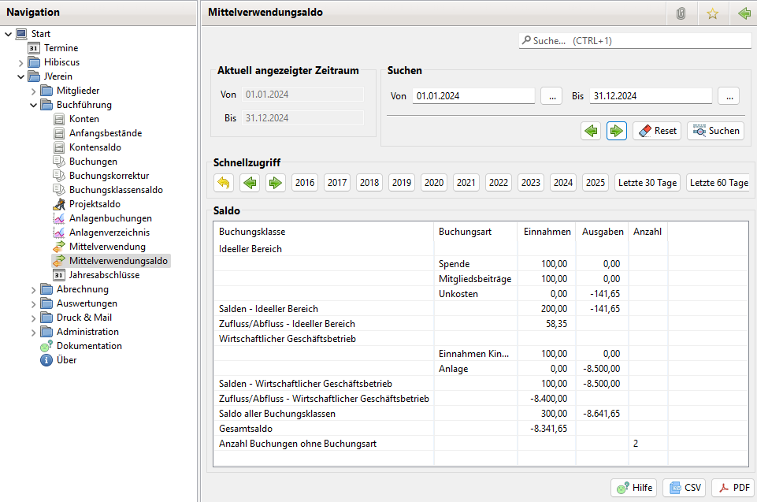

# Mittelverwendungsaldo

### Aktivierung

Zur Nutzung der Mittelverwendungssaldo ist die Option Mittelverwendung unter Administration->Einstellungen->Anzeige zu aktivieren.

Anschließend sollte JVerein neu gestartet werden, damit der Menüpunkt "Mittelverwendungssaldo" zur Verfügung steht.

### Saldo

Das Mittelverwendungssaldo zeigt Mittelzufluss und Mittelabfluss aller Buchungsklassen für ein Geschäftsjahr oder einen frei wählbaren Zeitraum.

Während der Buchungsklassensaldo View eine Einnahmen/Überschussrechnung nach steuerlichen Vorgaben ist, ist dieser View als Unterstützung zum Zufluss basierten Mittelverwendungsreport gedacht. Im Zufluss basierten Mittelverwendungsreport steht die Summe der im GJ insgesamt zugeflossenen und verwendeten Mittel. Dieser View zeigt auf Buchungsart Ebene wie diese Summe zusammen gesetzt ist.

Das jeweilige Geschäftsjahr lässt sich über die Schnellzugriff Buttons auswählen. Mit den Navigations Pfeilen lässt sich die Zeitachse um jeweils 5 Jahre verschieben. Mit dem Zurück Button kommt man zum aktuellen Geschäftsjahr zurück.

Der aktuell ausgewählte Zeitraum wird angezeigt.

Über die Suchen Funktion lassen sich beliebige Zeiträume auswählen.

Mit den den Navigations Pfeilen lässt sich der ausgewählte Bereich nach vorne oder hinten verschieben.

Beginnt das Von Datum an einem Monatsanfang und endet das Bis Datum an einem letzten Tag eines Monats, wird Monatsweise geblättert. Andernfalls mit der Anzahl der Tage des Zeitbereichs.

Die Daten lassen sich als CSV oder PDF exportieren.
