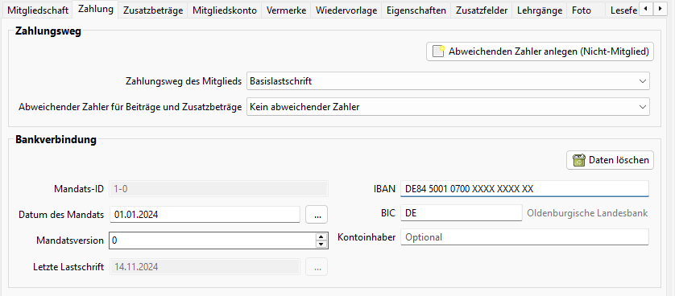
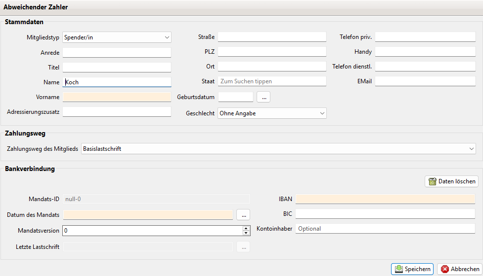

# Zahlung

Hier werden die Zahlungsdaten des Mitglieds konfiguriert

### Zahlungsweg des Mitglieds

Als Zahlungswege stehen

* Basislastschrift
* Barzahlung
* Überweisung

zur Verfügung. Die Standardwerte können unter Administration->Einstellungen->Beiträge festgelegt werden.

### Abweichender Zahler für Beiträge und Zusatzbeträge
PS: Dies ist ein neues Konzept welches in der Version 4.0 eingeführt wurde.

Sollen die Beiträge oder Zusatzbeträge nicht vom Mitglied selbst, sondern von einer anderen Person bezahlt werden z.B. Eltern, dann kann in diesem Feld das entsprechende Mitglied oder Nicht-Mitglied ausgewählt werden.

Dieses Feld wird ausschließlich während eine Abrechnungslaufes ausgewertet. Ist hier ein Mitglied/Nicht-Mitglied gesetzt, dann wird dieses als Zahler für den Beitrag bzw. Zusatzbetrag verwendet. Es wird dann sein Zahlungsweg verwendet und dieser Zahler als Zahler in der Sollbuchung eingetragen. Dieses stellt dann auch sicher, dass eine Spendenbescheinigung auf den Zahler ausgestellt wird.

Sollen einzelne Zusatzbeträge abweichend davon vom Mitglied selbst bezahlt werden, dann lässt sich dieses als Schalter im Zusatzbetrag auswählen. In diesem Fall wird dann im Abrechnungslauf das Mitglied als Zahler verwendet. Dabei wird auch der Zahlungsweg des Mitglieds benutzt. Es ist dann also auch wichtig, dass der Zahlungsweg und die Kontodaten des Mitglieds korrekt eingegeben sind.

Falls der abweichende Zahler noch nicht als Mitglied oder Nicht-Mitglied existiert lässt er sich über den Button "Abweichenden Zahler anlegen (Nicht-Mitglied)" erstellen. Es erscheint ein Dialog in dem ein neues Nicht-Mitglied erzeugt werden kann. Dieses wird nach dem Speichern automatisch im entsprechenden Feld eingetragen.

PS: Es empfiehlt sich für diese Zahler einen eigenen Mitgliedstyp anzulegen. So kann später leicht nach Zahlern in der Liste der Nicht-Mitglieder gefiltert werden.

Die Felder im Dialog zum Erzeugen eines neuen Nicht-Mitgliedes entsprechen den Feldern die sonst beim regulären Erzeugen eines Nicht-Mitgliedes verwendet werden. Allerdings werden nur die Basisdaten des Nicht-Mitglieds abgefragt. Das Nicht-Mitglied kann aber später jederzeit regulär editiert werden.

### Bankverbindung des Mitglieds
Beim Zahlungsweg Basislastschrift sind IBAN und Datum des Mandats anzugeben.

Die Mandats-ID wird automatisch aus der Mitgliedsnummer oder optional aus der externen Mitgliedsnummer (siehe Einstellungen) gebildet. Zusätzlich wird ein Versionszähler geführt, der das 1., 2., 3. .... Mandat referenziert.

Bei Lastschriften wird von JVerein der Kontoinhaber aus dem Namen und Vornamen des Mitglieds zusammen gesetzt. Bei einem Gemeinschaftskonto könnte der Kontoinhaber aber auch anders lauten. In diesem Fall kann der genaue Wortlaut des Kontoinhaber hier eingetragen werden. Ist dieses Feld gefüllt wird dieser Name bei Lastschriften verwendet.

Mit dem Button "Daten löschen" können die Einträge zur Bankverbindung gelöscht werden.