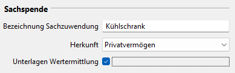
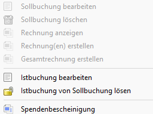

# Spendenbescheinigungen

### Aktivierung

Zur Nutzung der Spendenbescheinigungen ist die Option unter Administration->Einstellungen->Anzeige zu aktivieren.

Anschließend sollte JVerein neu gestartet werden, damit der Menüpunkt "Spendenbescheinigungen" zur Verfügung steht.

### Allgemeines

Mit JVerein können Spendenbescheinigungen ausgestellt und gespeichert werden. Vorbereitend können ein oder mehrere [Formulare](../administration/mitglieder/formulare.md) für den individuellen Druck eingerichtet werden.

JVerein unterstützt das Erstellen von Spendenbescheinigungen für:

* Sachspenden
* Aufwandsspenden
* Vergütungsspenden (Rückspenden)
* Leistungsspenden
* Geldspenden

### Spender

Bei der Erstellung von Spendenbescheinigungen ist zu beachten, dass sie nur auf die Person ausgestellt werden dürfen von denen das Geld vom Konto abgebucht wurde. Wird z.B. ein spenden berechtigter Beitrag von einer anderen Person als das Mitglied bezahlt muss die Spendenbescheinigung auf diesen Zahler ausgestellt werden.

Wird eine Spendenbescheinigung manuell erstellt, dann wird die Anschrift des Spender direkt eingegeben oder durch die Auswahl eines Mitglieds oder Nicht-Mitglieds im Spendenbescheinigung Dialog ausgewählt.

Bei der automatischen Generierung von Spendenbescheinigungen erfolgt die Auswahl des Spenders anhand des "Zahler" Attributs in der zugeordneten Sollbuchung.

Bei einem Abrechnungslauf wird das "Zahler" Attribut in der Sollbuchung folgendermaßen gesetzt:

* Normalerweise ist es das Mitglied selbst
* Ist das Mitglied ein Familienmitglied in einem Familienverband und es wurde als Zahlungsweg "Durch Vollzahler" ausgewählt, dann wird als Zahler das voll zahlende Mitglied eingetragen
* Ist beim Mitglied ein abweichender Kontoinhaber eingetragen, so wird das Mitglied als Zahler eingetragen. In die Spendenbescheinigung wird aber die Adresse des alternativen Kontoinhaber geschrieben

Wird also z.B. ein Abrechnungslauf gemacht und die Mitglieder zahlen per Überweisung wird das Mitglied als Zahler eingetragen. Sollte dann aber eine andere Person den Beitrag überweisen gibt es folgende Möglichkeiten:

* Die Spendenbescheinigung wird manuell ausgestellt und die Daten des Zahlers eingetragen
* Soll die Spendenbescheinigung automatisch erstellt werden, dann muss entweder ein zahlendes Mitglied oder ein Nicht-Mitglied als Zahler eingetragen werden, je nachdem wer bezahlt hat. Notfalls ist ein Nicht-Mitglied als Spender zu erzeugen

### Erstellung

Die Spendenbescheinigungen können erstellt werden

* im Kontextmenü einer Buchung (neu ab Version 3.1.0)
* in den Mitglied Details (siehe [Mitgliedskonto](content/mitgliedskonto.md))
* über das Kontextmenü eines Mitglieds (siehe [Mitglieder](content/mitglieder.md))
* aber auch in der Liste der Spendenbescheinigungen

Für Details zur Erstellung siehe weiter unten.

## Liste der Spendenbescheinigungen

Im View Spendenbescheinigungen werden bereits erstellte Spendenbescheinigungen angezeigt.

Der Filterbereich erlaubt es nach verschiedenen Kriterien zu filtern.

Über den Filter "Mail" lassen sich z.B. Spendenbescheinigungen finden für deren Spender keine Mail Adressen hinterlegt sind. Diese können dann nicht per Mail verschickt werden sondern nur per Brief.

Über den Filter "Spendenart" lassen sich folgende Optionen auswählen:

* Geldspende
* Sachspende
* Geldspende mit Erstattungsverzicht
* Geldspende ohne Erstattungsverzicht
* Sachspende oder Geldspende mit Erstattungsverzicht

Laut gesetzlicher Regelung darf eine maschinelle Erstellung von Spendenbescheinigungen mit gedruckter Unterschrift nur bei reinen Geldspenden angewendet werden. Spendenbescheinigungen für Sachspenden und Geldspenden für Verzicht auf Aufwendungen müssen weiterhin per Hand unterschrieben werden.

JVerein wird also eine gedruckte Unterschrift nur bei reinen Geldspenden generieren falls gedruckte Unterschrift aktiviert ist.

Möchte man also Spendenbescheinigungen per Mail verschicken geht das nur für echte Geldspenden. Dafür ist der Filter für Spendenart auf "Geldspende ohne Erstattungsverzicht" zu setzen. In diesem Fall erhält man alle echten Geldspenden für die auch eine Unterschrift generiert wurde.

Mit der Option "Sachspende oder Geldspende mit Erstattungsverzicht" erhält man alle Spendenbescheinigungen für die keine Unterschrift gedruckt wird. Diese müssen ausgedruckt und per Hand unterschrieben werden.

Folgende Buttons stehen zu Verfügung:

* CSV: Ausgabe der Liste als CSV Datei
* PDF: Ausgabe der Liste als PDF Datei
* Neu (automatisch): Automatisch neue Spendenbescheinigungen erstellen

Durch einen Doppelklick wird die Bearbeitung einer Spendenbescheinigung eingeleitet.

In der Liste können ein oder mehrere Einträge markiert werden.

Das Kontextmenü bietet folgende Optionen:

* Bearbeiten: Der ausgewählte Eintrag wird zum Bearbeiten geöffnet
* Löschen: Damit kann eine Spendenbescheinigung(en) gelöscht werden
* Mitglied anzeigen: Öffnet das Mitglied zur Spendenbescheinigung
* PDF: Drucken der Spendenbescheinigung(en) als PDF
* Druck und Mail: Spendenbescheinigung(en) über den Druck und Mail Dialog drucken oder per Mail verschicken. Eine Beschreibung zum Drucken und Verschicken siehe [Spendenbescheinigungen](../druckmail/spendenbescheinigungen.md)
* Mail an Spender: Eine Mail an den Spender verschicken

Sind mehrere Einträge markiert, wird die Aktion auf alle markierten Einträge angewendet. Das Drucken beschränkt sich darauf, die Dokumente in dem in den Einstellungen angegebenen Verzeichnis zu speichern.

## Spendenbescheinigung

Mit einem Klick auf Bearbeiten öffnet sich folgender Dialog:

Folgende Buttons stehen zu Verfügung:

* Druck und Mail: Spendenbescheinigung über den Druck und Mail Dialog drucken oder per Mail verschicken. Eine Beschreibung zum Drucken und Verschicken siehe [Spendenbescheinigungen](../druckmail/spendenbescheinigungen.md)
* Speichern: Spendenbescheinigung speichern

Durch einen Rechtsklick auf eine Buchung öffnet sich ein Kontextmenü mit mehreren Optionen:

* Anzeigen: Zeigt die Buchung an
* Mitglied anzeigen: Öffnet das Mitglied zur Buchung

## Voraussetzungen für das Erstellen von Spendenbescheinigungen

Um eine Spendenbescheinigung erstellen zu können muss  folgendes erfüllt sein:
* Es muss eine Buchung (Istbuchung) in einem Konto existieren
* Die Buchungsart der Buchung muss vom Typ Spende sein. Siehe Administration->Buchführung->Buchungsart Checkbox Spende
* Bei Aufwandsspenden, Vergütungsspenden (Rückspende) und Leistungsspenden muss die Checkbox "Erstattungsverzicht" in der Buchung selektiert werden.

    

* Bei Sachspenden müssen die betreffenden Felder in der Buchung ausgefüllt werden. JVerein erkennt Sachspenden daran, dass das Feld "Bezeichnung der Sachspende" nicht leer ist. Diese Option existiert seit der Version 3.2.0.

    

## Spendenbescheinigungen manuell erstellen

Eine Spendenbescheinigung kann manuell erzeugt werden:

*   In der Liste der Buchungen:   
Mit einem Klick auf eine Buchung mit der rechten Maustaste öffnet sich ein Kontextmenü um die Spendenbescheinigung zu erstellen. In diesem Fall kann entweder ein Mitglied oder Nicht-Mitglied im Dialog als Spender ausgewählt werden oder auch nur die Adressdaten des Spenders eingegeben werden. Die Buchung bestimmt den Betrag und das Spendendatum. Bei Sachspenden werden die entsprechenden Daten aus der Buchung übernommen.

    
    
*   Im Mitglieds View unter dem Tab Mitgliedskonto:  
Eine Istbuchung auswählen (Buchung mit Euro Symbol). Mit einem Klick auf die rechte Maustaste öffnet sich ein Kontextmenü um die Spendenbescheinigung zu erstellen. In diesem Fall werden die Mitgliedsdaten komplett in die Spendenbescheinigung übernommen, die Buchung bestimmt den Betrag und das Spendendatum. Bei Sachspenden werden die entsprechenden Daten aus der Buchung übernommen.

    

## Spendenbescheinigungen automatisch erstellen

### Voraussetzungen für die automatische Generierung von Spendenbescheinigungen:

* Die Buchung muss einer Sollbuchung zugeordnet sein
* Ein Mitglied wird nur berücksichtigt wenn Straße, Postleitzahl und Ort eingetragen ist
* Der Betrag einer Geldspendenscheinigung muss gleich oder größer sein als der Mindestbetrag der unter Administration->Einstellungen->Spendenbescheinigungen eingetragen ist

Bei der automatischen Generierung werden nur die Buchungen erfasst, die noch keiner Spendenbescheinigung oder Sammelbestätigung zugewiesen wurden. Es werden niemals für eine Buchung mehrere Bescheinigungen generiert.

Werden für ein Mitglied mehrere Buchungen gefunden werden sie zu einer Sammelbestätigung zusammen gefasst. Sachspenden werden immer einzeln bescheinigt.

Die Zuordnung einer Buchung zu einer Sollbuchung kann auf verschiedene Arten erzeugt werden.

* Wird bei einem Abrechnungslauf bei Mitgliedern mit Lastschrift eine Sollbuchung erzeugt, wird automatisch auch eine Buchung erzeugt und diese der Sollbuchung zugeordnet.
* Wird bei einem Abrechnungslauf bei Mitgliedern ohne Lastschrift eine Sollbuchung erzeugt muss die später erfolgte Buchung manuell der Sollbuchung zugeordnet werden. Siehe [Buchungen](../buchf/buchungen.md).
* Wurde die Buchung ohne einen Abrechnungslauf erzeugt muss eine Sollbuchung erzeugt und die Buchung zugeordnet werden. Dies kann in einem Schritt erfolgen. Siehe zweite Option in [Buchungen](../buchf/buchungen.md).
* Alternativ besteht natürlich die Möglichkeit manuell eine Sollbuchung zu erzeugen und ihr später die Buchung zuzuordnen. Für das Erstellen einer Sollbuchung siehe [Mitgliedskonto](content/mitgliedskonto.md) oder [Sollbuchungen](mitgliedskonto.md).

### Spendenbescheinigung automatisch erstellen

Spendenbescheinigungen können automatisch auf mehrere Arten erzeugt werden:

*   In der Liste der Mitglieder kann man mit einem Klick auf die rechte Maustaste ein Kontextmenü öffnen. Darin den Menüpunkt Spendenbescheinigung auswählen. Es werden alle spendenberechtigte Buchungen gesucht bei denen das Mitglied als Zahler in der zugeordneten Sollbuchung eingetragen ist und für die noch keine Spendenbescheinigungen erstellt wurden. In diesem Fall werden die Mitgliedsdaten komplett in die Spendenbescheinigung übernommen. Bei mehreren Geldspenden wird eine Sammelbestätigung generiert. In diesem Fall bestimmt die erste Buchung das Spendendatum, der Betrag ist die Summe der Beträge aller Buchungen. Bei Sachspenden wird für jede Buchung eine eigene Spendenbescheinigung generiert.  
Falls genau eine Bescheinigung generiert wird, wird diese geöffnet und angezeigt. Sie muss dann explizit gespeichert werden.

    

*   In der Übersicht über Spendenbescheinigungen können über den Button "Neu (Automatisch)" Geldspendenbescheinigungen generiert werden.  
Nach Drücken des Buttons erscheint folgende Anzeige:

    

In der Übersicht werden zunächst alle Namen und Buchungen angezeigt, die schließlich als Spendenbescheinigung angelegt werden. Der Typ der Spendenbescheinigungen (Einzel / Sammel) macht sich an der Anzahl Buchungen fest, die erfasst wurden.

Es werden alle spendenberechtigte Buchungen im ausgewählten Jahr gesucht denen noch keine Spendenbescheinigung zugeordnet ist. Diese werden den Mitgliedern/Nicht-Mitgliedern zugeordnet die als Zahler in den zugeordneten Sollbuchungen eingetragen sind.

Über den Button _Erstellen_ werden die Spendenbescheinigungen erzeugt.

## Weitere Anpassungen

### Formulare

Vorlagen von [Formularen](../administration/mitglieder/formulare.md) können auch mehrere Seiten umfassen. Formularfelder können auch auf anderen Seiten als der ersten platziert werden (siehe auch Formularfelder).

### Formularfelder

Formularfelder können nun auch auf anderen Seiten als nur der ersten Seite platziert werden. Hierzu gibt es die Spalte "Seite", mit der die Seitennummer angegeben wird.

Für Spendenbescheinigungen stehen nun ergänzend folgende zusätzlichen Felder zur Verfügung:

* Spendenzeitraum Datum der ersten und letzten Buchung auf der Sammelbestätigung
* Buchungsliste
* Alle Buchungen als Liste formatiert:

`Datum Betrag Verzicht Zuwendungsart`

Für eine korrekte Formatierung sollte eine Schriftart mit fester Zeichenbreite gewählt werden.

### Einstellungen

Mögliche Einstellungen zu Spendenbescheinigungen siehe [Einstellungen](../administration/einstellungen/spendenbescheinigungen.md).
