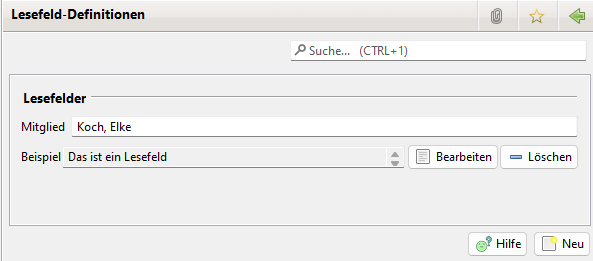

# Lesefelder

## Allgemeines

Zur Nutzung der Lehrgänge ist die Option in den Einstellungen (Administration->Einstellungen->Anzeige) zu aktivieren.

Lesefelder sind virtuelle Datenbank-Felder. Sie werden mit Hilfe eines Skriptes berechnet und sind daher nur lesbar (-> Lesefelder ). Jedes Lesefeld besteht aus einer Bezeichnung und Skript-Code.

Lesefeld-Namen können frei, aber eindeutig gewählt werden. Intern wird `mitglied_lesefelder_` vorne angefügt. Um z.B. beim Schreiben einer E-Mail auf Lesefeld Anrede zuzugreifen, muss `${mitglied_lesefelder_Anrede}` eingegeben werden.

Der Inhalt von Lesefeldern wird durch [http://www.beanshell.org/](http://www.beanshell.org/)-Skripte beschrieben. Damit ist es möglich sehr komplexe Skripte in Java zu erstellen.

Jedes Skript muss als Rückgabe-Wert einen String zurückliefern.

## Liste der Lesefelder



Mit Neu kann ein neues Lesefeld eingerichtet werden.

Mit Bearbeiten kann ein Lesefeld bearbeitet werden.

Mit Löschen kann ein Lesefeld gelöscht werden.

## Lesefeld


### Mitglied

Die Mitglied Auswahl dient dazu das Ergebnis einer Skript Auswertung für das selektierte Mitglied zu sehen.

### Skript-Name

Name des Skriptes.

### Skript

Der Code für das Skript.

### Ausgabe

Ausgabe des Skriptes für das selektierte Mitglied.

## Lesefelder nutzen

Zunächst muss die Lesefelder-Funktion aktiviert werden. Administration->Einstellungen->Anzeige->Lesefelder anzeigen.

Beim nächsten Start von Jameica erscheint unter Administration die neue Option Lesefelder. Außerdem wird sofort auf der Mitglieder-Details-Seite ein neuer Tab Lesefelder angezeigt. Über den Bearbeiten-Knopf erhält man die Möglichkeit neue Lesefelder anzulegen und vorhandene zu editieren bzw. zu löschen.

Die Skripts für Lesefelder werden in Java geschrieben. Genauere Informationen über und Möglichkeiten mit dem Beanshell-Interpreter, ist auf www.beanshell.org verfügbar. Nachfolgend ein paar Beispiele.

Die Lesefelder können als Formularfelder verwendet werden.

## Beispiel Skripte

### Statisch - Für jedes Mitglied identisch

```
"Dieser Text ist für jedes Mitglied identisch."
```

### Als Funktion - VorKommaNachname

```
String f()
{
  return mitglied_vorname + ", " + mitglied_name;
};
return f();
```

### Anrede - Liebe, Lieber, Hallo

```
String r = "";
if(mitglied_geschlecht.equals("w"))
  r = "Liebe " + mitglied_vorname;
else if(mitglied_geschlecht.equals("m"))
  r = "Lieber " + mitglied_vorname;
else
  r = "Hallo " + mitglied_vorname;
r += ",";
return r;
```

### Anrede - Wie oben + "liebe Eltern" bei nicht volljährigen Mitgliedern

```
import java.text.DateFormat;
import java.text.SimpleDateFormat;

public int getAlter()
{
    int age = -1;
    DateFormat formatter = new SimpleDateFormat("dd.MM.yy");
    Date date = formatter.parse(mitglied_geburtsdatum);
    Calendar dob = Calendar.getInstance();
    dob.setTime(date);
    Calendar today = Calendar.getInstance();
    age = today.get(Calendar.YEAR) - dob.get(Calendar.YEAR);
    if (today.get(Calendar.DAY_OF_YEAR) < dob.get(Calendar.DAY_OF_YEAR)) age--;
    return age;
}

String r = "";
try
{

if(mitglied_geschlecht.equals("w"))
  r = "Liebe " + mitglied_vorname;
else if(mitglied_geschlecht.equals("m"))
  r = "Lieber " + mitglied_vorname;
else
  r = "Hallo " + mitglied_vorname;

if(getAlter()<18)
  r += ", liebe Eltern";

r += ",";

}
catch (Exception e)
{
  r = e.getMessage();
}

return r;
```

### 14-Tage-Frist / Bitte um Rückmeldung bis...

```
import java.text.SimpleDateFormat;
import java.text.DateFormat;
import java.util.Calendar;
import java.util.GregorianCalendar;

Calendar calendar = new GregorianCalendar();
calendar.add(Calendar.DAY_OF_YEAR, 14);
DateFormat dateFormat = new SimpleDateFormat("dd. MMMM yyyy");
return dateFormat.format(calendar.getTime());
```
